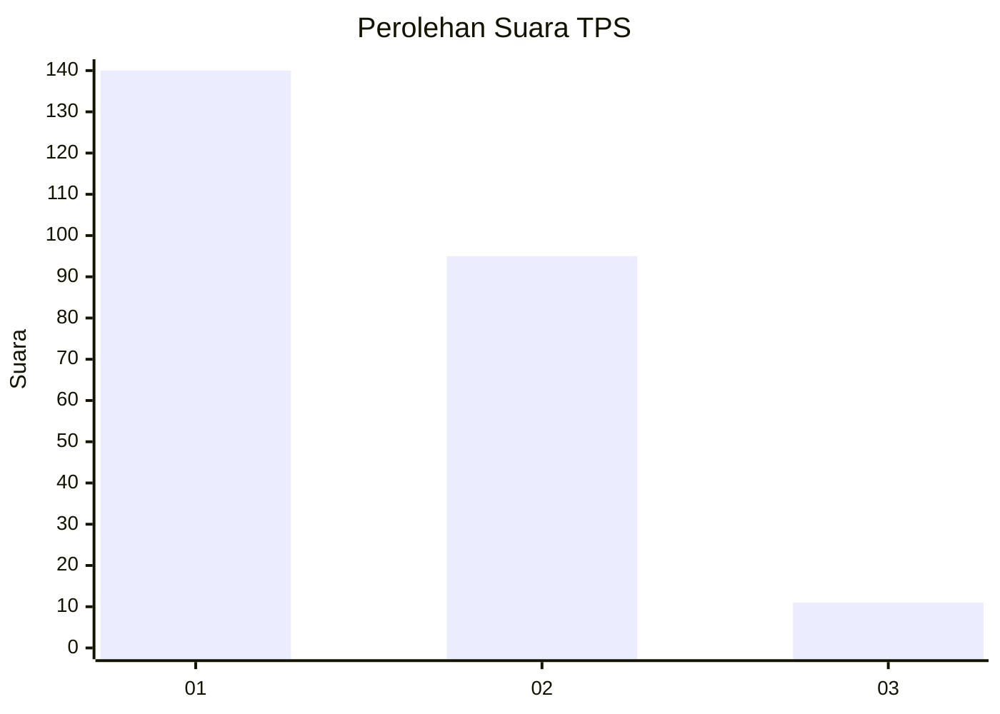
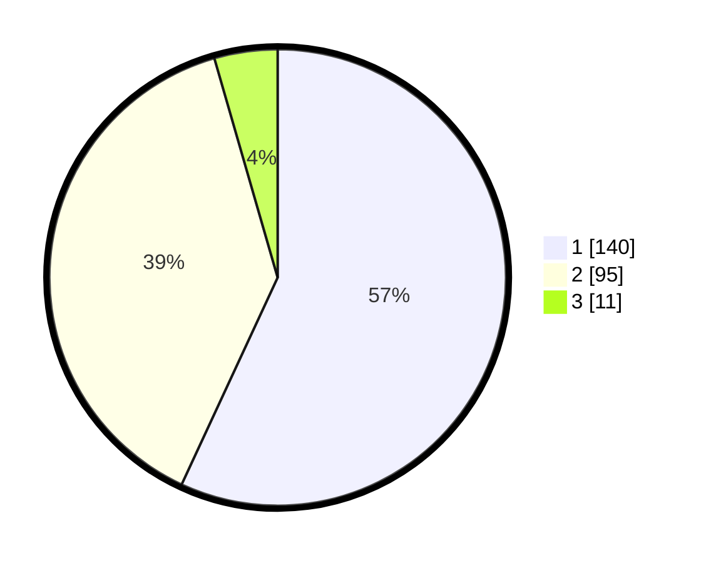

# Hasil

## Grafik

## Tabel

| No. | Nama Paslon    | Suara | Suara (raw) | Persentase |
|:--- |:-------------- | -----:| -----------:| ----------:|
| 1   | ANIES MUHAIMIN | 140   | [140][p-1]  | 56,91      |
| 2   | PRABOWO GIBRAN | 95    | [95][p-2]   | 38,62      |
| 3   | GANJAR MAHFUD  | 11    | [11][p-3]   | 4,47       |

[p-1]: https://github.com/gigit-pemilu/pemilu-2024-14-riau/blob/main/pilpres/hitung-suara/sub/14-riau/sub/09-kuantan-singingi/sub/06-benai/sub/2013-simandolak/sub/001-tps/sub/paslon-1.txt
[p-2]: https://github.com/gigit-pemilu/pemilu-2024-14-riau/blob/main/pilpres/hitung-suara/sub/14-riau/sub/09-kuantan-singingi/sub/06-benai/sub/2013-simandolak/sub/001-tps/sub/paslon-2.txt
[p-3]: https://github.com/gigit-pemilu/pemilu-2024-14-riau/blob/main/pilpres/hitung-suara/sub/14-riau/sub/09-kuantan-singingi/sub/06-benai/sub/2013-simandolak/sub/001-tps/sub/paslon-3.txt

## Foto C Plano

https://sirekap-obj-formc.kpu.go.id/9b1d/pemilu/ppwp/14/09/06/20/13/1409062013001-20240215-040350--94d294fe-bf37-4330-a9ba-6a92cc7f6e3c.jpg

https://sirekap-obj-formc.kpu.go.id/9b1d/pemilu/ppwp/14/09/06/20/13/1409062013001-20240215-040413--80c72499-d641-4fe7-b5ae-67c62caf91c4.jpg

https://sirekap-obj-formc.kpu.go.id/9b1d/pemilu/ppwp/14/09/06/20/13/1409062013001-20240215-040422--2c07a259-c152-45b3-a9df-83670abff33a.jpg

## Metadata

| Key        | Value               |
| ---------- | ------------------- |
| Time Stamp | 2024-02-15 12:00:28 |

