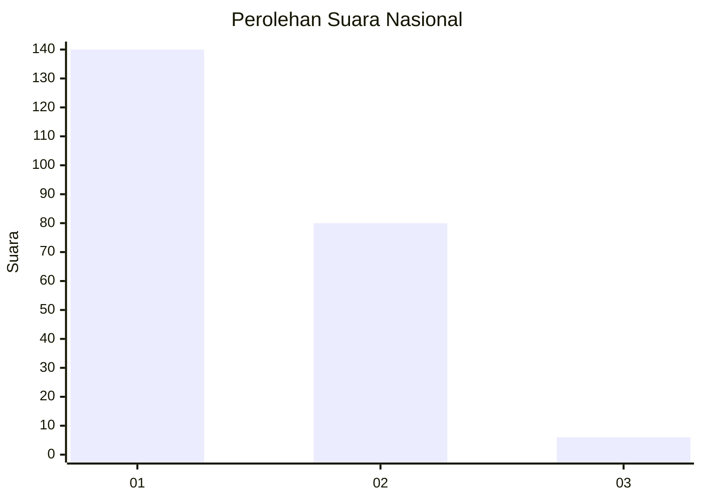
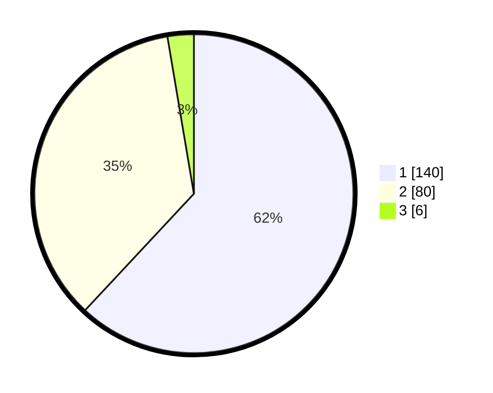

# Hasil

## Grafik

## Tabel

| No. | Nama Paslon    | Suara | Suara (raw) | Persentase |
|:--- |:-------------- | -----:| -----------:| ----------:|
| 1   | ANIES MUHAIMIN | 140   | [140][p-1]  | 61,95      |
| 2   | PRABOWO GIBRAN | 80    | [80][p-2]   | 35,40      |
| 3   | GANJAR MAHFUD  | 6     | [6][p-3]    | 2,65       |

[p-1]: https://github.com/gigit-pemilu/pemilu-2024/blob/main/pilpres/hitung-suara/sub/14-riau/sub/09-kuantan-singingi/sub/07-gunungtoar/sub/2001-pulaumungkur/sub/001-tps/sub/paslon-1.txt
[p-2]: https://github.com/gigit-pemilu/pemilu-2024/blob/main/pilpres/hitung-suara/sub/14-riau/sub/09-kuantan-singingi/sub/07-gunungtoar/sub/2001-pulaumungkur/sub/001-tps/sub/paslon-2.txt
[p-3]: https://github.com/gigit-pemilu/pemilu-2024/blob/main/pilpres/hitung-suara/sub/14-riau/sub/09-kuantan-singingi/sub/07-gunungtoar/sub/2001-pulaumungkur/sub/001-tps/sub/paslon-3.txt

## Foto C Plano

https://sirekap-obj-formc.kpu.go.id/d809/pemilu/ppwp/14/09/07/20/01/1409072001001-20240215-045546--980baa69-aeb7-4a87-8a7b-b53fa2100d3b.jpg

https://sirekap-obj-formc.kpu.go.id/d809/pemilu/ppwp/14/09/07/20/01/1409072001001-20240214-191536--b849a623-4efc-4e70-a796-3f45c8eea41f.jpg

https://sirekap-obj-formc.kpu.go.id/d809/pemilu/ppwp/14/09/07/20/01/1409072001001-20240214-191600--90a88c97-4b32-4f30-82ff-bc04ddf24cbb.jpg

## Metadata

| Key        | Value               |
| ---------- | ------------------- |
| Time Stamp | 2024-02-15 05:00:24 |

