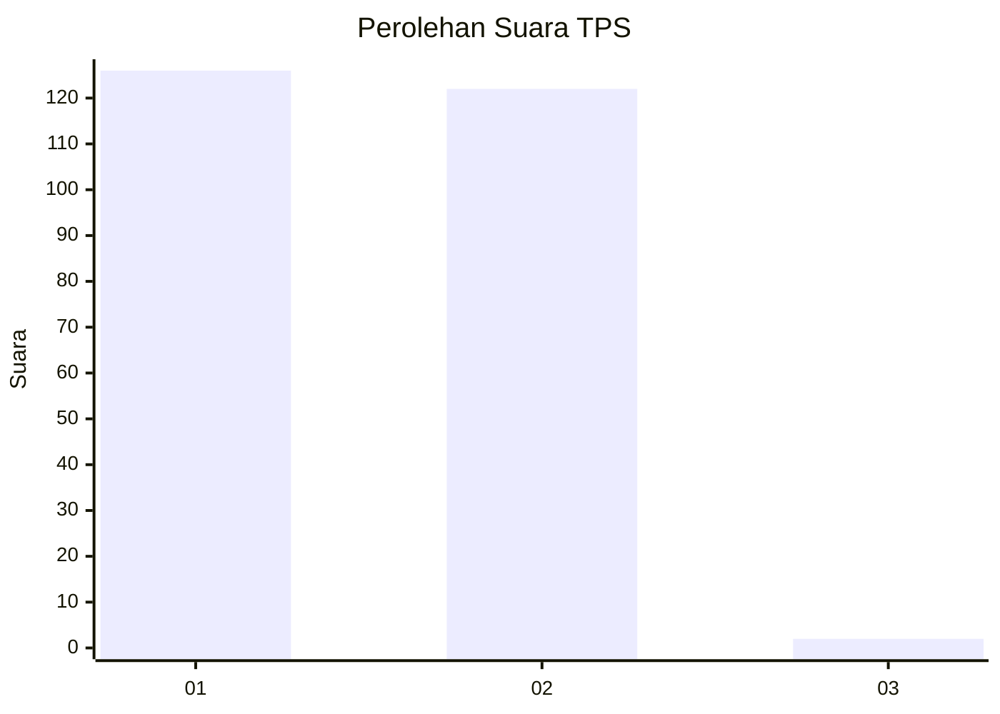
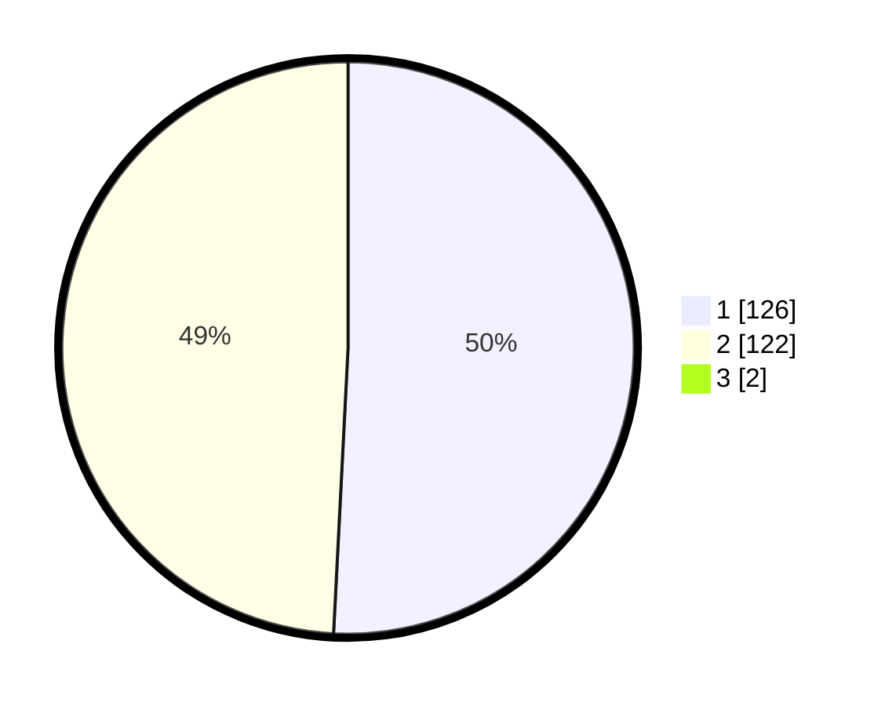

# Hasil

## Grafik

## Tabel

| No. | Nama Paslon    | Suara | Suara (raw) | Persentase |
|:--- |:-------------- | -----:| -----------:| ----------:|
| 1   | ANIES MUHAIMIN | 126   | [126][p-1]  | 50,40      |
| 2   | PRABOWO GIBRAN | 122   | [122][p-2]  | 48,80      |
| 3   | GANJAR MAHFUD  | 2     | [2][p-3]    | 0,80       |

[p-1]: https://github.com/gigit-pemilu/pemilu-2024-14-riau/blob/main/pilpres/hitung-suara/sub/14-riau/sub/09-kuantan-singingi/sub/07-gunungtoar/sub/2002-telukberingin/sub/001-tps/sub/paslon-1.txt
[p-2]: https://github.com/gigit-pemilu/pemilu-2024-14-riau/blob/main/pilpres/hitung-suara/sub/14-riau/sub/09-kuantan-singingi/sub/07-gunungtoar/sub/2002-telukberingin/sub/001-tps/sub/paslon-2.txt
[p-3]: https://github.com/gigit-pemilu/pemilu-2024-14-riau/blob/main/pilpres/hitung-suara/sub/14-riau/sub/09-kuantan-singingi/sub/07-gunungtoar/sub/2002-telukberingin/sub/001-tps/sub/paslon-3.txt

## Foto C Plano

https://sirekap-obj-formc.kpu.go.id/e29f/pemilu/ppwp/14/09/07/20/02/1409072002001-20240215-045640--58c02250-5aa4-4e21-8248-31f4aa1e648a.jpg

https://sirekap-obj-formc.kpu.go.id/e29f/pemilu/ppwp/14/09/07/20/02/1409072002001-20240215-045816--ce4d0d79-31a8-4472-bab2-e37bcd75cf03.jpg

https://sirekap-obj-formc.kpu.go.id/e29f/pemilu/ppwp/14/09/07/20/02/1409072002001-20240215-045916--025e719a-6167-4146-a439-6f8036c1f248.jpg

## Metadata

| Key        | Value               |
| ---------- | ------------------- |
| Time Stamp | 2024-02-24 22:31:28 |

