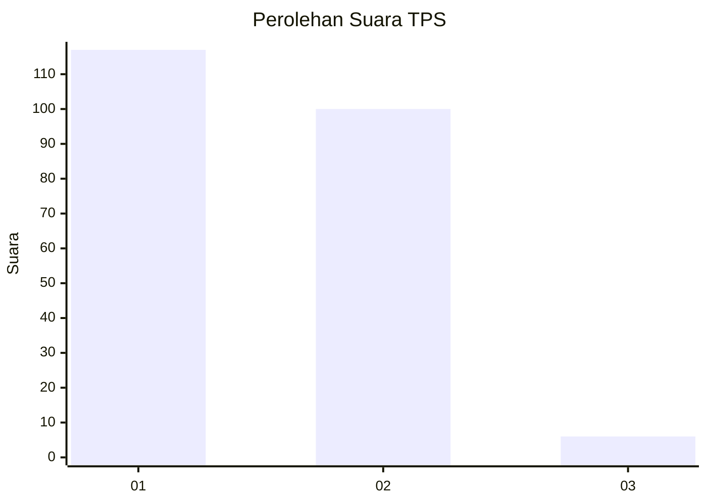
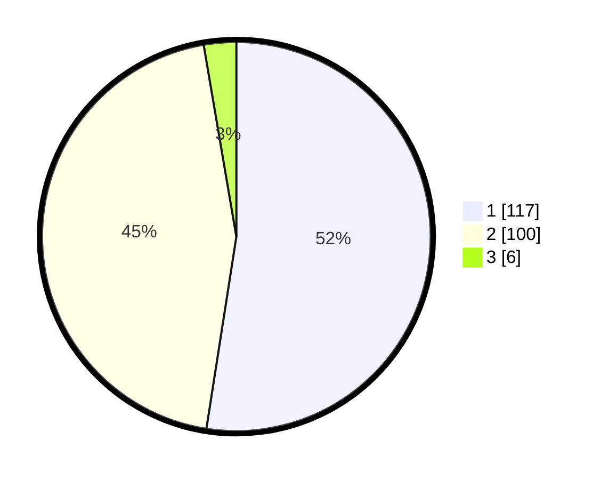

# Hasil

## Grafik

## Tabel

| No. | Nama Paslon    | Suara | Suara (raw) | Persentase |
|:--- |:-------------- | -----:| -----------:| ----------:|
| 1   | ANIES MUHAIMIN | 117   | [117][p-1]  | 52,47      |
| 2   | PRABOWO GIBRAN | 100   | [100][p-2]  | 44,84      |
| 3   | GANJAR MAHFUD  | 6     | [6][p-3]    | 2,69       |

[p-1]: https://github.com/gigit-pemilu/pemilu-2024-14-riau/blob/main/pilpres/hitung-suara/sub/14-riau/sub/09-kuantan-singingi/sub/07-gunungtoar/sub/2002-telukberingin/sub/003-tps/sub/paslon-1.txt
[p-2]: https://github.com/gigit-pemilu/pemilu-2024-14-riau/blob/main/pilpres/hitung-suara/sub/14-riau/sub/09-kuantan-singingi/sub/07-gunungtoar/sub/2002-telukberingin/sub/003-tps/sub/paslon-2.txt
[p-3]: https://github.com/gigit-pemilu/pemilu-2024-14-riau/blob/main/pilpres/hitung-suara/sub/14-riau/sub/09-kuantan-singingi/sub/07-gunungtoar/sub/2002-telukberingin/sub/003-tps/sub/paslon-3.txt

## Foto C Plano

https://sirekap-obj-formc.kpu.go.id/8b53/pemilu/ppwp/14/09/07/20/02/1409072002003-20240215-022348--1e43e835-96d0-4aba-acc9-579df4843c62.jpg

https://sirekap-obj-formc.kpu.go.id/8b53/pemilu/ppwp/14/09/07/20/02/1409072002003-20240214-220904--ac86af87-ca89-4736-a60e-61c2035501dd.jpg

https://sirekap-obj-formc.kpu.go.id/8b53/pemilu/ppwp/14/09/07/20/02/1409072002003-20240214-221107--b69d1602-f4fd-44fe-90c4-fc21eb4576da.jpg

## Metadata

| Key        | Value               |
| ---------- | ------------------- |
| Time Stamp | 2024-02-15 20:00:44 |

