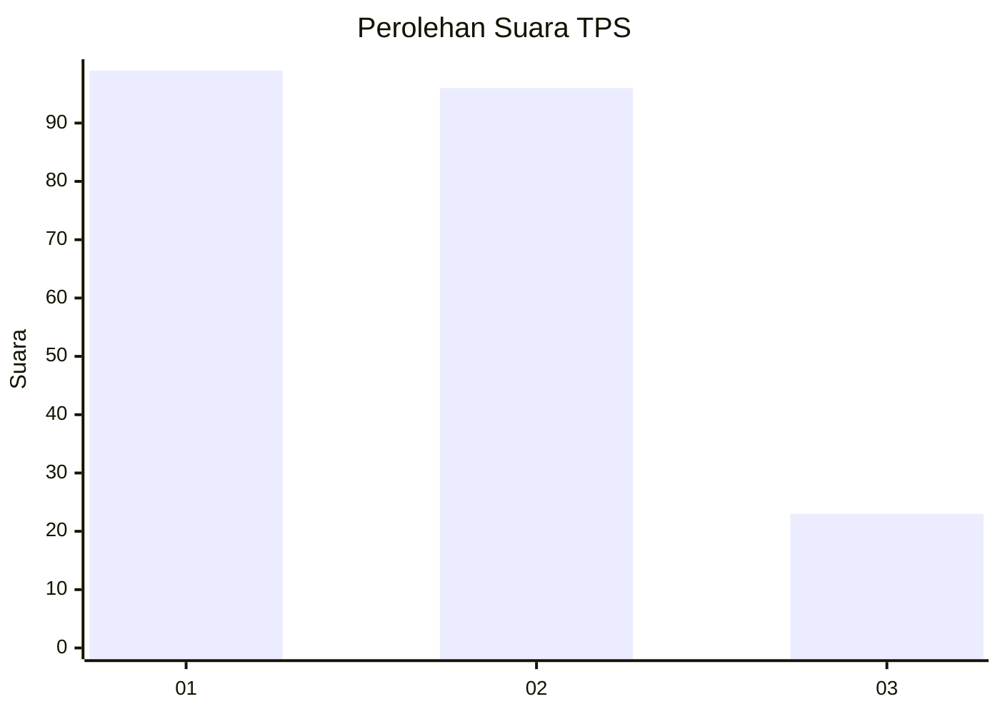
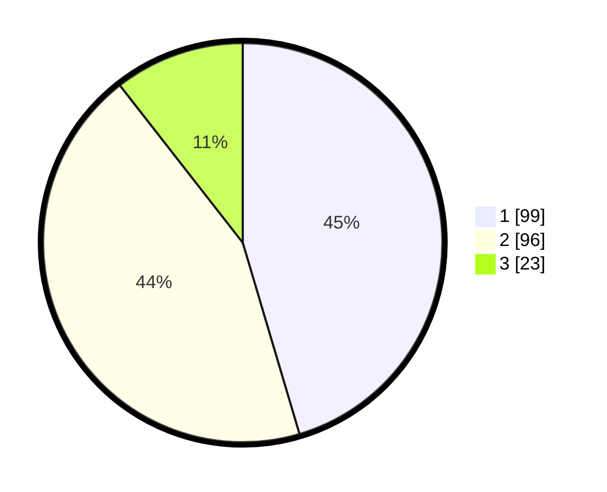

# Hasil

## Grafik

## Tabel

| No. | Nama Paslon    | Suara | Suara (raw) | Persentase |
|:--- |:-------------- | -----:| -----------:| ----------:|
| 1   | ANIES MUHAIMIN | 99    | [99][p-1]   | 45,41      |
| 2   | PRABOWO GIBRAN | 96    | [96][p-2]   | 44,04      |
| 3   | GANJAR MAHFUD  | 23    | [23][p-3]   | 10,55      |

[p-1]: https://github.com/gigit-pemilu/pemilu-2024-14-riau/blob/main/pilpres/hitung-suara/sub/14-riau/sub/09-kuantan-singingi/sub/08-singingi-hilir/sub/2001-koto-baru/sub/004-tps/sub/paslon-1.txt
[p-2]: https://github.com/gigit-pemilu/pemilu-2024-14-riau/blob/main/pilpres/hitung-suara/sub/14-riau/sub/09-kuantan-singingi/sub/08-singingi-hilir/sub/2001-koto-baru/sub/004-tps/sub/paslon-2.txt
[p-3]: https://github.com/gigit-pemilu/pemilu-2024-14-riau/blob/main/pilpres/hitung-suara/sub/14-riau/sub/09-kuantan-singingi/sub/08-singingi-hilir/sub/2001-koto-baru/sub/004-tps/sub/paslon-3.txt

## Foto C Plano

https://sirekap-obj-formc.kpu.go.id/f9de/pemilu/ppwp/14/09/08/20/01/1409082001004-20240216-185508--84d4fa12-a319-410a-9a36-d822ff745e37.jpg

https://sirekap-obj-formc.kpu.go.id/f9de/pemilu/ppwp/14/09/08/20/01/1409082001004-20240216-185608--2c2fd05f-ca5a-47d8-af8d-a130294639ae.jpg

https://sirekap-obj-formc.kpu.go.id/f9de/pemilu/ppwp/14/09/08/20/01/1409082001004-20240216-185712--2d851e2b-5e2a-40fc-9c1f-92974591dee7.jpg

## Metadata

| Key        | Value               |
| ---------- | ------------------- |
| Time Stamp | 2024-02-16 22:01:00 |

