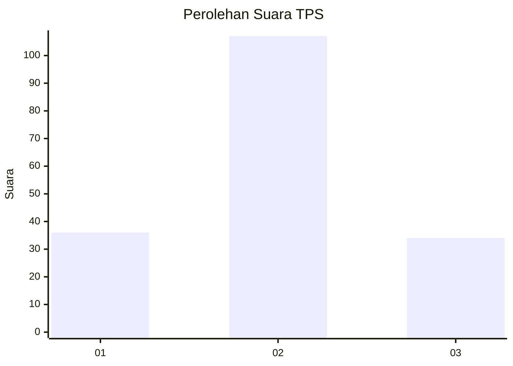
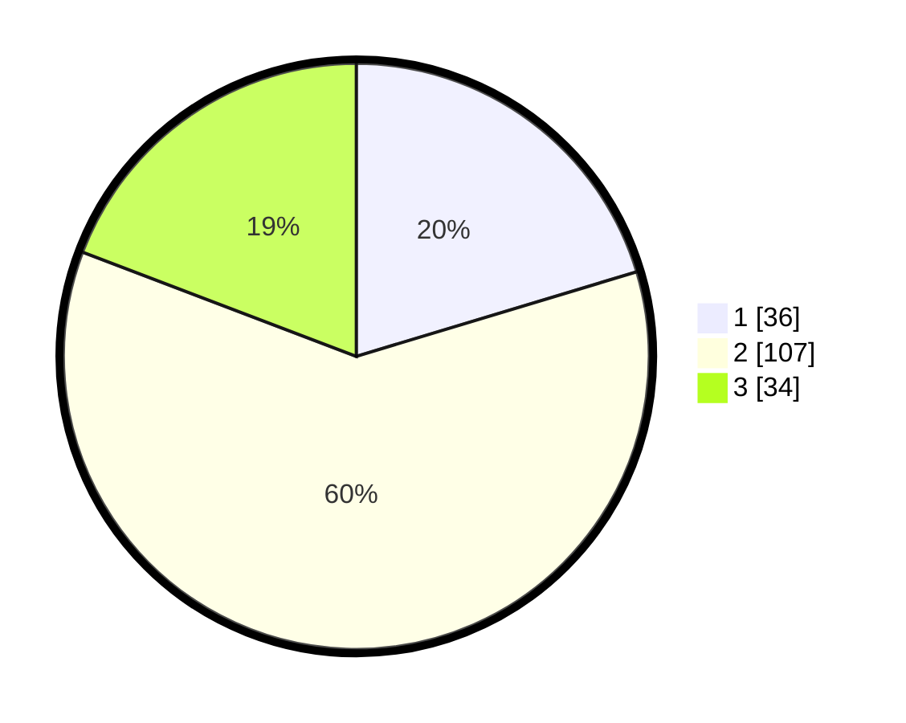

# Hasil

## Grafik

## Tabel

| No. | Nama Paslon    | Suara | Suara (raw) | Persentase |
|:--- |:-------------- | -----:| -----------:| ----------:|
| 1   | ANIES MUHAIMIN | 36    | [36][p-1]   | 20,34      |
| 2   | PRABOWO GIBRAN | 107   | [107][p-2]  | 60,45      |
| 3   | GANJAR MAHFUD  | 34    | [34][p-3]   | 19,21      |

[p-1]: https://github.com/gigit-pemilu/pemilu-2024-14-riau/blob/main/pilpres/hitung-suara/sub/14-riau/sub/09-kuantan-singingi/sub/08-singingi-hilir/sub/2002-petai/sub/001-tps/sub/paslon-1.txt
[p-2]: https://github.com/gigit-pemilu/pemilu-2024-14-riau/blob/main/pilpres/hitung-suara/sub/14-riau/sub/09-kuantan-singingi/sub/08-singingi-hilir/sub/2002-petai/sub/001-tps/sub/paslon-2.txt
[p-3]: https://github.com/gigit-pemilu/pemilu-2024-14-riau/blob/main/pilpres/hitung-suara/sub/14-riau/sub/09-kuantan-singingi/sub/08-singingi-hilir/sub/2002-petai/sub/001-tps/sub/paslon-3.txt

## Foto C Plano

https://sirekap-obj-formc.kpu.go.id/f69e/pemilu/ppwp/14/09/08/20/02/1409082002001-20240215-092435--3007f55d-d284-4ed6-b759-158aad513166.jpg

https://sirekap-obj-formc.kpu.go.id/f69e/pemilu/ppwp/14/09/08/20/02/1409082002001-20240215-092200--d9657de0-f8b1-41e7-b4ec-d6d444e70b64.jpg

https://sirekap-obj-formc.kpu.go.id/f69e/pemilu/ppwp/14/09/08/20/02/1409082002001-20240215-092606--b3b748a8-0cf9-421d-ada6-d1b75fa4fa8c.jpg

## Metadata

| Key        | Value               |
| ---------- | ------------------- |
| Time Stamp | 2024-02-19 06:16:00 |

