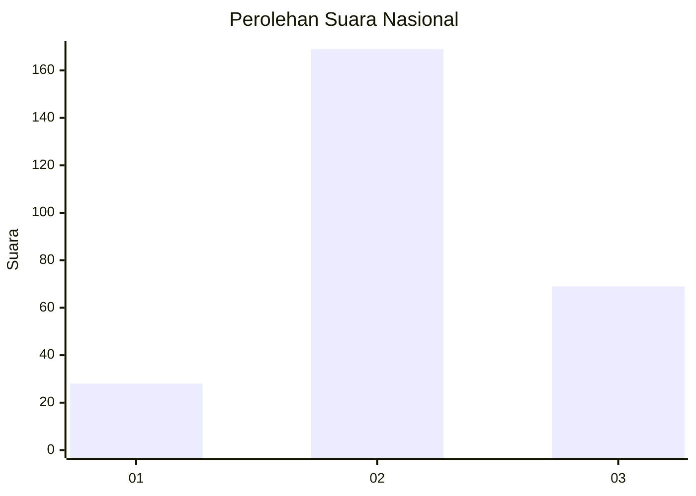
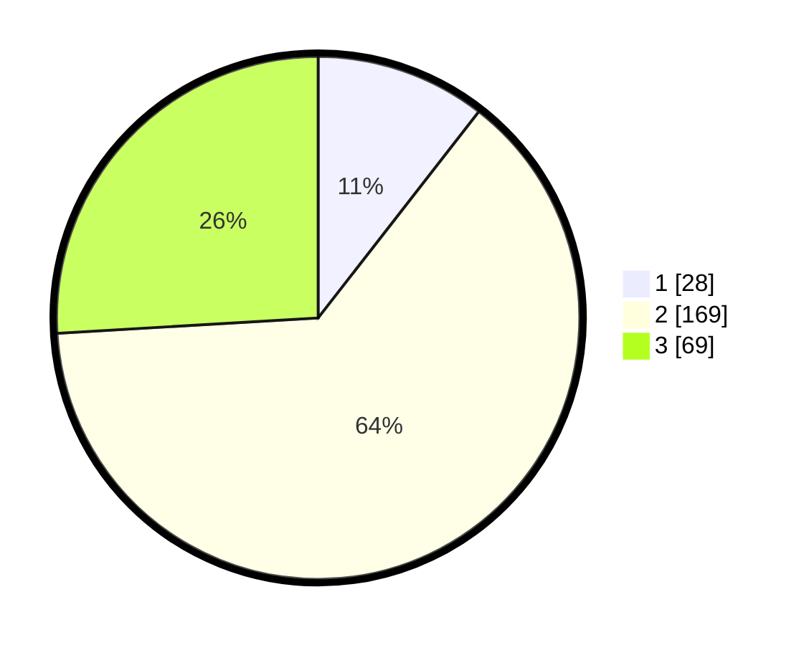

# Hasil

## Grafik

## Tabel

| No. | Nama Paslon    | Suara | Suara (raw) | Persentase |
|:--- |:-------------- | -----:| -----------:| ----------:|
| 1   | ANIES MUHAIMIN | 28    | [28][p-1]   | 10,53      |
| 2   | PRABOWO GIBRAN | 169   | [169][p-2]  | 63,53      |
| 3   | GANJAR MAHFUD  | 69    | [69][p-3]   | 25,94      |

[p-1]: https://github.com/gigit-pemilu/pemilu-2024/blob/main/pilpres/hitung-suara/sub/14-riau/sub/09-kuantan-singingi/sub/08-singingi-hilir/sub/2005-simpang-raya/sub/001-tps/sub/paslon-1.txt
[p-2]: https://github.com/gigit-pemilu/pemilu-2024/blob/main/pilpres/hitung-suara/sub/14-riau/sub/09-kuantan-singingi/sub/08-singingi-hilir/sub/2005-simpang-raya/sub/001-tps/sub/paslon-2.txt
[p-3]: https://github.com/gigit-pemilu/pemilu-2024/blob/main/pilpres/hitung-suara/sub/14-riau/sub/09-kuantan-singingi/sub/08-singingi-hilir/sub/2005-simpang-raya/sub/001-tps/sub/paslon-3.txt

## Foto C Plano

https://sirekap-obj-formc.kpu.go.id/d8f0/pemilu/ppwp/14/09/08/20/05/1409082005001-20240216-193558--281146d9-d226-4562-bc8e-b373ea57319b.jpg

https://sirekap-obj-formc.kpu.go.id/d8f0/pemilu/ppwp/14/09/08/20/05/1409082005001-20240215-001111--ec5ccd22-b6ff-42c3-b314-1bd25db69671.jpg

https://sirekap-obj-formc.kpu.go.id/d8f0/pemilu/ppwp/14/09/08/20/05/1409082005001-20240215-001257--426e877a-6700-4b0c-9510-474658a894ff.jpg

## Metadata

| Key        | Value               |
| ---------- | ------------------- |
| Time Stamp | 2024-02-16 21:01:00 |

