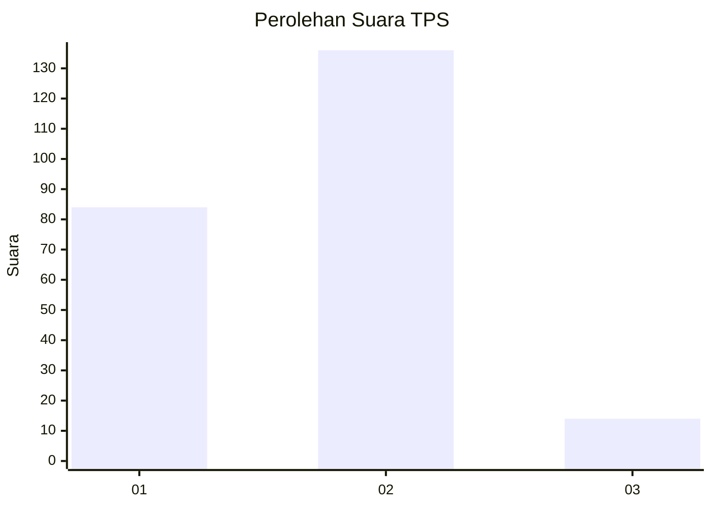
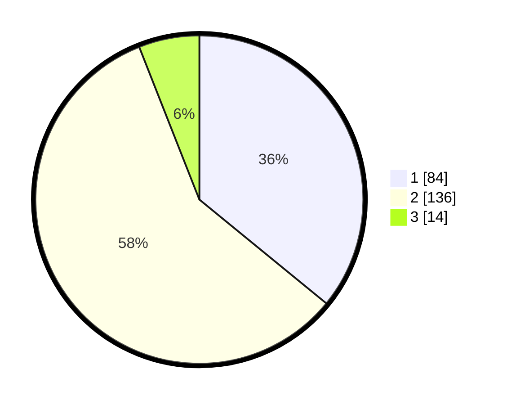

# Hasil

## Grafik

## Tabel

| No. | Nama Paslon    | Suara | Suara (raw) | Persentase |
|:--- |:-------------- | -----:| -----------:| ----------:|
| 1   | ANIES MUHAIMIN | 84    | [84][p-1]   | 35,90      |
| 2   | PRABOWO GIBRAN | 136   | [136][p-2]  | 58,12      |
| 3   | GANJAR MAHFUD  | 14    | [14][p-3]   | 5,98       |

[p-1]: https://github.com/gigit-pemilu/pemilu-2024-14-riau/blob/main/pilpres/hitung-suara/sub/14-riau/sub/09-kuantan-singingi/sub/10-logas-tanah-darat/sub/2001-perhentian-luas/sub/002-tps/sub/paslon-1.txt
[p-2]: https://github.com/gigit-pemilu/pemilu-2024-14-riau/blob/main/pilpres/hitung-suara/sub/14-riau/sub/09-kuantan-singingi/sub/10-logas-tanah-darat/sub/2001-perhentian-luas/sub/002-tps/sub/paslon-2.txt
[p-3]: https://github.com/gigit-pemilu/pemilu-2024-14-riau/blob/main/pilpres/hitung-suara/sub/14-riau/sub/09-kuantan-singingi/sub/10-logas-tanah-darat/sub/2001-perhentian-luas/sub/002-tps/sub/paslon-3.txt

## Foto C Plano

https://sirekap-obj-formc.kpu.go.id/478a/pemilu/ppwp/14/09/10/20/01/1409102001002-20240215-162439--d0979e64-fdbb-4576-99c7-d13b211cec73.jpg

https://sirekap-obj-formc.kpu.go.id/478a/pemilu/ppwp/14/09/10/20/01/1409102001002-20240215-171837--2958aec0-0927-47d0-890b-091c4b7e9990.jpg

https://sirekap-obj-formc.kpu.go.id/478a/pemilu/ppwp/14/09/10/20/01/1409102001002-20240215-171930--fcd662da-8a05-4e70-b1e7-101dbeb1e547.jpg

## Metadata

| Key        | Value               |
| ---------- | ------------------- |
| Time Stamp | 2024-02-15 21:01:18 |

