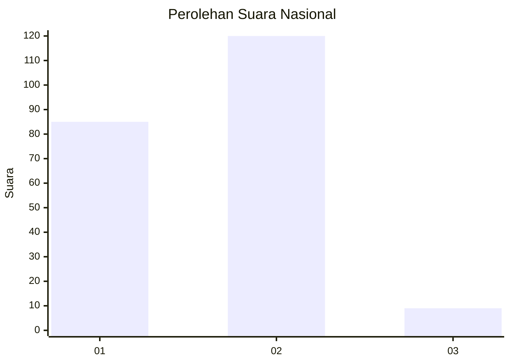
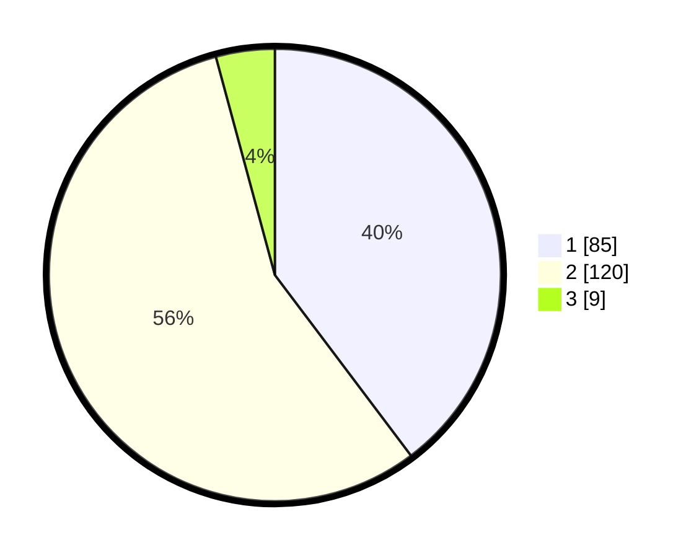

# Hasil

## Grafik

## Tabel

| No. | Nama Paslon    | Suara | Suara (raw) | Persentase |
|:--- |:-------------- | -----:| -----------:| ----------:|
| 1   | ANIES MUHAIMIN | 85    | [85][p-1]   | 39,72      |
| 2   | PRABOWO GIBRAN | 120   | [120][p-2]  | 56,07      |
| 3   | GANJAR MAHFUD  | 9     | [9][p-3]    | 4,21       |

[p-1]: https://github.com/gigit-pemilu/pemilu-2024/blob/main/pilpres/hitung-suara/sub/14-riau/sub/09-kuantan-singingi/sub/10-logas-tanah-darat/sub/2001-perhentian-luas/sub/004-tps/sub/paslon-1.txt
[p-2]: https://github.com/gigit-pemilu/pemilu-2024/blob/main/pilpres/hitung-suara/sub/14-riau/sub/09-kuantan-singingi/sub/10-logas-tanah-darat/sub/2001-perhentian-luas/sub/004-tps/sub/paslon-2.txt
[p-3]: https://github.com/gigit-pemilu/pemilu-2024/blob/main/pilpres/hitung-suara/sub/14-riau/sub/09-kuantan-singingi/sub/10-logas-tanah-darat/sub/2001-perhentian-luas/sub/004-tps/sub/paslon-3.txt

## Foto C Plano

https://sirekap-obj-formc.kpu.go.id/8739/pemilu/ppwp/14/09/10/20/01/1409102001004-20240215-101939--615cd4bf-1b48-4114-97d2-802ac5f1d709.jpg

https://sirekap-obj-formc.kpu.go.id/8739/pemilu/ppwp/14/09/10/20/01/1409102001004-20240215-101954--d46c14a3-89c9-47ff-a0dc-ec794b75117e.jpg

https://sirekap-obj-formc.kpu.go.id/8739/pemilu/ppwp/14/09/10/20/01/1409102001004-20240215-102008--618ae17e-0c6f-4797-b76a-e182666d5b90.jpg

## Metadata

| Key        | Value               |
| ---------- | ------------------- |
| Time Stamp | 2024-02-15 16:00:26 |

