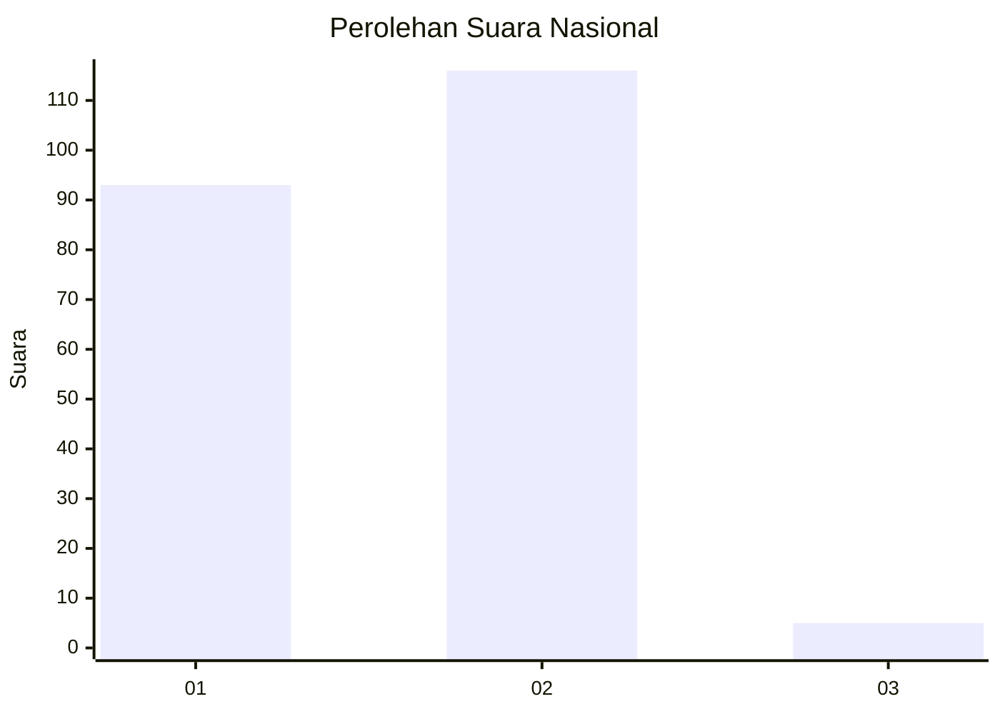
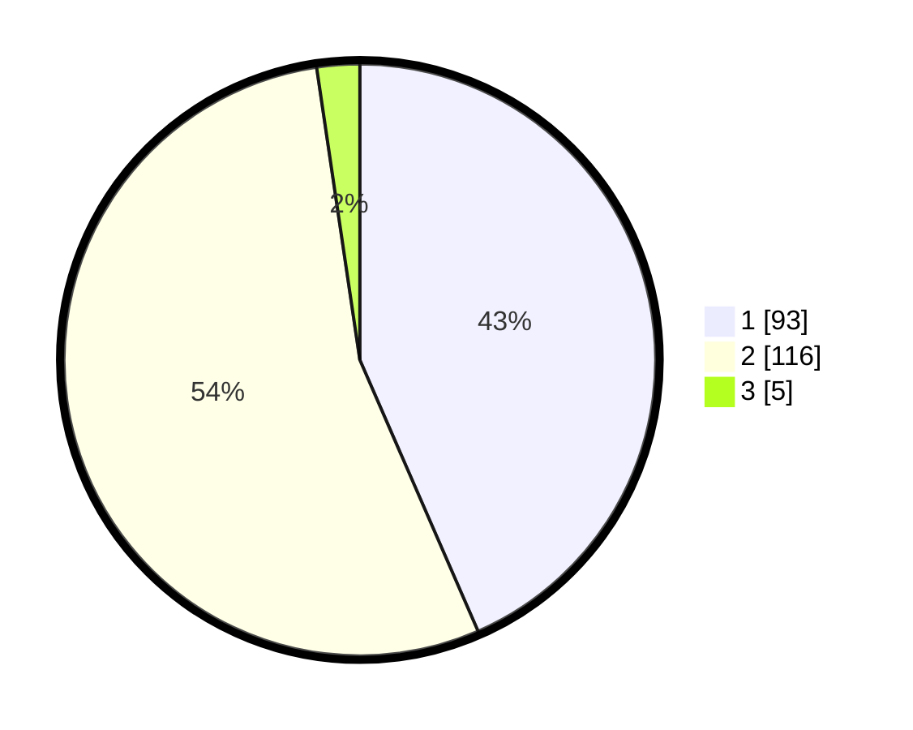

# Hasil

## Grafik

## Tabel

| No. | Nama Paslon    | Suara | Suara (raw) | Persentase |
|:--- |:-------------- | -----:| -----------:| ----------:|
| 1   | ANIES MUHAIMIN | 93    | [93][p-1]   | 43,46      |
| 2   | PRABOWO GIBRAN | 116   | [116][p-2]  | 54,21      |
| 3   | GANJAR MAHFUD  | 5     | [5][p-3]    | 2,34       |

[p-1]: https://github.com/gigit-pemilu/pemilu-2024/blob/main/pilpres/hitung-suara/sub/14-riau/sub/09-kuantan-singingi/sub/10-logas-tanah-darat/sub/2001-perhentian-luas/sub/007-tps/sub/paslon-1.txt
[p-2]: https://github.com/gigit-pemilu/pemilu-2024/blob/main/pilpres/hitung-suara/sub/14-riau/sub/09-kuantan-singingi/sub/10-logas-tanah-darat/sub/2001-perhentian-luas/sub/007-tps/sub/paslon-2.txt
[p-3]: https://github.com/gigit-pemilu/pemilu-2024/blob/main/pilpres/hitung-suara/sub/14-riau/sub/09-kuantan-singingi/sub/10-logas-tanah-darat/sub/2001-perhentian-luas/sub/007-tps/sub/paslon-3.txt

## Foto C Plano

https://sirekap-obj-formc.kpu.go.id/35f1/pemilu/ppwp/14/09/10/20/01/1409102001007-20240214-232506--2b601a18-5cc0-4e43-9be9-452232956701.jpg

https://sirekap-obj-formc.kpu.go.id/35f1/pemilu/ppwp/14/09/10/20/01/1409102001007-20240214-232546--0807c335-6d0f-4490-b352-f108b896e920.jpg

https://sirekap-obj-formc.kpu.go.id/35f1/pemilu/ppwp/14/09/10/20/01/1409102001007-20240214-232623--79aed6d8-aa29-4fac-9b33-70f868fd0da0.jpg

## Metadata

| Key        | Value               |
| ---------- | ------------------- |
| Time Stamp | 2024-02-15 12:00:28 |

