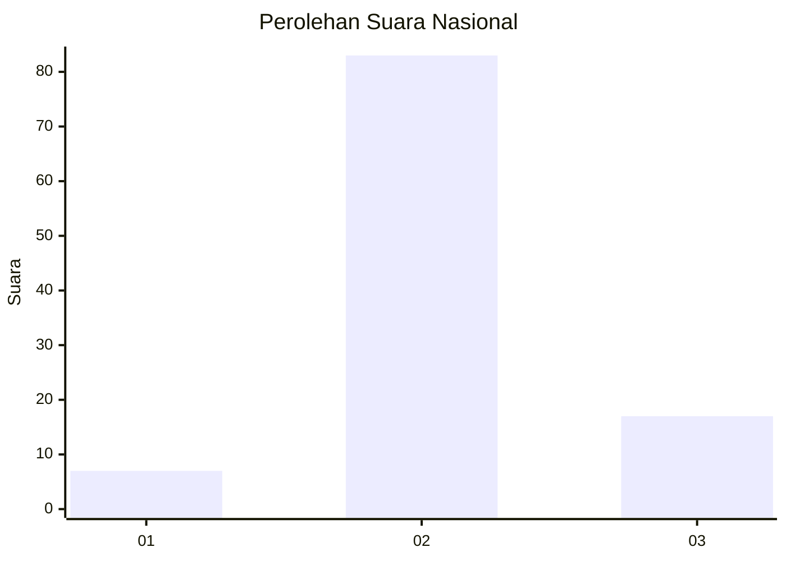
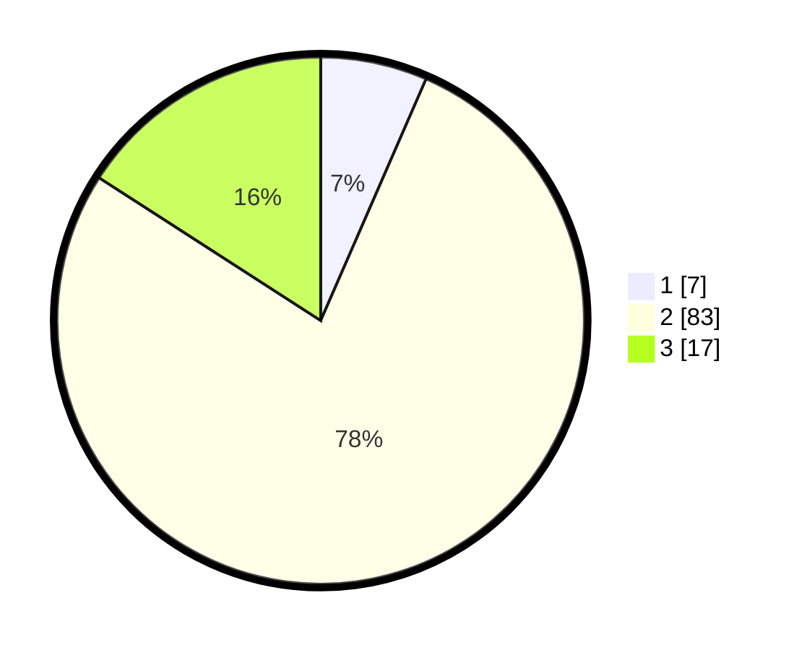

# Hasil

## Grafik

## Tabel

| No. | Nama Paslon    | Suara | Suara (raw) | Persentase |
|:--- |:-------------- | -----:| -----------:| ----------:|
| 1   | ANIES MUHAIMIN | 7     | [7][p-1]    | 6,54       |
| 2   | PRABOWO GIBRAN | 83    | [83][p-2]   | 77,57      |
| 3   | GANJAR MAHFUD  | 17    | [17][p-3]   | 15,89      |

[p-1]: https://github.com/gigit-pemilu/pemilu-2024/blob/main/pilpres/hitung-suara/sub/14-riau/sub/09-kuantan-singingi/sub/10-logas-tanah-darat/sub/2012-hulu-teso/sub/007-tps/sub/paslon-1.txt
[p-2]: https://github.com/gigit-pemilu/pemilu-2024/blob/main/pilpres/hitung-suara/sub/14-riau/sub/09-kuantan-singingi/sub/10-logas-tanah-darat/sub/2012-hulu-teso/sub/007-tps/sub/paslon-2.txt
[p-3]: https://github.com/gigit-pemilu/pemilu-2024/blob/main/pilpres/hitung-suara/sub/14-riau/sub/09-kuantan-singingi/sub/10-logas-tanah-darat/sub/2012-hulu-teso/sub/007-tps/sub/paslon-3.txt

## Foto C Plano

https://sirekap-obj-formc.kpu.go.id/3b5f/pemilu/ppwp/14/09/10/20/12/1409102012007-20240215-172005--6ea2fd24-431c-4e9d-b33e-7010c4beb9f7.jpg

https://sirekap-obj-formc.kpu.go.id/3b5f/pemilu/ppwp/14/09/10/20/12/1409102012007-20240215-072250--83217aa6-4431-4d19-b795-ce55f944a528.jpg

https://sirekap-obj-formc.kpu.go.id/3b5f/pemilu/ppwp/14/09/10/20/12/1409102012007-20240215-072300--abd9e67c-86a3-4232-b510-a428809f5b5d.jpg

## Metadata

| Key        | Value               |
| ---------- | ------------------- |
| Time Stamp | 2024-02-15 22:00:27 |

