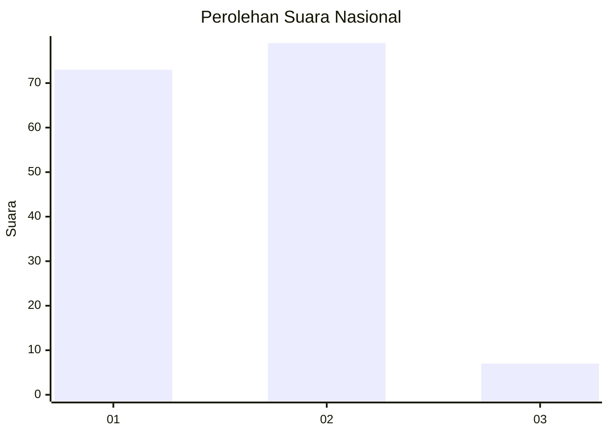
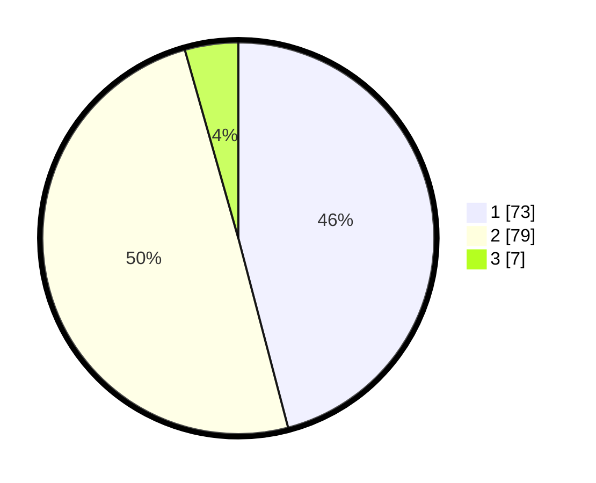

# Hasil

## Grafik

## Tabel

| No. | Nama Paslon    | Suara | Suara (raw) | Persentase |
|:--- |:-------------- | -----:| -----------:| ----------:|
| 1   | ANIES MUHAIMIN | 73    | [73][p-1]   | 45,91      |
| 2   | PRABOWO GIBRAN | 79    | [79][p-2]   | 49,69      |
| 3   | GANJAR MAHFUD  | 7     | [7][p-3]    | 4,40       |

[p-1]: https://github.com/gigit-pemilu/pemilu-2024/blob/main/pilpres/hitung-suara/sub/14-riau/sub/09-kuantan-singingi/sub/11-inuman/sub/2011-seberang-pulau-busuk/sub/004-tps/sub/paslon-1.txt
[p-2]: https://github.com/gigit-pemilu/pemilu-2024/blob/main/pilpres/hitung-suara/sub/14-riau/sub/09-kuantan-singingi/sub/11-inuman/sub/2011-seberang-pulau-busuk/sub/004-tps/sub/paslon-2.txt
[p-3]: https://github.com/gigit-pemilu/pemilu-2024/blob/main/pilpres/hitung-suara/sub/14-riau/sub/09-kuantan-singingi/sub/11-inuman/sub/2011-seberang-pulau-busuk/sub/004-tps/sub/paslon-3.txt

## Foto C Plano

https://sirekap-obj-formc.kpu.go.id/f97b/pemilu/ppwp/14/09/11/20/11/1409112011004-20240215-105124--1b4d8f8b-c84f-4d24-8f16-b7115abd7817.jpg

https://sirekap-obj-formc.kpu.go.id/f97b/pemilu/ppwp/14/09/11/20/11/1409112011004-20240215-105243--58441b87-5f64-4785-bbec-9c7e74ee4947.jpg

https://sirekap-obj-formc.kpu.go.id/f97b/pemilu/ppwp/14/09/11/20/11/1409112011004-20240215-105354--fed9fa6e-a00b-4624-9d13-9c1a1bec5c3b.jpg

## Metadata

| Key        | Value               |
| ---------- | ------------------- |
| Time Stamp | 2024-02-16 12:51:22 |

