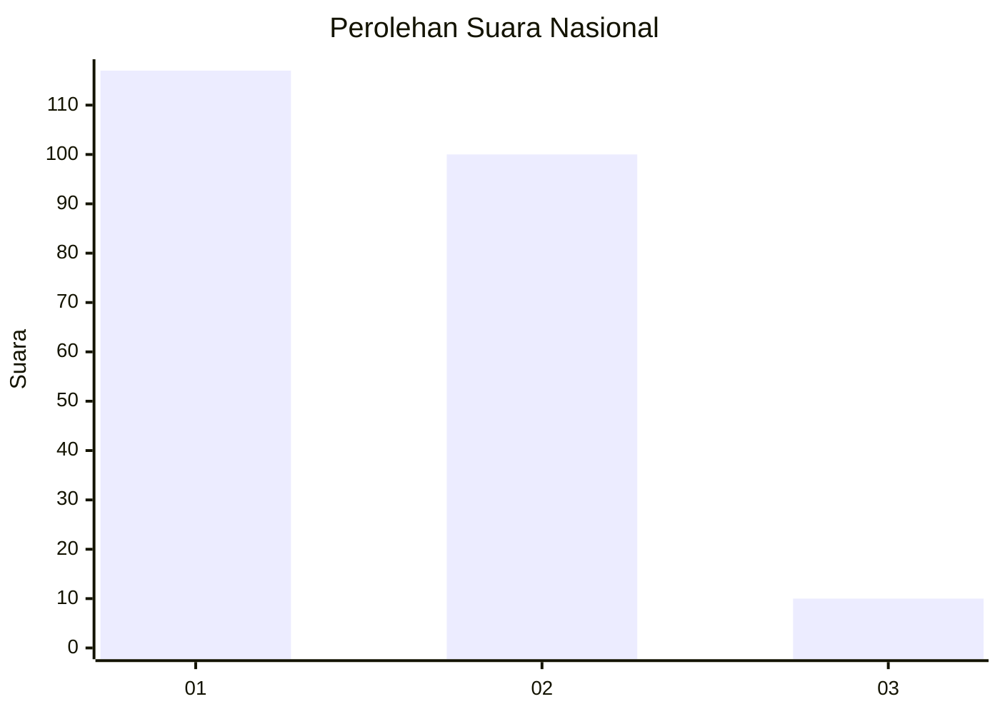
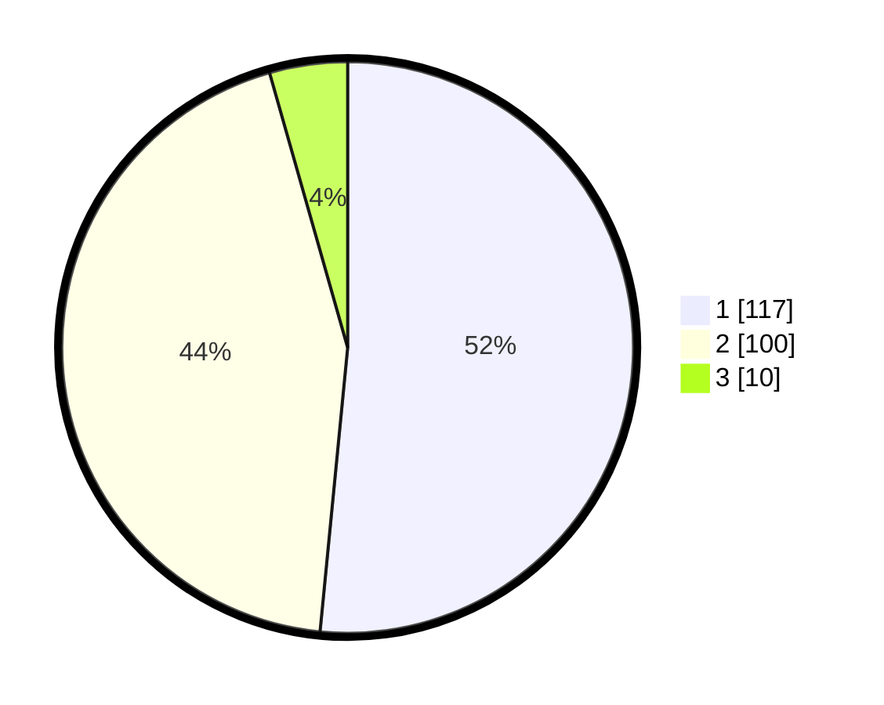

# Hasil

## Grafik

## Tabel

| No. | Nama Paslon    | Suara | Suara (raw) | Persentase |
|:--- |:-------------- | -----:| -----------:| ----------:|
| 1   | ANIES MUHAIMIN | 117   | [117][p-1]  | 51,54      |
| 2   | PRABOWO GIBRAN | 100   | [100][p-2]  | 44,05      |
| 3   | GANJAR MAHFUD  | 10    | [10][p-3]   | 4,41       |

[p-1]: https://github.com/gigit-pemilu/pemilu-2024/blob/main/pilpres/hitung-suara/sub/14-riau/sub/09-kuantan-singingi/sub/13-kuantan-hilir-seberang/sub/2001-pulaubaru/sub/002-tps/sub/paslon-1.txt
[p-2]: https://github.com/gigit-pemilu/pemilu-2024/blob/main/pilpres/hitung-suara/sub/14-riau/sub/09-kuantan-singingi/sub/13-kuantan-hilir-seberang/sub/2001-pulaubaru/sub/002-tps/sub/paslon-2.txt
[p-3]: https://github.com/gigit-pemilu/pemilu-2024/blob/main/pilpres/hitung-suara/sub/14-riau/sub/09-kuantan-singingi/sub/13-kuantan-hilir-seberang/sub/2001-pulaubaru/sub/002-tps/sub/paslon-3.txt

## Foto C Plano

https://sirekap-obj-formc.kpu.go.id/adcd/pemilu/ppwp/14/09/13/20/01/1409132001002-20240215-113035--fdc8d939-1101-4188-9704-076f0762ea32.jpg

https://sirekap-obj-formc.kpu.go.id/adcd/pemilu/ppwp/14/09/13/20/01/1409132001002-20240215-113124--18d2fbf6-9dd0-4fc3-80a3-617413f669a4.jpg

https://sirekap-obj-formc.kpu.go.id/adcd/pemilu/ppwp/14/09/13/20/01/1409132001002-20240215-113151--47eb18f0-8445-4e33-9e0e-4db83c562347.jpg

## Metadata

| Key        | Value               |
| ---------- | ------------------- |
| Time Stamp | 2024-02-15 16:00:26 |

