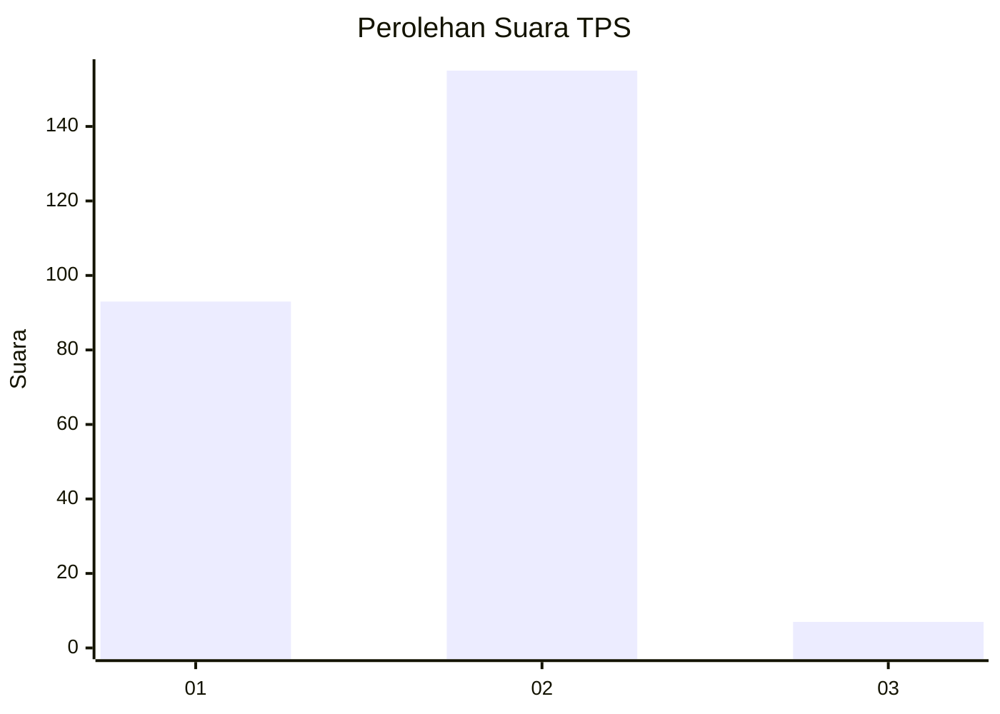
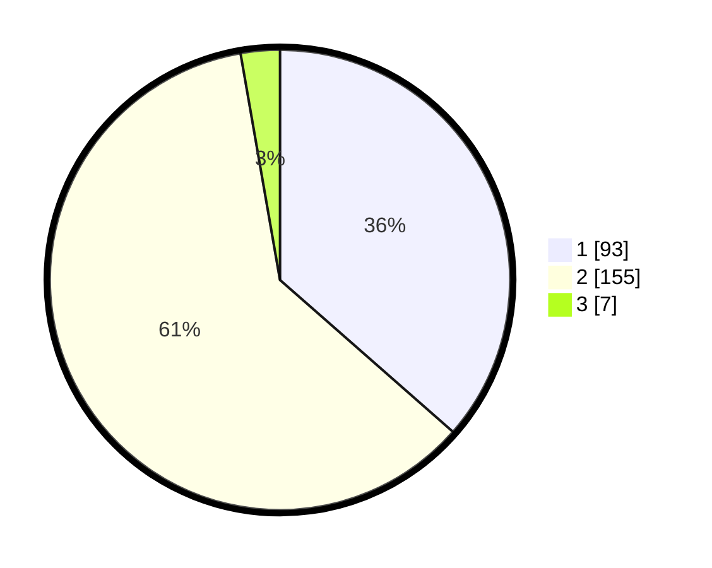

# Hasil

## Grafik

## Tabel

| No. | Nama Paslon    | Suara | Suara (raw) | Persentase |
|:--- |:-------------- | -----:| -----------:| ----------:|
| 1   | ANIES MUHAIMIN | 93    | [93][p-1]   | 36,47      |
| 2   | PRABOWO GIBRAN | 155   | [155][p-2]  | 60,78      |
| 3   | GANJAR MAHFUD  | 7     | [7][p-3]    | 2,75       |

[p-1]: https://github.com/gigit-pemilu/pemilu-2024-14-riau/blob/main/pilpres/hitung-suara/sub/14-riau/sub/09-kuantan-singingi/sub/13-kuantan-hilir-seberang/sub/2002-pulauberalo/sub/004-tps/sub/paslon-1.txt
[p-2]: https://github.com/gigit-pemilu/pemilu-2024-14-riau/blob/main/pilpres/hitung-suara/sub/14-riau/sub/09-kuantan-singingi/sub/13-kuantan-hilir-seberang/sub/2002-pulauberalo/sub/004-tps/sub/paslon-2.txt
[p-3]: https://github.com/gigit-pemilu/pemilu-2024-14-riau/blob/main/pilpres/hitung-suara/sub/14-riau/sub/09-kuantan-singingi/sub/13-kuantan-hilir-seberang/sub/2002-pulauberalo/sub/004-tps/sub/paslon-3.txt

## Foto C Plano

https://sirekap-obj-formc.kpu.go.id/7047/pemilu/ppwp/14/09/13/20/02/1409132002004-20240214-232842--e9ea9812-d5bb-4b85-8009-b6f9d883e36b.jpg

https://sirekap-obj-formc.kpu.go.id/7047/pemilu/ppwp/14/09/13/20/02/1409132002004-20240214-232952--fa5db2ae-ac52-438c-b17a-e4822d71135a.jpg

https://sirekap-obj-formc.kpu.go.id/7047/pemilu/ppwp/14/09/13/20/02/1409132002004-20240214-232814--c8454cde-7ad3-49c6-9051-9b913c9e6770.jpg

## Metadata

| Key        | Value               |
| ---------- | ------------------- |
| Time Stamp | 2024-02-15 18:00:26 |

