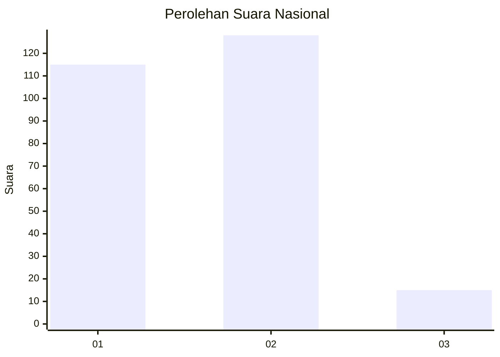
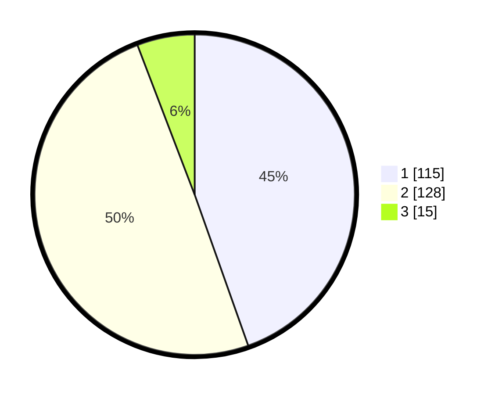

# Hasil

## Grafik

## Tabel

| No. | Nama Paslon    | Suara | Suara (raw) | Persentase |
|:--- |:-------------- | -----:| -----------:| ----------:|
| 1   | ANIES MUHAIMIN | 115   | [115][p-1]  | 44,57      |
| 2   | PRABOWO GIBRAN | 128   | [128][p-2]  | 49,61      |
| 3   | GANJAR MAHFUD  | 15    | [15][p-3]   | 5,81       |

[p-1]: https://github.com/gigit-pemilu/pemilu-2024/blob/main/pilpres/hitung-suara/sub/14-riau/sub/09-kuantan-singingi/sub/13-kuantan-hilir-seberang/sub/2004-pelukahan/sub/001-tps/sub/paslon-1.txt
[p-2]: https://github.com/gigit-pemilu/pemilu-2024/blob/main/pilpres/hitung-suara/sub/14-riau/sub/09-kuantan-singingi/sub/13-kuantan-hilir-seberang/sub/2004-pelukahan/sub/001-tps/sub/paslon-2.txt
[p-3]: https://github.com/gigit-pemilu/pemilu-2024/blob/main/pilpres/hitung-suara/sub/14-riau/sub/09-kuantan-singingi/sub/13-kuantan-hilir-seberang/sub/2004-pelukahan/sub/001-tps/sub/paslon-3.txt

## Foto C Plano

https://sirekap-obj-formc.kpu.go.id/b514/pemilu/ppwp/14/09/13/20/04/1409132004001-20240220-155555--29ed3e5a-5b8b-4391-aca7-20a16f5e7bc8.jpg

https://sirekap-obj-formc.kpu.go.id/b514/pemilu/ppwp/14/09/13/20/04/1409132004001-20240215-100616--7961df4e-d0b3-47e1-8c3b-68ef0b5ad00f.jpg

https://sirekap-obj-formc.kpu.go.id/b514/pemilu/ppwp/14/09/13/20/04/1409132004001-20240215-100725--f4721a38-fbab-48de-a4ff-6d7d0e6fc976.jpg

## Metadata

| Key        | Value               |
| ---------- | ------------------- |
| Time Stamp | 2024-02-20 16:00:00 |

