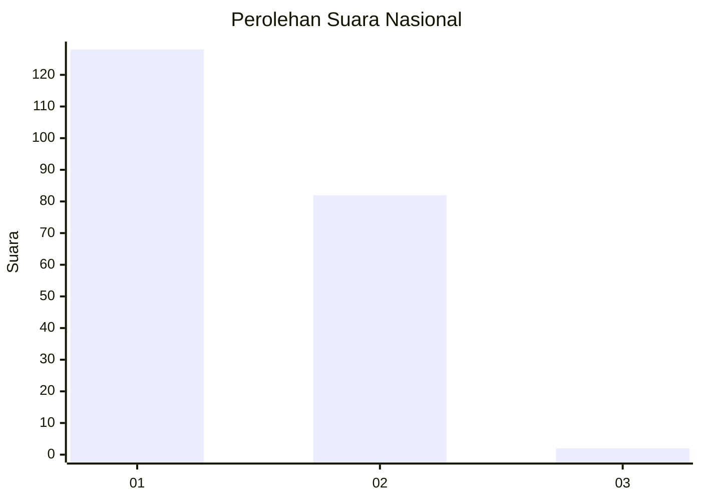
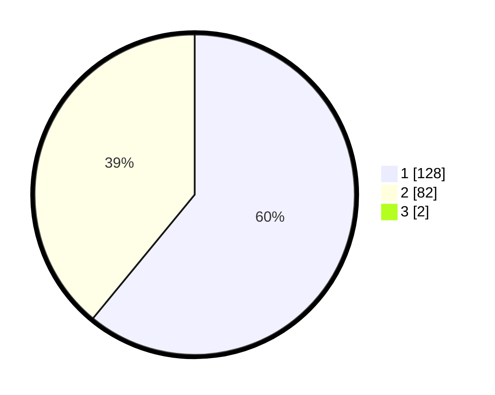

# Hasil

## Grafik

## Tabel

| No. | Nama Paslon    | Suara | Suara (raw) | Persentase |
|:--- |:-------------- | -----:| -----------:| ----------:|
| 1   | ANIES MUHAIMIN | 128   | [128][p-1]  | 60,38      |
| 2   | PRABOWO GIBRAN | 82    | [82][p-2]   | 38,68      |
| 3   | GANJAR MAHFUD  | 2     | [2][p-3]    | 0,94       |

[p-1]: https://github.com/gigit-pemilu/pemilu-2024/blob/main/pilpres/hitung-suara/sub/14-riau/sub/09-kuantan-singingi/sub/13-kuantan-hilir-seberang/sub/2010-kasang-limau-sundai/sub/001-tps/sub/paslon-1.txt
[p-2]: https://github.com/gigit-pemilu/pemilu-2024/blob/main/pilpres/hitung-suara/sub/14-riau/sub/09-kuantan-singingi/sub/13-kuantan-hilir-seberang/sub/2010-kasang-limau-sundai/sub/001-tps/sub/paslon-2.txt
[p-3]: https://github.com/gigit-pemilu/pemilu-2024/blob/main/pilpres/hitung-suara/sub/14-riau/sub/09-kuantan-singingi/sub/13-kuantan-hilir-seberang/sub/2010-kasang-limau-sundai/sub/001-tps/sub/paslon-3.txt

## Foto C Plano

https://sirekap-obj-formc.kpu.go.id/b114/pemilu/ppwp/14/09/13/20/10/1409132010001-20240220-163626--87a113c9-83bc-4edf-ae0c-ab09ad0ab9c8.jpg

https://sirekap-obj-formc.kpu.go.id/b114/pemilu/ppwp/14/09/13/20/10/1409132010001-20240215-184107--86e74d0c-545a-4d24-a26b-f5bcff6dd228.jpg

https://sirekap-obj-formc.kpu.go.id/b114/pemilu/ppwp/14/09/13/20/10/1409132010001-20240215-184150--26070c56-95c5-404a-95a3-95eb726d6ca1.jpg

## Metadata

| Key        | Value               |
| ---------- | ------------------- |
| Time Stamp | 2024-02-20 17:00:00 |

