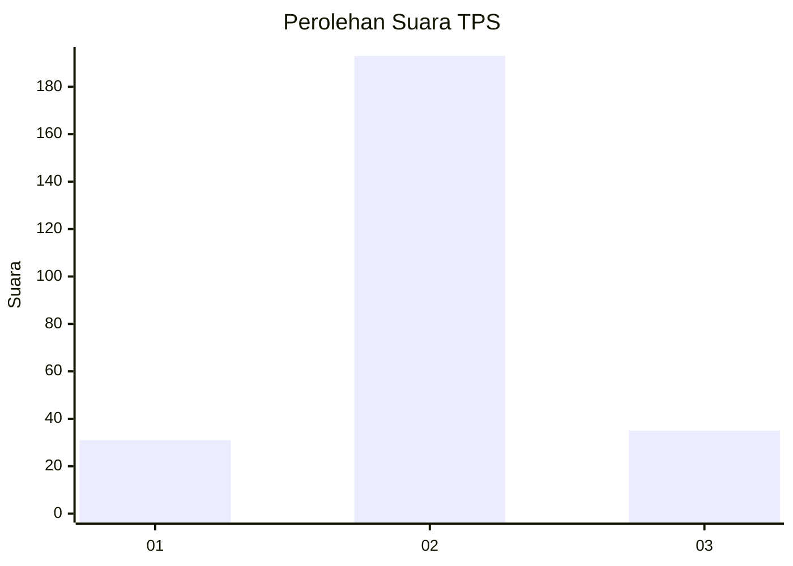
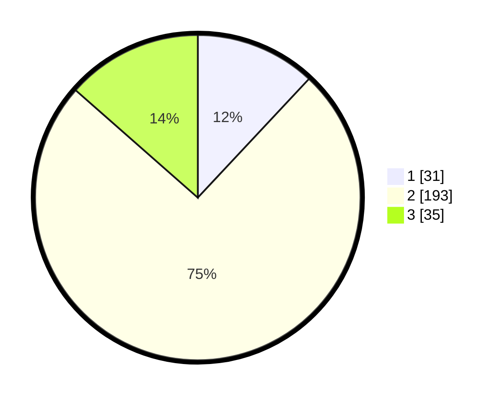

# Hasil

## Grafik

## Tabel

| No. | Nama Paslon    | Suara | Suara (raw) | Persentase |
|:--- |:-------------- | -----:| -----------:| ----------:|
| 1   | ANIES MUHAIMIN | 31    | [31][p-1]   | 11,97      |
| 2   | PRABOWO GIBRAN | 193   | [193][p-2]  | 74,52      |
| 3   | GANJAR MAHFUD  | 35    | [35][p-3]   | 13,51      |

[p-1]: https://github.com/gigit-pemilu/pemilu-2024-14-riau/blob/main/pilpres/hitung-suara/sub/14-riau/sub/09-kuantan-singingi/sub/14-sentajo-raya/sub/1015-beringin-jaya/sub/002-tps/sub/paslon-1.txt
[p-2]: https://github.com/gigit-pemilu/pemilu-2024-14-riau/blob/main/pilpres/hitung-suara/sub/14-riau/sub/09-kuantan-singingi/sub/14-sentajo-raya/sub/1015-beringin-jaya/sub/002-tps/sub/paslon-2.txt
[p-3]: https://github.com/gigit-pemilu/pemilu-2024-14-riau/blob/main/pilpres/hitung-suara/sub/14-riau/sub/09-kuantan-singingi/sub/14-sentajo-raya/sub/1015-beringin-jaya/sub/002-tps/sub/paslon-3.txt

## Foto C Plano

https://sirekap-obj-formc.kpu.go.id/9025/pemilu/ppwp/14/09/14/10/15/1409141015002-20240214-184826--fe069f58-9246-4afd-94d3-488ca60022bd.jpg

https://sirekap-obj-formc.kpu.go.id/9025/pemilu/ppwp/14/09/14/10/15/1409141015002-20240214-184924--21f6f3d7-42e8-4f34-992b-e6e1911b6844.jpg

https://sirekap-obj-formc.kpu.go.id/9025/pemilu/ppwp/14/09/14/10/15/1409141015002-20240214-185050--0ee01eee-2c1a-44c2-82dd-7f2e08ed7161.jpg

## Metadata

| Key        | Value               |
| ---------- | ------------------- |
| Time Stamp | 2024-02-15 18:00:26 |

