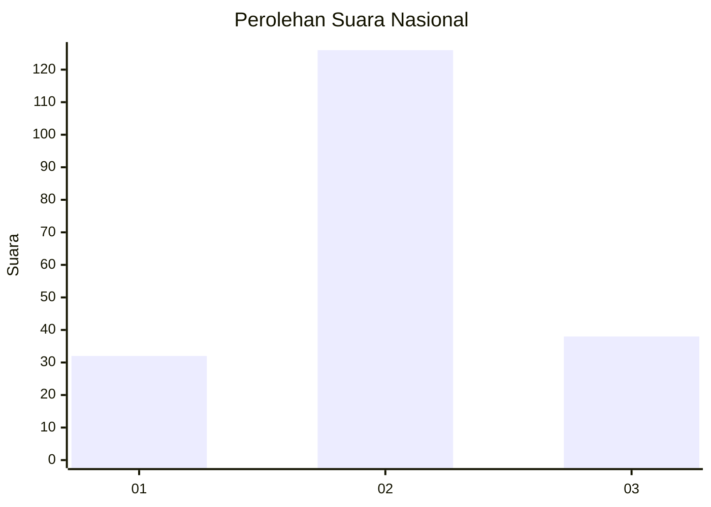
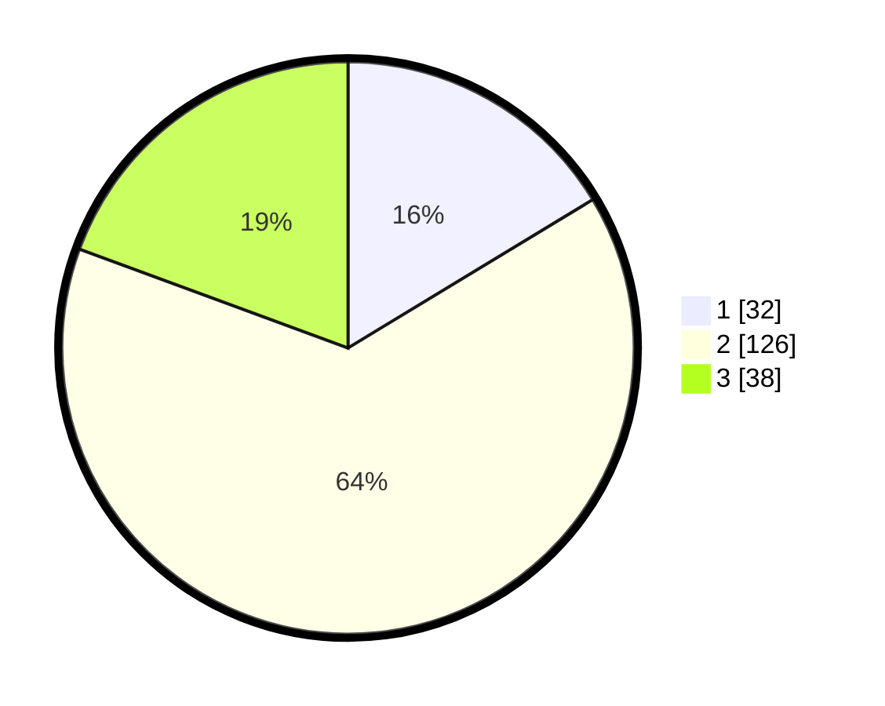

# Hasil

## Grafik

## Tabel

| No. | Nama Paslon    | Suara | Suara (raw) | Persentase |
|:--- |:-------------- | -----:| -----------:| ----------:|
| 1   | ANIES MUHAIMIN | 32    | [32][p-1]   | 16,33      |
| 2   | PRABOWO GIBRAN | 126   | [126][p-2]  | 64,29      |
| 3   | GANJAR MAHFUD  | 38    | [38][p-3]   | 19,39      |

[p-1]: https://github.com/gigit-pemilu/pemilu-2024/blob/main/pilpres/hitung-suara/sub/14-riau/sub/09-kuantan-singingi/sub/14-sentajo-raya/sub/1015-beringin-jaya/sub/005-tps/sub/paslon-1.txt
[p-2]: https://github.com/gigit-pemilu/pemilu-2024/blob/main/pilpres/hitung-suara/sub/14-riau/sub/09-kuantan-singingi/sub/14-sentajo-raya/sub/1015-beringin-jaya/sub/005-tps/sub/paslon-2.txt
[p-3]: https://github.com/gigit-pemilu/pemilu-2024/blob/main/pilpres/hitung-suara/sub/14-riau/sub/09-kuantan-singingi/sub/14-sentajo-raya/sub/1015-beringin-jaya/sub/005-tps/sub/paslon-3.txt

## Foto C Plano

https://sirekap-obj-formc.kpu.go.id/6a62/pemilu/ppwp/14/09/14/10/15/1409141015005-20240215-010951--4ba066ca-fdca-45ef-89a3-e27eff8124dd.jpg

https://sirekap-obj-formc.kpu.go.id/6a62/pemilu/ppwp/14/09/14/10/15/1409141015005-20240215-011142--67160109-aed4-4eda-8a4f-41819e38c447.jpg

https://sirekap-obj-formc.kpu.go.id/6a62/pemilu/ppwp/14/09/14/10/15/1409141015005-20240215-011259--5425beca-61e3-43d3-b294-6978ce3fb915.jpg

## Metadata

| Key        | Value               |
| ---------- | ------------------- |
| Time Stamp | 2024-02-15 18:00:26 |

