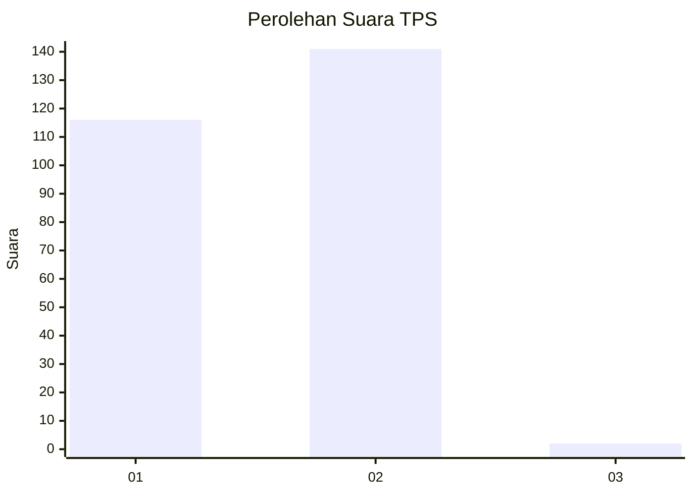
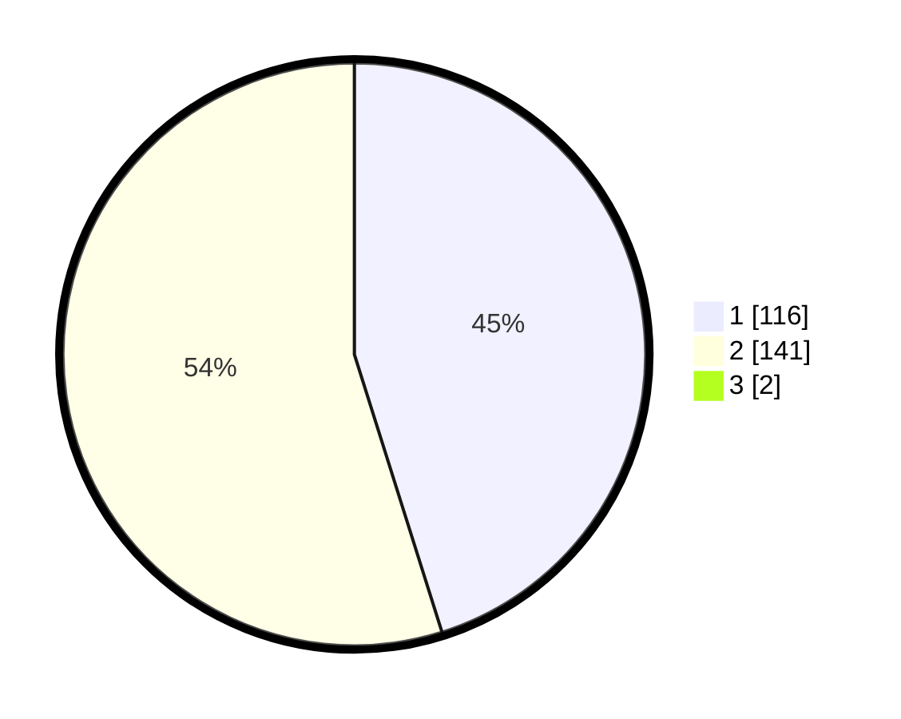

# Hasil

## Grafik

## Tabel

| No. | Nama Paslon    | Suara | Suara (raw) | Persentase |
|:--- |:-------------- | -----:| -----------:| ----------:|
| 1   | ANIES MUHAIMIN | 116   | [116][p-1]  | 44,79      |
| 2   | PRABOWO GIBRAN | 141   | [141][p-2]  | 54,44      |
| 3   | GANJAR MAHFUD  | 2     | [2][p-3]    | 0,77       |

[p-1]: https://github.com/gigit-pemilu/pemilu-2024-14-riau/blob/main/pilpres/hitung-suara/sub/14-riau/sub/09-kuantan-singingi/sub/14-sentajo-raya/sub/2001-pulaukomang-sentajo/sub/004-tps/sub/paslon-1.txt
[p-2]: https://github.com/gigit-pemilu/pemilu-2024-14-riau/blob/main/pilpres/hitung-suara/sub/14-riau/sub/09-kuantan-singingi/sub/14-sentajo-raya/sub/2001-pulaukomang-sentajo/sub/004-tps/sub/paslon-2.txt
[p-3]: https://github.com/gigit-pemilu/pemilu-2024-14-riau/blob/main/pilpres/hitung-suara/sub/14-riau/sub/09-kuantan-singingi/sub/14-sentajo-raya/sub/2001-pulaukomang-sentajo/sub/004-tps/sub/paslon-3.txt

## Foto C Plano

https://sirekap-obj-formc.kpu.go.id/c19a/pemilu/ppwp/14/09/14/20/01/1409142001004-20240214-155408--5a28475c-b5a4-44dc-aaff-59b4f082ef0e.jpg

https://sirekap-obj-formc.kpu.go.id/c19a/pemilu/ppwp/14/09/14/20/01/1409142001004-20240214-155150--2c9103da-f525-4b47-aae0-f61b8f50b5db.jpg

https://sirekap-obj-formc.kpu.go.id/c19a/pemilu/ppwp/14/09/14/20/01/1409142001004-20240214-155310--7e4f7cf1-aae8-446c-9aa0-d46da6e3f4d4.jpg

## Metadata

| Key        | Value               |
| ---------- | ------------------- |
| Time Stamp | 2024-02-14 21:46:01 |

