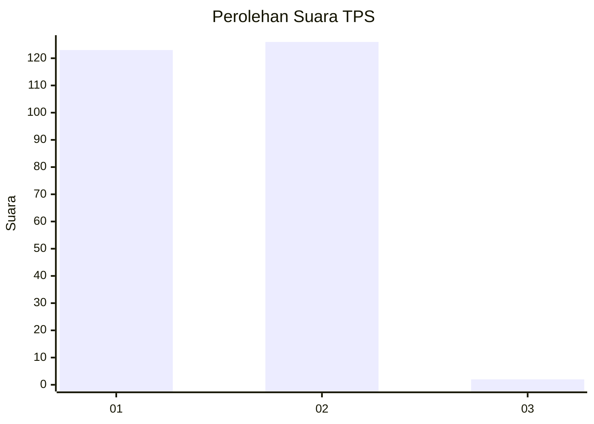
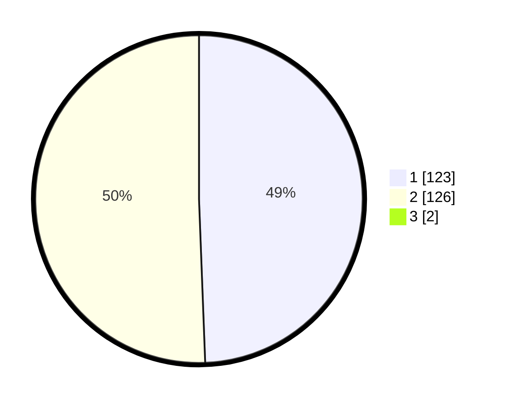

# Hasil

## Grafik

## Tabel

| No. | Nama Paslon    | Suara | Suara (raw) | Persentase |
|:--- |:-------------- | -----:| -----------:| ----------:|
| 1   | ANIES MUHAIMIN | 123   | [123][p-1]  | 49,00      |
| 2   | PRABOWO GIBRAN | 126   | [126][p-2]  | 50,20      |
| 3   | GANJAR MAHFUD  | 2     | [2][p-3]    | 0,80       |

[p-1]: https://github.com/gigit-pemilu/pemilu-2024-14-riau/blob/main/pilpres/hitung-suara/sub/14-riau/sub/09-kuantan-singingi/sub/14-sentajo-raya/sub/2002-muaro-sentajo/sub/002-tps/sub/paslon-1.txt
[p-2]: https://github.com/gigit-pemilu/pemilu-2024-14-riau/blob/main/pilpres/hitung-suara/sub/14-riau/sub/09-kuantan-singingi/sub/14-sentajo-raya/sub/2002-muaro-sentajo/sub/002-tps/sub/paslon-2.txt
[p-3]: https://github.com/gigit-pemilu/pemilu-2024-14-riau/blob/main/pilpres/hitung-suara/sub/14-riau/sub/09-kuantan-singingi/sub/14-sentajo-raya/sub/2002-muaro-sentajo/sub/002-tps/sub/paslon-3.txt

## Foto C Plano

https://sirekap-obj-formc.kpu.go.id/2445/pemilu/ppwp/14/09/14/20/02/1409142002002-20240215-111450--e2b936d6-05ee-43d4-adb7-c8cbe00e95e6.jpg

https://sirekap-obj-formc.kpu.go.id/2445/pemilu/ppwp/14/09/14/20/02/1409142002002-20240215-111658--dd2f5ae0-3faa-4c5d-80e5-86ed4663bbee.jpg

https://sirekap-obj-formc.kpu.go.id/2445/pemilu/ppwp/14/09/14/20/02/1409142002002-20240215-111941--ea434a18-5d48-45b6-b173-df135829b6cb.jpg

## Metadata

| Key        | Value               |
| ---------- | ------------------- |
| Time Stamp | 2024-02-15 18:00:26 |

