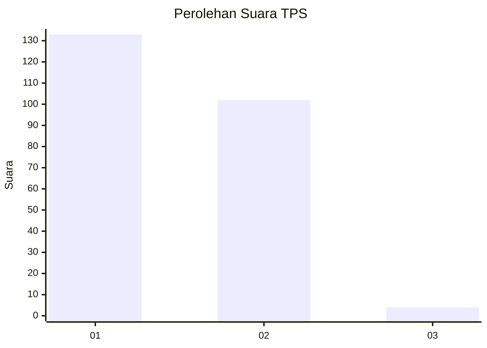
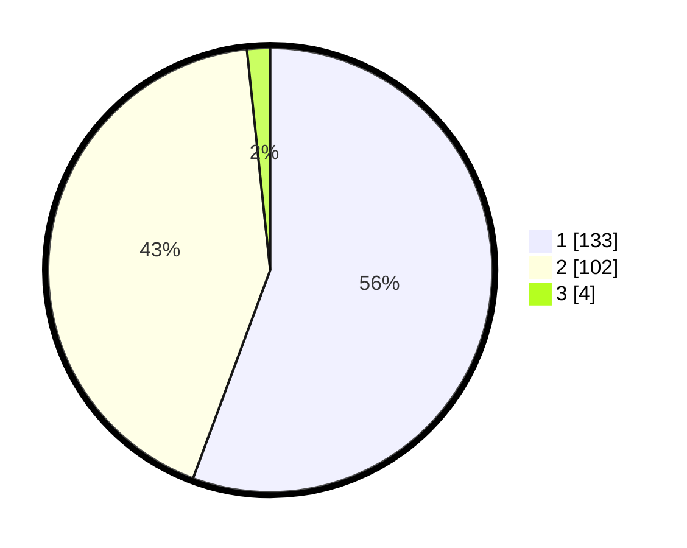

# Hasil

## Grafik

## Tabel

| No. | Nama Paslon    | Suara | Suara (raw) | Persentase |
|:--- |:-------------- | -----:| -----------:| ----------:|
| 1   | ANIES MUHAIMIN | 133   | [133][p-1]  | 55,65      |
| 2   | PRABOWO GIBRAN | 102   | [102][p-2]  | 42,68      |
| 3   | GANJAR MAHFUD  | 4     | [4][p-3]    | 1,67       |

[p-1]: https://github.com/gigit-pemilu/pemilu-2024-14-riau/blob/main/pilpres/hitung-suara/sub/14-riau/sub/09-kuantan-singingi/sub/14-sentajo-raya/sub/2004-kampungbaru-sentajo/sub/004-tps/sub/paslon-1.txt
[p-2]: https://github.com/gigit-pemilu/pemilu-2024-14-riau/blob/main/pilpres/hitung-suara/sub/14-riau/sub/09-kuantan-singingi/sub/14-sentajo-raya/sub/2004-kampungbaru-sentajo/sub/004-tps/sub/paslon-2.txt
[p-3]: https://github.com/gigit-pemilu/pemilu-2024-14-riau/blob/main/pilpres/hitung-suara/sub/14-riau/sub/09-kuantan-singingi/sub/14-sentajo-raya/sub/2004-kampungbaru-sentajo/sub/004-tps/sub/paslon-3.txt

## Foto C Plano

https://sirekap-obj-formc.kpu.go.id/298c/pemilu/ppwp/14/09/14/20/04/1409142004004-20240215-182831--d56ea11a-f1b4-4282-9dc6-5efabf47c755.jpg

https://sirekap-obj-formc.kpu.go.id/298c/pemilu/ppwp/14/09/14/20/04/1409142004004-20240215-190906--7eb55917-526e-4f77-813c-76105ff3942c.jpg

https://sirekap-obj-formc.kpu.go.id/298c/pemilu/ppwp/14/09/14/20/04/1409142004004-20240215-183045--cff7e294-0745-4b3d-aea4-4b2164d068fd.jpg

## Metadata

| Key        | Value               |
| ---------- | ------------------- |
| Time Stamp | 2024-02-15 20:30:46 |

