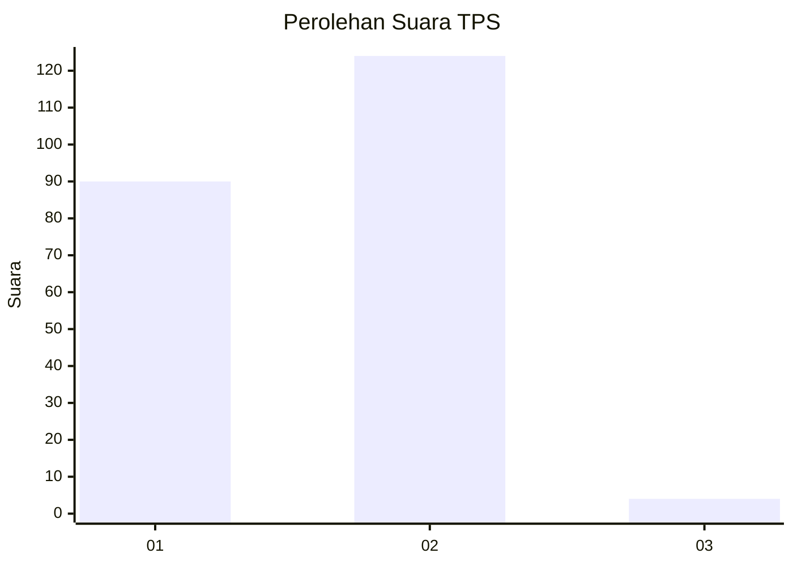
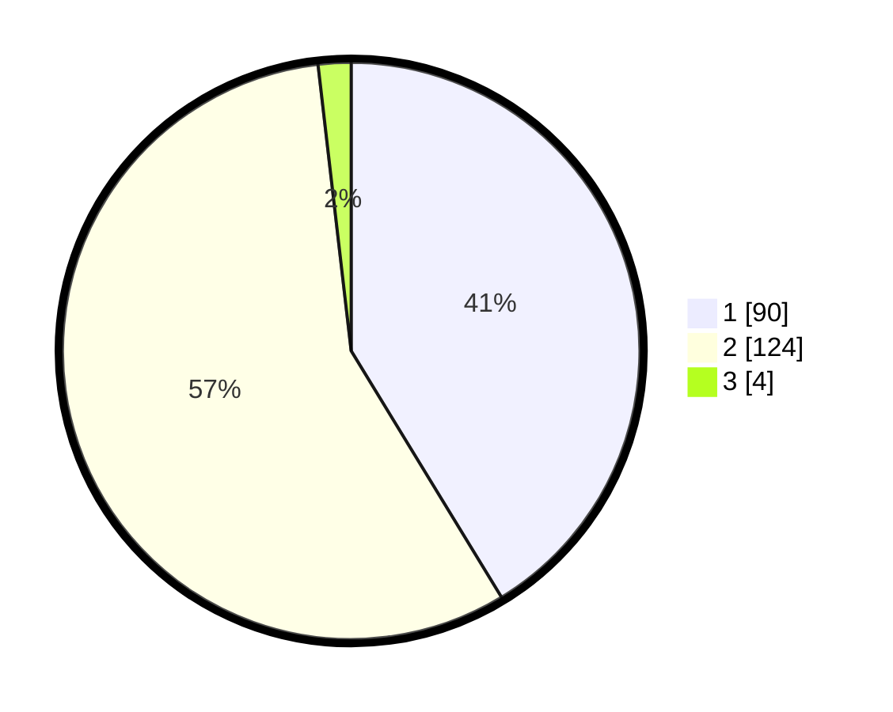

# Hasil

## Grafik

## Tabel

| No. | Nama Paslon    | Suara | Suara (raw) | Persentase |
|:--- |:-------------- | -----:| -----------:| ----------:|
| 1   | ANIES MUHAIMIN | 90    | [90][p-1]   | 41,28      |
| 2   | PRABOWO GIBRAN | 124   | [124][p-2]  | 56,88      |
| 3   | GANJAR MAHFUD  | 4     | [4][p-3]    | 1,83       |

[p-1]: https://github.com/gigit-pemilu/pemilu-2024-14-riau/blob/main/pilpres/hitung-suara/sub/14-riau/sub/09-kuantan-singingi/sub/14-sentajo-raya/sub/2005-pulaukopung-sentajo/sub/001-tps/sub/paslon-1.txt
[p-2]: https://github.com/gigit-pemilu/pemilu-2024-14-riau/blob/main/pilpres/hitung-suara/sub/14-riau/sub/09-kuantan-singingi/sub/14-sentajo-raya/sub/2005-pulaukopung-sentajo/sub/001-tps/sub/paslon-2.txt
[p-3]: https://github.com/gigit-pemilu/pemilu-2024-14-riau/blob/main/pilpres/hitung-suara/sub/14-riau/sub/09-kuantan-singingi/sub/14-sentajo-raya/sub/2005-pulaukopung-sentajo/sub/001-tps/sub/paslon-3.txt

## Foto C Plano

https://sirekap-obj-formc.kpu.go.id/808c/pemilu/ppwp/14/09/14/20/05/1409142005001-20240217-194211--7310e5ea-d92b-4300-af6a-3169c41f0d1c.jpg

https://sirekap-obj-formc.kpu.go.id/808c/pemilu/ppwp/14/09/14/20/05/1409142005001-20240217-194402--2a761398-53ab-4c5e-b087-96d28fc08031.jpg

https://sirekap-obj-formc.kpu.go.id/808c/pemilu/ppwp/14/09/14/20/05/1409142005001-20240217-194547--06d8b8e1-c527-470c-9df8-9e22ecc43d12.jpg

## Metadata

| Key        | Value               |
| ---------- | ------------------- |
| Time Stamp | 2024-02-19 06:16:00 |

