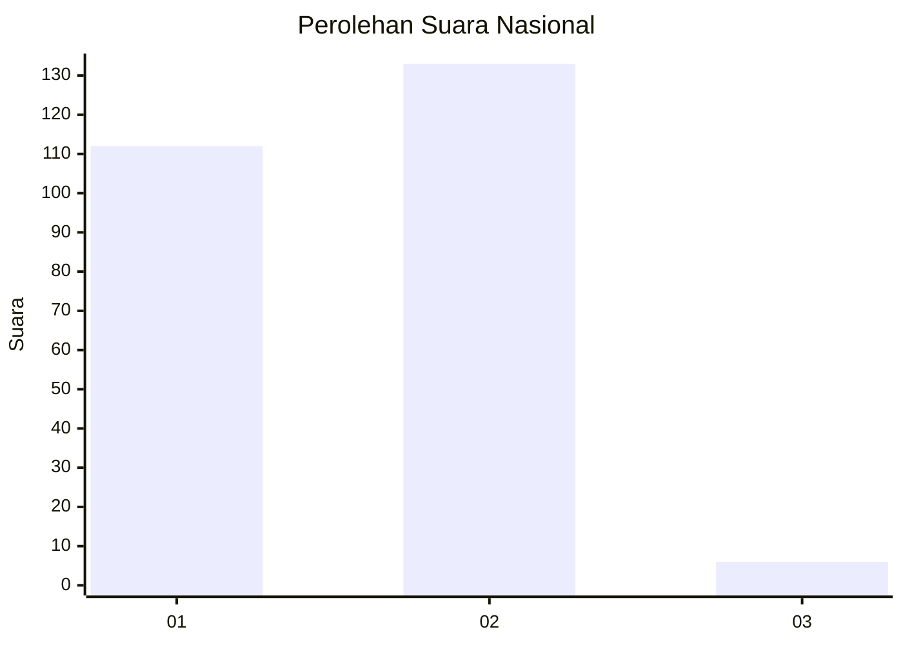
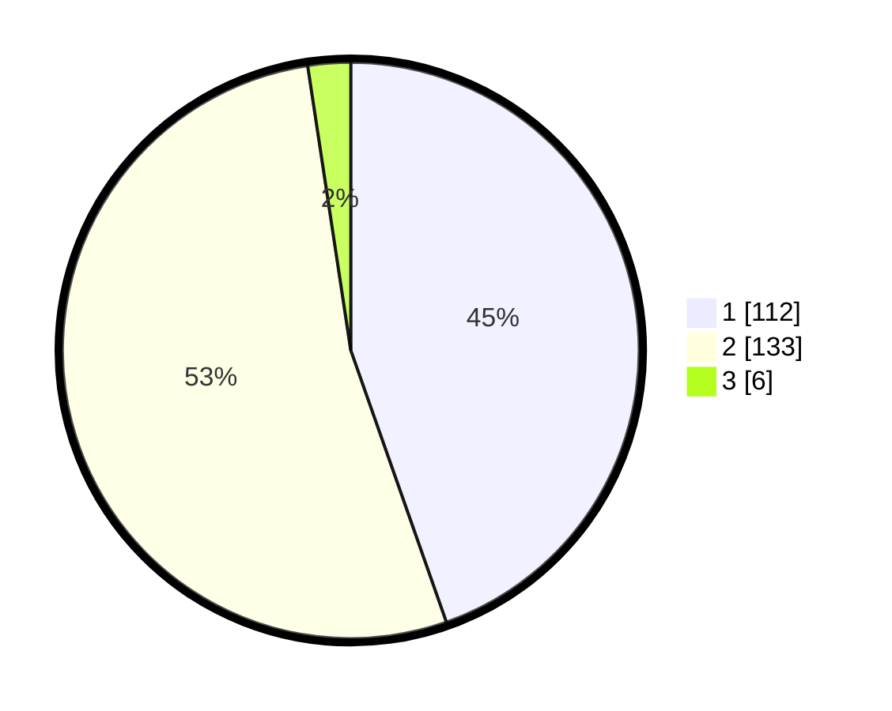

# Hasil

## Grafik

## Tabel

| No. | Nama Paslon    | Suara | Suara (raw) | Persentase |
|:--- |:-------------- | -----:| -----------:| ----------:|
| 1   | ANIES MUHAIMIN | 112   | [112][p-1]  | 44,62      |
| 2   | PRABOWO GIBRAN | 133   | [133][p-2]  | 52,99      |
| 3   | GANJAR MAHFUD  | 6     | [6][p-3]    | 2,39       |

[p-1]: https://github.com/gigit-pemilu/pemilu-2024/blob/main/pilpres/hitung-suara/sub/14-riau/sub/09-kuantan-singingi/sub/14-sentajo-raya/sub/2009-jalur-patah/sub/001-tps/sub/paslon-1.txt
[p-2]: https://github.com/gigit-pemilu/pemilu-2024/blob/main/pilpres/hitung-suara/sub/14-riau/sub/09-kuantan-singingi/sub/14-sentajo-raya/sub/2009-jalur-patah/sub/001-tps/sub/paslon-2.txt
[p-3]: https://github.com/gigit-pemilu/pemilu-2024/blob/main/pilpres/hitung-suara/sub/14-riau/sub/09-kuantan-singingi/sub/14-sentajo-raya/sub/2009-jalur-patah/sub/001-tps/sub/paslon-3.txt

## Foto C Plano

https://sirekap-obj-formc.kpu.go.id/51aa/pemilu/ppwp/14/09/14/20/09/1409142009001-20240214-223342--28f8dbd6-24da-4aa4-9c63-e7cfe8c087b4.jpg

https://sirekap-obj-formc.kpu.go.id/51aa/pemilu/ppwp/14/09/14/20/09/1409142009001-20240214-223425--d3311094-41e9-4527-aeb7-23ef669ba254.jpg

https://sirekap-obj-formc.kpu.go.id/51aa/pemilu/ppwp/14/09/14/20/09/1409142009001-20240214-223727--2258f165-db09-444d-a6f0-f403b6635d86.jpg

## Metadata

| Key        | Value               |
| ---------- | ------------------- |
| Time Stamp | 2024-02-15 16:00:26 |

