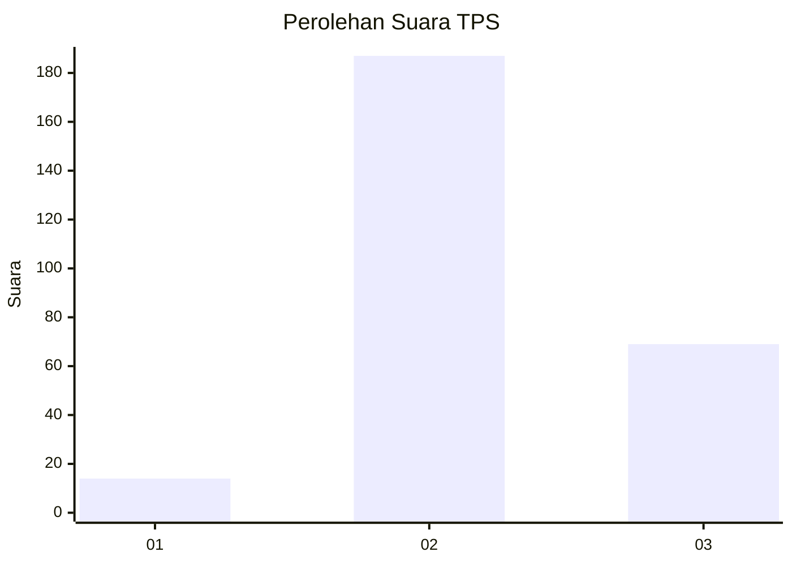
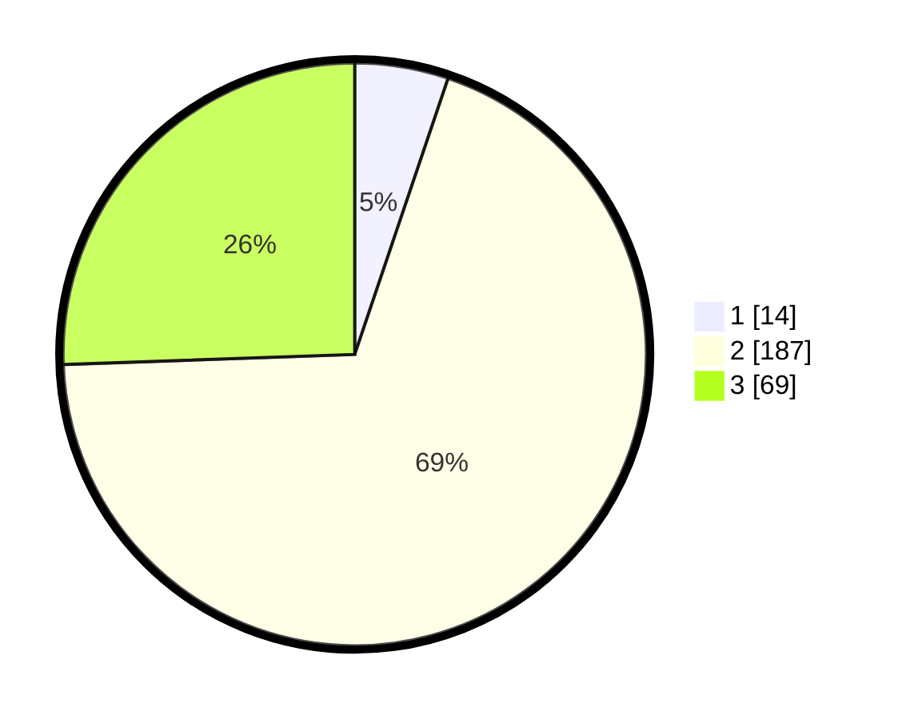

# Hasil

## Grafik

## Tabel

| No. | Nama Paslon    | Suara | Suara (raw) | Persentase |
|:--- |:-------------- | -----:| -----------:| ----------:|
| 1   | ANIES MUHAIMIN | 14    | [14][p-1]   | 5,19       |
| 2   | PRABOWO GIBRAN | 187   | [187][p-2]  | 69,26      |
| 3   | GANJAR MAHFUD  | 69    | [69][p-3]   | 25,56      |

[p-1]: https://github.com/gigit-pemilu/pemilu-2024-14-riau/blob/main/pilpres/hitung-suara/sub/14-riau/sub/09-kuantan-singingi/sub/14-sentajo-raya/sub/2012-langsat-hulu/sub/003-tps/sub/paslon-1.txt
[p-2]: https://github.com/gigit-pemilu/pemilu-2024-14-riau/blob/main/pilpres/hitung-suara/sub/14-riau/sub/09-kuantan-singingi/sub/14-sentajo-raya/sub/2012-langsat-hulu/sub/003-tps/sub/paslon-2.txt
[p-3]: https://github.com/gigit-pemilu/pemilu-2024-14-riau/blob/main/pilpres/hitung-suara/sub/14-riau/sub/09-kuantan-singingi/sub/14-sentajo-raya/sub/2012-langsat-hulu/sub/003-tps/sub/paslon-3.txt

## Foto C Plano

https://sirekap-obj-formc.kpu.go.id/8106/pemilu/ppwp/14/09/14/20/12/1409142012003-20240214-191419--8fdeabcb-3606-43c1-8fc6-b0e79419c83b.jpg

https://sirekap-obj-formc.kpu.go.id/8106/pemilu/ppwp/14/09/14/20/12/1409142012003-20240214-191454--9a445218-3656-42f9-b64a-c226c4eb5a9d.jpg

https://sirekap-obj-formc.kpu.go.id/8106/pemilu/ppwp/14/09/14/20/12/1409142012003-20240214-191525--b05f39d0-755b-4960-8617-dd5d632a585a.jpg

## Metadata

| Key        | Value               |
| ---------- | ------------------- |
| Time Stamp | 2024-02-14 21:46:01 |

