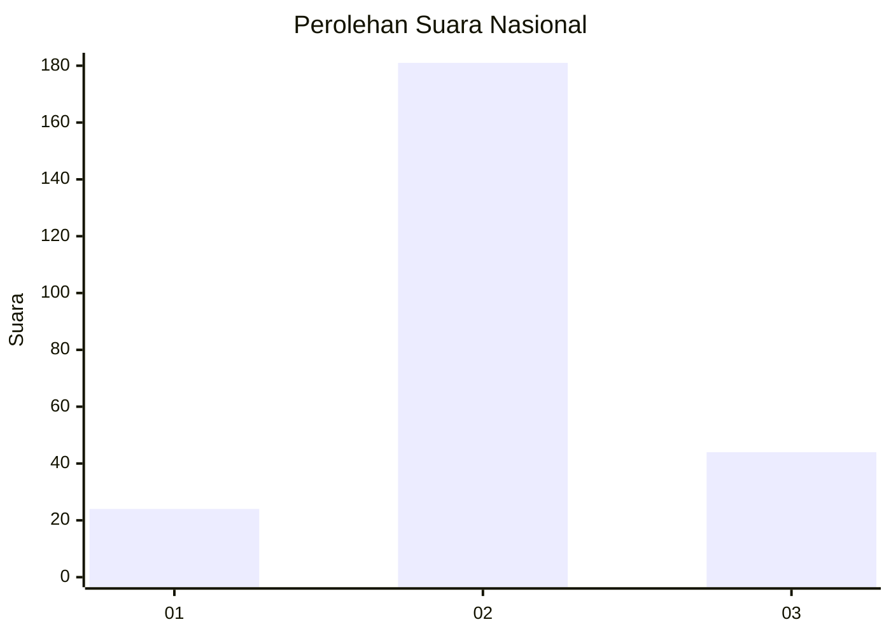
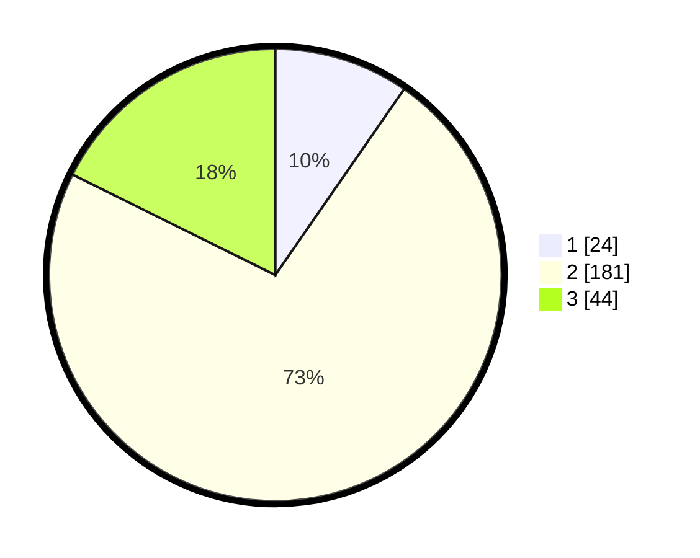

# Hasil

## Grafik

## Tabel

| No. | Nama Paslon    | Suara | Suara (raw) | Persentase |
|:--- |:-------------- | -----:| -----------:| ----------:|
| 1   | ANIES MUHAIMIN | 24    | [24][p-1]   | 9,64       |
| 2   | PRABOWO GIBRAN | 181   | [181][p-2]  | 72,69      |
| 3   | GANJAR MAHFUD  | 44    | [44][p-3]   | 17,67      |

[p-1]: https://github.com/gigit-pemilu/pemilu-2024/blob/main/pilpres/hitung-suara/sub/14-riau/sub/09-kuantan-singingi/sub/14-sentajo-raya/sub/2013-muara-langsat/sub/006-tps/sub/paslon-1.txt
[p-2]: https://github.com/gigit-pemilu/pemilu-2024/blob/main/pilpres/hitung-suara/sub/14-riau/sub/09-kuantan-singingi/sub/14-sentajo-raya/sub/2013-muara-langsat/sub/006-tps/sub/paslon-2.txt
[p-3]: https://github.com/gigit-pemilu/pemilu-2024/blob/main/pilpres/hitung-suara/sub/14-riau/sub/09-kuantan-singingi/sub/14-sentajo-raya/sub/2013-muara-langsat/sub/006-tps/sub/paslon-3.txt

## Foto C Plano

https://sirekap-obj-formc.kpu.go.id/5e5f/pemilu/ppwp/14/09/14/20/13/1409142013006-20240214-190950--263defeb-641c-4c0a-b898-c965c2aa63aa.jpg

https://sirekap-obj-formc.kpu.go.id/5e5f/pemilu/ppwp/14/09/14/20/13/1409142013006-20240215-013634--5ebbd850-3aba-4c84-8379-3cc66b7f2dd5.jpg

https://sirekap-obj-formc.kpu.go.id/5e5f/pemilu/ppwp/14/09/14/20/13/1409142013006-20240215-013013--34caf507-9d7a-4b58-8ffa-1fe64b65e90d.jpg

## Metadata

| Key        | Value               |
| ---------- | ------------------- |
| Time Stamp | 2024-02-15 12:00:28 |

