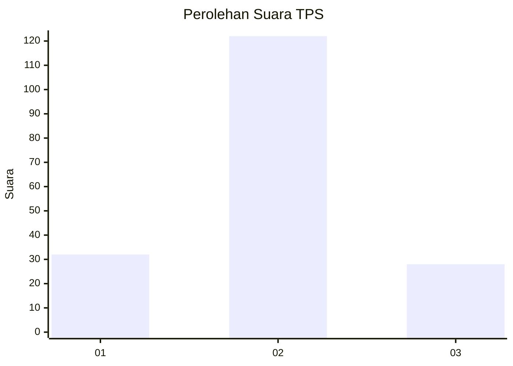
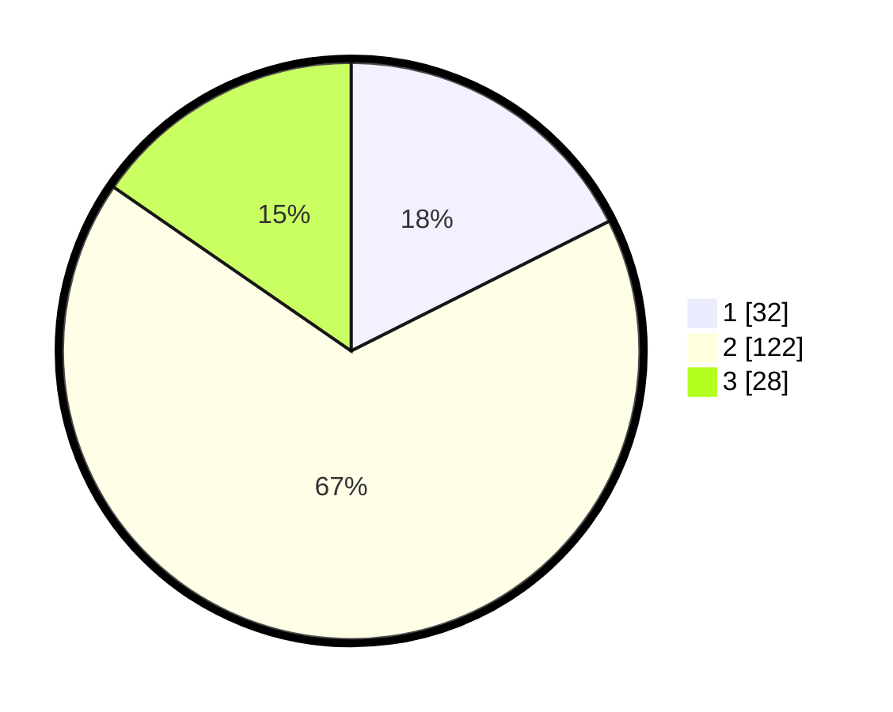

# Hasil

## Grafik

## Tabel

| No. | Nama Paslon    | Suara | Suara (raw) | Persentase |
|:--- |:-------------- | -----:| -----------:| ----------:|
| 1   | ANIES MUHAIMIN | 32    | [32][p-1]   | 17,58      |
| 2   | PRABOWO GIBRAN | 122   | [122][p-2]  | 67,03      |
| 3   | GANJAR MAHFUD  | 28    | [28][p-3]   | 15,38      |

[p-1]: https://github.com/gigit-pemilu/pemilu-2024-14-riau/blob/main/pilpres/hitung-suara/sub/14-riau/sub/09-kuantan-singingi/sub/15-pucuk-rantau/sub/2005-sungaibesar/sub/003-tps/sub/paslon-1.txt
[p-2]: https://github.com/gigit-pemilu/pemilu-2024-14-riau/blob/main/pilpres/hitung-suara/sub/14-riau/sub/09-kuantan-singingi/sub/15-pucuk-rantau/sub/2005-sungaibesar/sub/003-tps/sub/paslon-2.txt
[p-3]: https://github.com/gigit-pemilu/pemilu-2024-14-riau/blob/main/pilpres/hitung-suara/sub/14-riau/sub/09-kuantan-singingi/sub/15-pucuk-rantau/sub/2005-sungaibesar/sub/003-tps/sub/paslon-3.txt

## Foto C Plano

https://sirekap-obj-formc.kpu.go.id/d81b/pemilu/ppwp/14/09/15/20/05/1409152005003-20240214-235555--aee4e9a3-eb59-491c-b5f3-c300a8d4a31a.jpg

https://sirekap-obj-formc.kpu.go.id/d81b/pemilu/ppwp/14/09/15/20/05/1409152005003-20240214-235751--6ddd7ff3-e766-4d9e-9401-5c8820ae9c75.jpg

https://sirekap-obj-formc.kpu.go.id/d81b/pemilu/ppwp/14/09/15/20/05/1409152005003-20240214-235948--c844d206-b1c6-4b1f-9959-1b03c39c44df.jpg

## Metadata

| Key        | Value               |
| ---------- | ------------------- |
| Time Stamp | 2024-02-15 17:00:25 |

