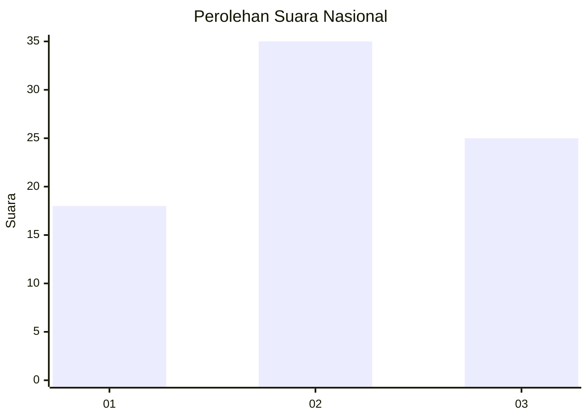
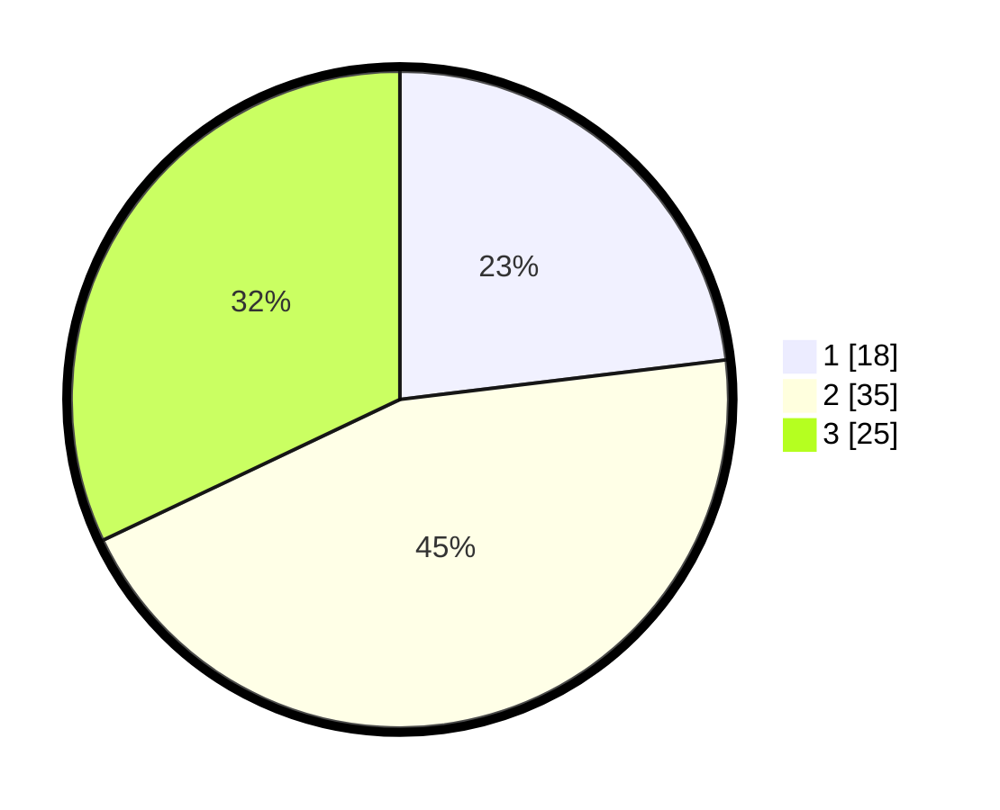

# Hasil

## Grafik

## Tabel

| No. | Nama Paslon    | Suara | Suara (raw) | Persentase |
|:--- |:-------------- | -----:| -----------:| ----------:|
| 1   | ANIES MUHAIMIN | 18    | [18][p-1]   | 23,08      |
| 2   | PRABOWO GIBRAN | 35    | [35][p-2]   | 44,87      |
| 3   | GANJAR MAHFUD  | 25    | [25][p-3]   | 32,05      |

[p-1]: https://github.com/gigit-pemilu/pemilu-2024/blob/main/pilpres/hitung-suara/sub/14-riau/sub/09-kuantan-singingi/sub/15-pucuk-rantau/sub/2009-sungaibesar-hilir/sub/002-tps/sub/paslon-1.txt
[p-2]: https://github.com/gigit-pemilu/pemilu-2024/blob/main/pilpres/hitung-suara/sub/14-riau/sub/09-kuantan-singingi/sub/15-pucuk-rantau/sub/2009-sungaibesar-hilir/sub/002-tps/sub/paslon-2.txt
[p-3]: https://github.com/gigit-pemilu/pemilu-2024/blob/main/pilpres/hitung-suara/sub/14-riau/sub/09-kuantan-singingi/sub/15-pucuk-rantau/sub/2009-sungaibesar-hilir/sub/002-tps/sub/paslon-3.txt

## Foto C Plano

https://sirekap-obj-formc.kpu.go.id/d5a3/pemilu/ppwp/14/09/15/20/09/1409152009002-20240214-224034--ecdb886d-4936-4b9c-bf0d-633a82a91329.jpg

https://sirekap-obj-formc.kpu.go.id/d5a3/pemilu/ppwp/14/09/15/20/09/1409152009002-20240214-224309--a5fd2e48-a8ef-492a-b289-570cdc26ca9a.jpg

## Metadata

| Key        | Value               |
| ---------- | ------------------- |
| Time Stamp | 2024-02-15 17:00:25 |

