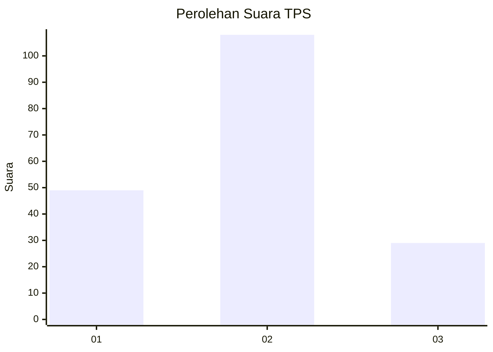

# Hasil

## Grafik

## Tabel

| No. | Nama Paslon    | Suara | Suara (raw) | Persentase |
|:--- |:-------------- | -----:| -----------:| ----------:|
| 1   | ANIES MUHAIMIN | 49    | [49][p-1]   | 26,34      |
| 2   | PRABOWO GIBRAN | 108   | [108][p-2]  | 58,06      |
| 3   | GANJAR MAHFUD  | 29    | [29][p-3]   | 15,59      |

[p-1]: https://github.com/gigit-pemilu/pemilu-2024-14-riau/blob/main/pilpres/hitung-suara/sub/14-riau/sub/10-kepulauan-meranti/sub/01-tebing-tinggi/sub/1001-selatpanjang-kota/sub/003-tps/sub/paslon-1.txt
[p-2]: https://github.com/gigit-pemilu/pemilu-2024-14-riau/blob/main/pilpres/hitung-suara/sub/14-riau/sub/10-kepulauan-meranti/sub/01-tebing-tinggi/sub/1001-selatpanjang-kota/sub/003-tps/sub/paslon-2.txt
[p-3]: https://github.com/gigit-pemilu/pemilu-2024-14-riau/blob/main/pilpres/hitung-suara/sub/14-riau/sub/10-kepulauan-meranti/sub/01-tebing-tinggi/sub/1001-selatpanjang-kota/sub/003-tps/sub/paslon-3.txt

## Foto C Plano

https://sirekap-obj-formc.kpu.go.id/0a1c/pemilu/ppwp/14/10/01/10/01/1410011001003-20240214-230331--4f8ea028-08d4-43a2-9bb5-33862235de57.jpg

https://sirekap-obj-formc.kpu.go.id/0a1c/pemilu/ppwp/14/10/01/10/01/1410011001003-20240214-230436--217ce65a-9bcc-43d0-a70b-16e3beca5d3f.jpg

https://sirekap-obj-formc.kpu.go.id/0a1c/pemilu/ppwp/14/10/01/10/01/1410011001003-20240214-230554--bbb3311a-a2bf-453e-8479-0aa1bf2c968f.jpg

## Metadata

| Key        | Value               |
| ---------- | ------------------- |
| Time Stamp | 2024-02-15 12:00:28 |

