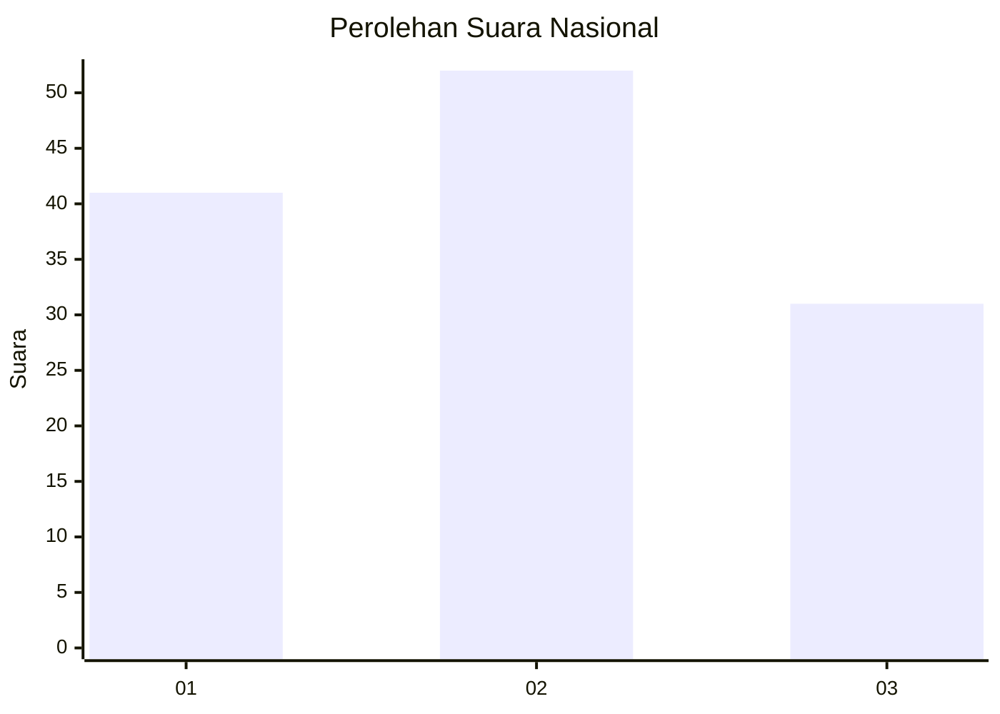
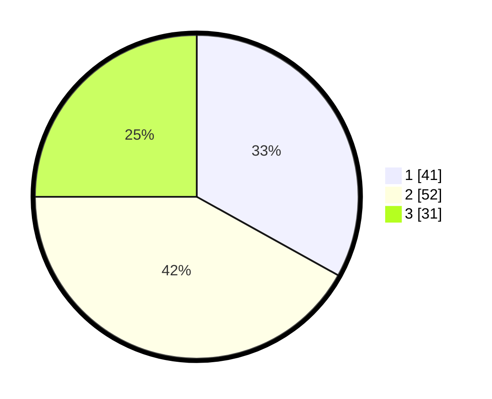

# Hasil

## Grafik

## Tabel

| No. | Nama Paslon    | Suara | Suara (raw) | Persentase |
|:--- |:-------------- | -----:| -----------:| ----------:|
| 1   | ANIES MUHAIMIN | 41    | [41][p-1]   | 33,06      |
| 2   | PRABOWO GIBRAN | 52    | [52][p-2]   | 41,94      |
| 3   | GANJAR MAHFUD  | 31    | [31][p-3]   | 25,00      |

[p-1]: https://github.com/gigit-pemilu/pemilu-2024/blob/main/pilpres/hitung-suara/sub/14-riau/sub/10-kepulauan-meranti/sub/01-tebing-tinggi/sub/1001-selatpanjang-kota/sub/011-tps/sub/paslon-1.txt
[p-2]: https://github.com/gigit-pemilu/pemilu-2024/blob/main/pilpres/hitung-suara/sub/14-riau/sub/10-kepulauan-meranti/sub/01-tebing-tinggi/sub/1001-selatpanjang-kota/sub/011-tps/sub/paslon-2.txt
[p-3]: https://github.com/gigit-pemilu/pemilu-2024/blob/main/pilpres/hitung-suara/sub/14-riau/sub/10-kepulauan-meranti/sub/01-tebing-tinggi/sub/1001-selatpanjang-kota/sub/011-tps/sub/paslon-3.txt

## Foto C Plano

https://sirekap-obj-formc.kpu.go.id/c30f/pemilu/ppwp/14/10/01/10/01/1410011001011-20240215-032626--d539625b-f585-478b-a0fa-bde98cc56217.jpg

https://sirekap-obj-formc.kpu.go.id/c30f/pemilu/ppwp/14/10/01/10/01/1410011001011-20240215-032651--9a1af390-290a-4b8d-a065-26d667136d58.jpg

https://sirekap-obj-formc.kpu.go.id/c30f/pemilu/ppwp/14/10/01/10/01/1410011001011-20240215-032710--68946faf-aa55-4007-ba71-3f8231ede230.jpg

## Metadata

| Key        | Value               |
| ---------- | ------------------- |
| Time Stamp | 2024-02-15 15:30:25 |

