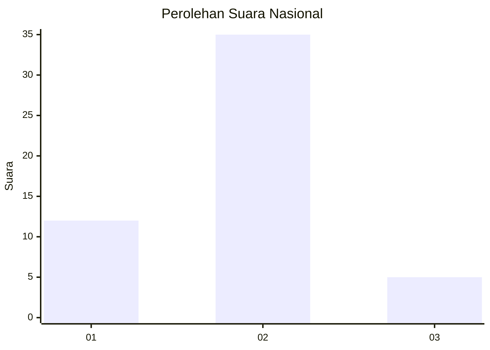

# Hasil

## Grafik

## Tabel

| No. | Nama Paslon    | Suara | Suara (raw) | Persentase |
|:--- |:-------------- | -----:| -----------:| ----------:|
| 1   | ANIES MUHAIMIN | 12    | [12][p-1]   | 23,08      |
| 2   | PRABOWO GIBRAN | 35    | [35][p-2]   | 67,31      |
| 3   | GANJAR MAHFUD  | 5     | [5][p-3]    | 9,62       |

[p-1]: https://github.com/gigit-pemilu/pemilu-2024/blob/main/pilpres/hitung-suara/sub/14-riau/sub/10-kepulauan-meranti/sub/01-tebing-tinggi/sub/1001-selatpanjang-kota/sub/902-tps/sub/paslon-1.txt
[p-2]: https://github.com/gigit-pemilu/pemilu-2024/blob/main/pilpres/hitung-suara/sub/14-riau/sub/10-kepulauan-meranti/sub/01-tebing-tinggi/sub/1001-selatpanjang-kota/sub/902-tps/sub/paslon-2.txt
[p-3]: https://github.com/gigit-pemilu/pemilu-2024/blob/main/pilpres/hitung-suara/sub/14-riau/sub/10-kepulauan-meranti/sub/01-tebing-tinggi/sub/1001-selatpanjang-kota/sub/902-tps/sub/paslon-3.txt

## Foto C Plano

https://sirekap-obj-formc.kpu.go.id/ce07/pemilu/ppwp/14/10/01/10/01/1410011001902-20240214-141616--9feb8cb2-b80c-4bb2-ab0a-2a74058e519c.jpg

https://sirekap-obj-formc.kpu.go.id/ce07/pemilu/ppwp/14/10/01/10/01/1410011001902-20240214-141717--b9eaaaf1-e7de-48bb-963f-b1142f6df8b6.jpg

https://sirekap-obj-formc.kpu.go.id/ce07/pemilu/ppwp/14/10/01/10/01/1410011001902-20240214-141758--b16e9428-f147-4531-bff5-11508df8f98d.jpg

## Metadata

| Key        | Value               |
| ---------- | ------------------- |
| Time Stamp | 2024-02-15 22:00:27 |

## DATA PEMILIH TETAP

Jumlah pemilih dalam DPT: **51**.
 * L: **46**.
 * P: **5**.

## DATA PENGGUNA HAK PILIH

Jumlah pengguna hak pilih dalam DPT: **28**.
 * L: **24**.
 * P: **4**.

Jumlah pengguna hak pilih dalam DPTb: **25**.
 * L: **25**.
 * P: **0**.

Jumlah pengguna hak pilih dalam DPK: **0**.
 * L: **0**.
 * P: **0**.

Jumlah pengguna hak pilih: **53**.
 * L: **49**.
 * P: **4**.

## JUMLAH SUARA SAH DAN TIDAK SAH

JUMLAH SELURUH SUARA SAH: **52**.

JUMLAH SUARA TIDAK SAH: **1**.

JUMLAH SELURUH SUARA SAH DAN SUARA TIDAK SAH: **53**.

