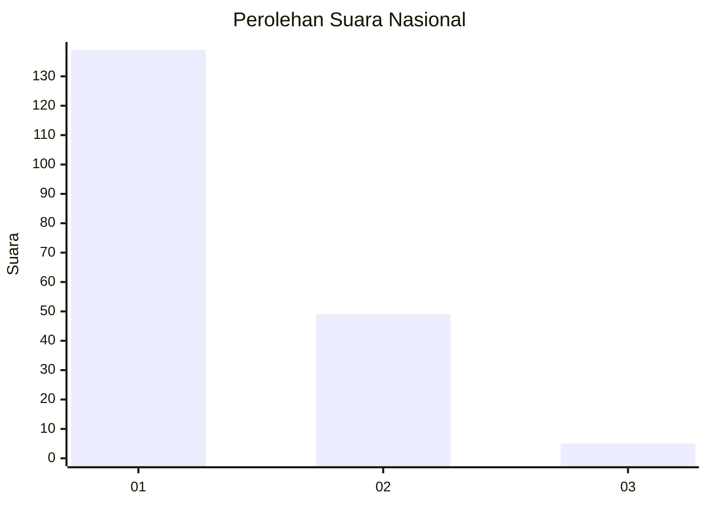
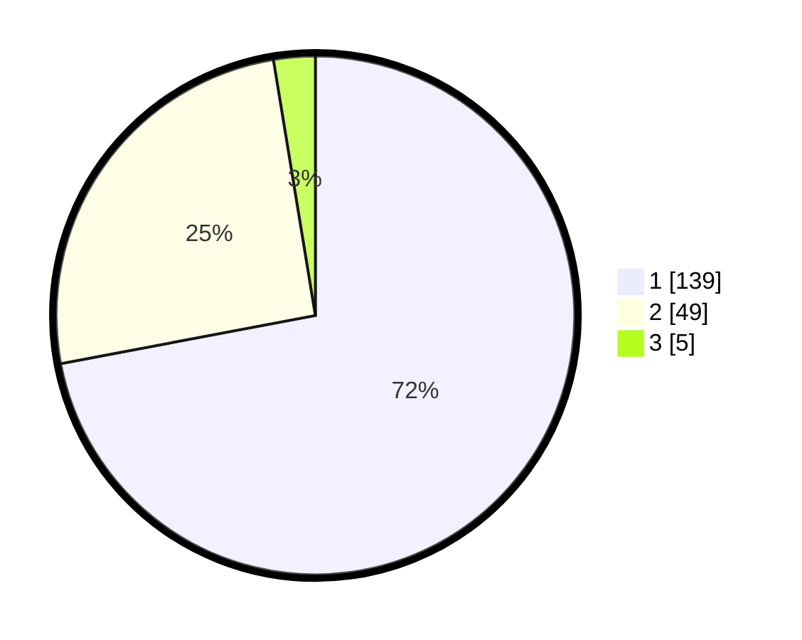

# Hasil

## Grafik

## Tabel

| No. | Nama Paslon    | Suara | Suara (raw) | Persentase |
|:--- |:-------------- | -----:| -----------:| ----------:|
| 1   | ANIES MUHAIMIN | 139   | [139][p-1]  | 72,02      |
| 2   | PRABOWO GIBRAN | 49    | [49][p-2]   | 25,39      |
| 3   | GANJAR MAHFUD  | 5     | [5][p-3]    | 2,59       |

[p-1]: https://github.com/gigit-pemilu/pemilu-2024/blob/main/pilpres/hitung-suara/sub/14-riau/sub/71-kota-pekanbaru/sub/01-sukajadi/sub/1003-kampung-tengah/sub/016-tps/sub/paslon-1.txt
[p-2]: https://github.com/gigit-pemilu/pemilu-2024/blob/main/pilpres/hitung-suara/sub/14-riau/sub/71-kota-pekanbaru/sub/01-sukajadi/sub/1003-kampung-tengah/sub/016-tps/sub/paslon-2.txt
[p-3]: https://github.com/gigit-pemilu/pemilu-2024/blob/main/pilpres/hitung-suara/sub/14-riau/sub/71-kota-pekanbaru/sub/01-sukajadi/sub/1003-kampung-tengah/sub/016-tps/sub/paslon-3.txt

## Foto C Plano

https://sirekap-obj-formc.kpu.go.id/0b1c/pemilu/ppwp/14/71/01/10/03/1471011003016-20240215-005948--a4f4a08d-3dac-4b96-9b7b-51cb73eca56f.jpg

https://sirekap-obj-formc.kpu.go.id/0b1c/pemilu/ppwp/14/71/01/10/03/1471011003016-20240215-010214--7c388ebc-950c-41d7-9388-e6cbd77edce6.jpg

https://sirekap-obj-formc.kpu.go.id/0b1c/pemilu/ppwp/14/71/01/10/03/1471011003016-20240215-011056--f3c469b2-7357-49ff-858b-caf6b316b739.jpg

## Metadata

| Key        | Value               |
| ---------- | ------------------- |
| Time Stamp | 2024-02-17 11:30:03 |

