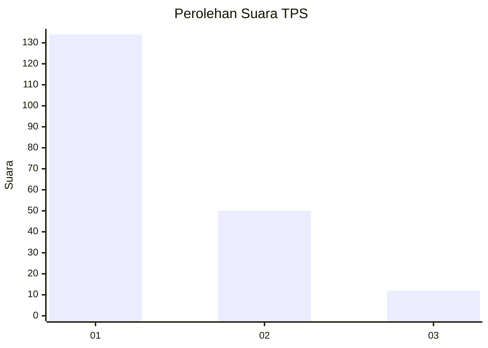
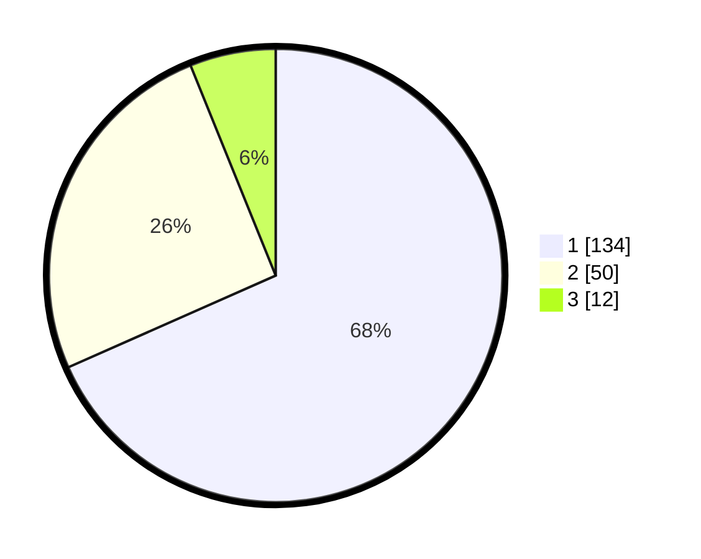

# Hasil

## Grafik

## Tabel

| No. | Nama Paslon    | Suara | Suara (raw) | Persentase |
|:--- |:-------------- | -----:| -----------:| ----------:|
| 1   | ANIES MUHAIMIN | 134   | [134][p-1]  | 68,37      |
| 2   | PRABOWO GIBRAN | 50    | [50][p-2]   | 25,51      |
| 3   | GANJAR MAHFUD  | 12    | [12][p-3]   | 6,12       |

[p-1]: https://github.com/gigit-pemilu/pemilu-2024-14-riau/blob/main/pilpres/hitung-suara/sub/14-riau/sub/71-kota-pekanbaru/sub/02-pekanbaru-kota/sub/1004-kota-baru/sub/012-tps/sub/paslon-1.txt
[p-2]: https://github.com/gigit-pemilu/pemilu-2024-14-riau/blob/main/pilpres/hitung-suara/sub/14-riau/sub/71-kota-pekanbaru/sub/02-pekanbaru-kota/sub/1004-kota-baru/sub/012-tps/sub/paslon-2.txt
[p-3]: https://github.com/gigit-pemilu/pemilu-2024-14-riau/blob/main/pilpres/hitung-suara/sub/14-riau/sub/71-kota-pekanbaru/sub/02-pekanbaru-kota/sub/1004-kota-baru/sub/012-tps/sub/paslon-3.txt

## Foto C Plano

https://sirekap-obj-formc.kpu.go.id/30ce/pemilu/ppwp/14/71/02/10/04/1471021004012-20240215-000551--b9d27b0e-5ef0-4784-a6ae-cff42031ff9f.jpg

https://sirekap-obj-formc.kpu.go.id/30ce/pemilu/ppwp/14/71/02/10/04/1471021004012-20240216-184133--7ab155a6-41ab-4ea7-a4d4-49237bd46492.jpg

https://sirekap-obj-formc.kpu.go.id/30ce/pemilu/ppwp/14/71/02/10/04/1471021004012-20240214-233221--35e3618a-f018-4f45-9015-d9dfd734fc89.jpg

## Metadata

| Key        | Value               |
| ---------- | ------------------- |
| Time Stamp | 2024-02-17 13:37:34 |

