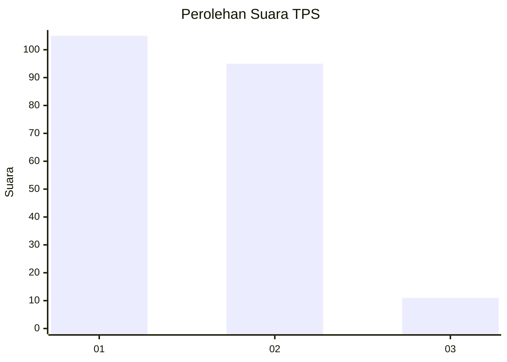
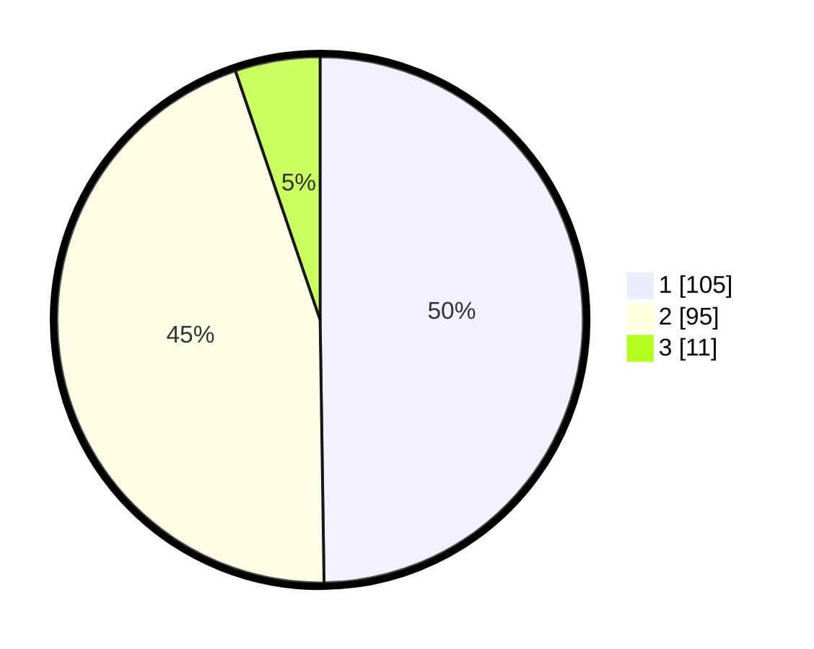

# Hasil

## Grafik

## Tabel

| No. | Nama Paslon    | Suara | Suara (raw) | Persentase |
|:--- |:-------------- | -----:| -----------:| ----------:|
| 1   | ANIES MUHAIMIN | 105   | [105][p-1]  | 49,76      |
| 2   | PRABOWO GIBRAN | 95    | [95][p-2]   | 45,02      |
| 3   | GANJAR MAHFUD  | 11    | [11][p-3]   | 5,21       |

[p-1]: https://github.com/gigit-pemilu/pemilu-2024-14-riau/blob/main/pilpres/hitung-suara/sub/14-riau/sub/71-kota-pekanbaru/sub/07-bukit-raya/sub/1005-simpang-tiga/sub/003-tps/sub/paslon-1.txt
[p-2]: https://github.com/gigit-pemilu/pemilu-2024-14-riau/blob/main/pilpres/hitung-suara/sub/14-riau/sub/71-kota-pekanbaru/sub/07-bukit-raya/sub/1005-simpang-tiga/sub/003-tps/sub/paslon-2.txt
[p-3]: https://github.com/gigit-pemilu/pemilu-2024-14-riau/blob/main/pilpres/hitung-suara/sub/14-riau/sub/71-kota-pekanbaru/sub/07-bukit-raya/sub/1005-simpang-tiga/sub/003-tps/sub/paslon-3.txt

## Foto C Plano

https://sirekap-obj-formc.kpu.go.id/3d43/pemilu/ppwp/14/71/07/10/05/1471071005003-20240216-124633--00c301ed-727e-4e92-af0e-8f5f32d9824b.jpg

https://sirekap-obj-formc.kpu.go.id/3d43/pemilu/ppwp/14/71/07/10/05/1471071005003-20240216-200044--93320fc4-3a51-4828-988b-298915a5e9c0.jpg

https://sirekap-obj-formc.kpu.go.id/3d43/pemilu/ppwp/14/71/07/10/05/1471071005003-20240214-195201--23d9d56b-972d-45a7-9196-2566e1df5b2d.jpg

## Metadata

| Key        | Value               |
| ---------- | ------------------- |
| Time Stamp | 2024-02-17 11:00:02 |

