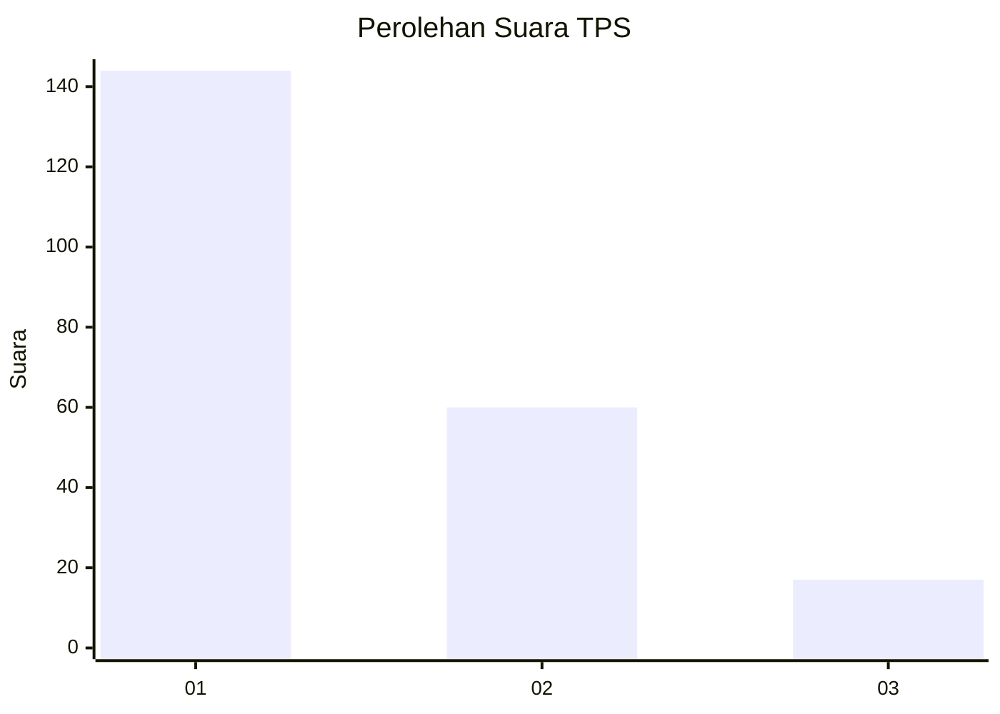
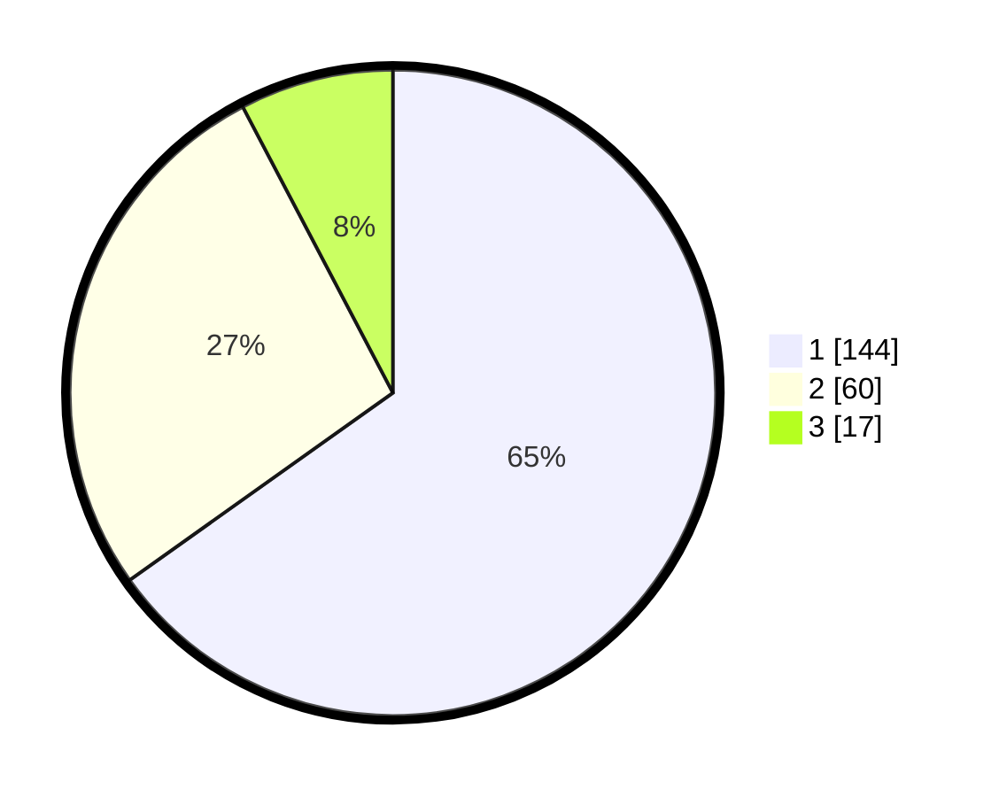

# Hasil

## Grafik

## Tabel

| No. | Nama Paslon    | Suara | Suara (raw) | Persentase |
|:--- |:-------------- | -----:| -----------:| ----------:|
| 1   | ANIES MUHAIMIN | 144   | [144][p-1]  | 65,16      |
| 2   | PRABOWO GIBRAN | 60    | [60][p-2]   | 27,15      |
| 3   | GANJAR MAHFUD  | 17    | [17][p-3]   | 7,69       |

[p-1]: https://github.com/gigit-pemilu/pemilu-2024-14-riau/blob/main/pilpres/hitung-suara/sub/14-riau/sub/71-kota-pekanbaru/sub/07-bukit-raya/sub/1005-simpang-tiga/sub/017-tps/sub/paslon-1.txt
[p-2]: https://github.com/gigit-pemilu/pemilu-2024-14-riau/blob/main/pilpres/hitung-suara/sub/14-riau/sub/71-kota-pekanbaru/sub/07-bukit-raya/sub/1005-simpang-tiga/sub/017-tps/sub/paslon-2.txt
[p-3]: https://github.com/gigit-pemilu/pemilu-2024-14-riau/blob/main/pilpres/hitung-suara/sub/14-riau/sub/71-kota-pekanbaru/sub/07-bukit-raya/sub/1005-simpang-tiga/sub/017-tps/sub/paslon-3.txt

## Foto C Plano

https://sirekap-obj-formc.kpu.go.id/2aea/pemilu/ppwp/14/71/07/10/05/1471071005017-20240216-160438--e610761d-50b5-4506-a2f5-f9b533009bf5.jpg

https://sirekap-obj-formc.kpu.go.id/2aea/pemilu/ppwp/14/71/07/10/05/1471071005017-20240216-154812--0981ff8c-1dd3-4b97-a081-cdffdd08a3bd.jpg

https://sirekap-obj-formc.kpu.go.id/2aea/pemilu/ppwp/14/71/07/10/05/1471071005017-20240216-154955--4bff7973-960e-41e6-b52a-9eb8aff4d99c.jpg

## Metadata

| Key        | Value               |
| ---------- | ------------------- |
| Time Stamp | 2024-02-16 21:01:00 |

