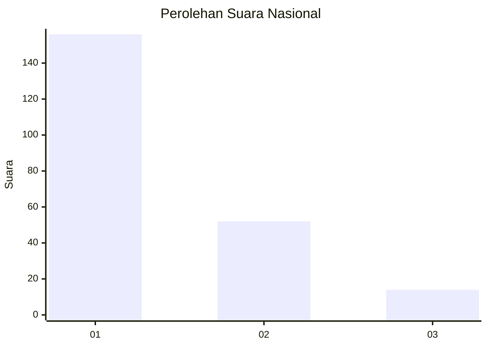
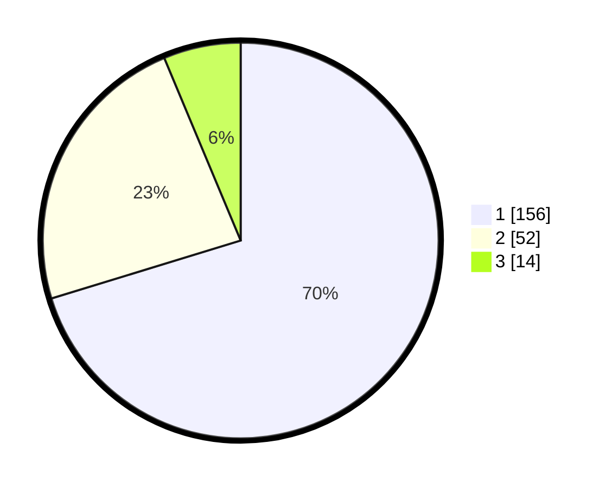

# Hasil

## Grafik

## Tabel

| No. | Nama Paslon    | Suara | Suara (raw) | Persentase |
|:--- |:-------------- | -----:| -----------:| ----------:|
| 1   | ANIES MUHAIMIN | 156   | [156][p-1]  | 70,27      |
| 2   | PRABOWO GIBRAN | 52    | [52][p-2]   | 23,42      |
| 3   | GANJAR MAHFUD  | 14    | [14][p-3]   | 6,31       |

[p-1]: https://github.com/gigit-pemilu/pemilu-2024/blob/main/pilpres/hitung-suara/sub/14-riau/sub/71-kota-pekanbaru/sub/07-bukit-raya/sub/1006-tangkerang-selatan/sub/014-tps/sub/paslon-1.txt
[p-2]: https://github.com/gigit-pemilu/pemilu-2024/blob/main/pilpres/hitung-suara/sub/14-riau/sub/71-kota-pekanbaru/sub/07-bukit-raya/sub/1006-tangkerang-selatan/sub/014-tps/sub/paslon-2.txt
[p-3]: https://github.com/gigit-pemilu/pemilu-2024/blob/main/pilpres/hitung-suara/sub/14-riau/sub/71-kota-pekanbaru/sub/07-bukit-raya/sub/1006-tangkerang-selatan/sub/014-tps/sub/paslon-3.txt

## Foto C Plano

https://sirekap-obj-formc.kpu.go.id/0936/pemilu/ppwp/14/71/07/10/06/1471071006014-20240215-150221--3bd9a1dd-e160-4ec5-8aca-9366999f5f52.jpg

https://sirekap-obj-formc.kpu.go.id/0936/pemilu/ppwp/14/71/07/10/06/1471071006014-20240215-150727--3e5c6dcd-9262-4df7-bbe9-696e01d430b6.jpg

https://sirekap-obj-formc.kpu.go.id/0936/pemilu/ppwp/14/71/07/10/06/1471071006014-20240215-160903--7c51b915-79bd-43ba-9c9d-a5a2a0173b0d.jpg

## Metadata

| Key        | Value               |
| ---------- | ------------------- |
| Time Stamp | 2024-02-16 16:25:10 |

