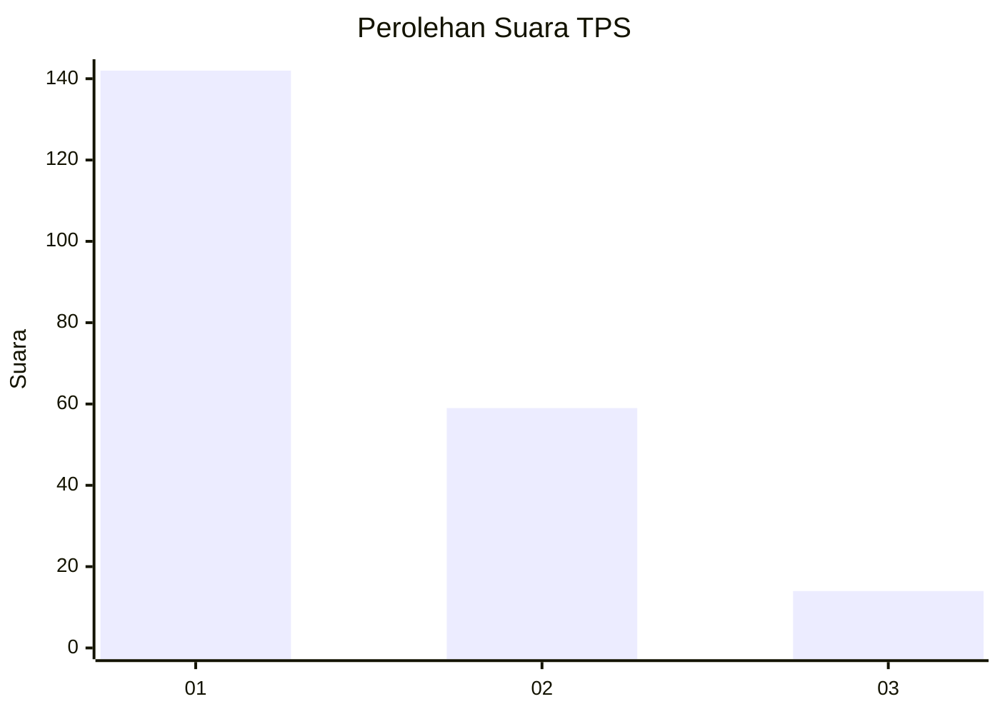
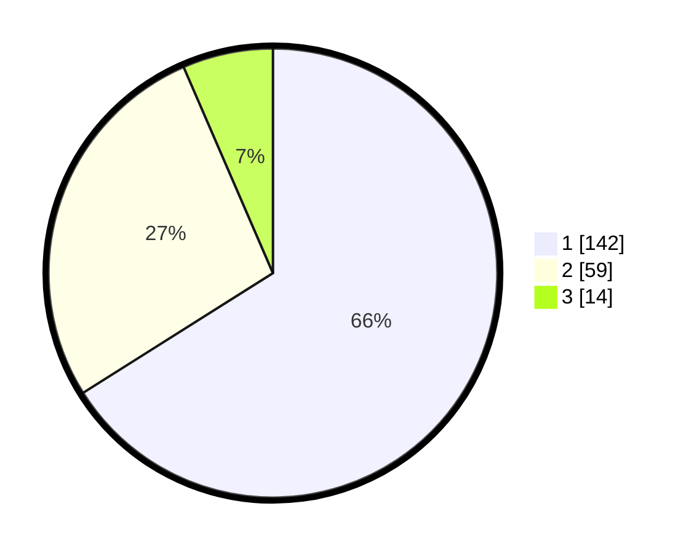

# Hasil

## Grafik

## Tabel

| No. | Nama Paslon    | Suara | Suara (raw) | Persentase |
|:--- |:-------------- | -----:| -----------:| ----------:|
| 1   | ANIES MUHAIMIN | 142   | [142][p-1]  | 66,05      |
| 2   | PRABOWO GIBRAN | 59    | [59][p-2]   | 27,44      |
| 3   | GANJAR MAHFUD  | 14    | [14][p-3]   | 6,51       |

[p-1]: https://github.com/gigit-pemilu/pemilu-2024-14-riau/blob/main/pilpres/hitung-suara/sub/14-riau/sub/71-kota-pekanbaru/sub/07-bukit-raya/sub/1006-tangkerang-selatan/sub/044-tps/sub/paslon-1.txt
[p-2]: https://github.com/gigit-pemilu/pemilu-2024-14-riau/blob/main/pilpres/hitung-suara/sub/14-riau/sub/71-kota-pekanbaru/sub/07-bukit-raya/sub/1006-tangkerang-selatan/sub/044-tps/sub/paslon-2.txt
[p-3]: https://github.com/gigit-pemilu/pemilu-2024-14-riau/blob/main/pilpres/hitung-suara/sub/14-riau/sub/71-kota-pekanbaru/sub/07-bukit-raya/sub/1006-tangkerang-selatan/sub/044-tps/sub/paslon-3.txt

## Foto C Plano

https://sirekap-obj-formc.kpu.go.id/02b6/pemilu/ppwp/14/71/07/10/06/1471071006044-20240214-155518--fe586b25-0e2d-41cc-90f6-ef793b5d6c70.jpg

https://sirekap-obj-formc.kpu.go.id/02b6/pemilu/ppwp/14/71/07/10/06/1471071006044-20240214-155556--46f9ce0d-989e-4858-9305-5a0ac53428df.jpg

https://sirekap-obj-formc.kpu.go.id/02b6/pemilu/ppwp/14/71/07/10/06/1471071006044-20240214-155624--9bf7c15a-10bb-46ed-9f03-ba184e942a18.jpg

## Metadata

| Key        | Value               |
| ---------- | ------------------- |
| Time Stamp | 2024-02-16 16:25:10 |

