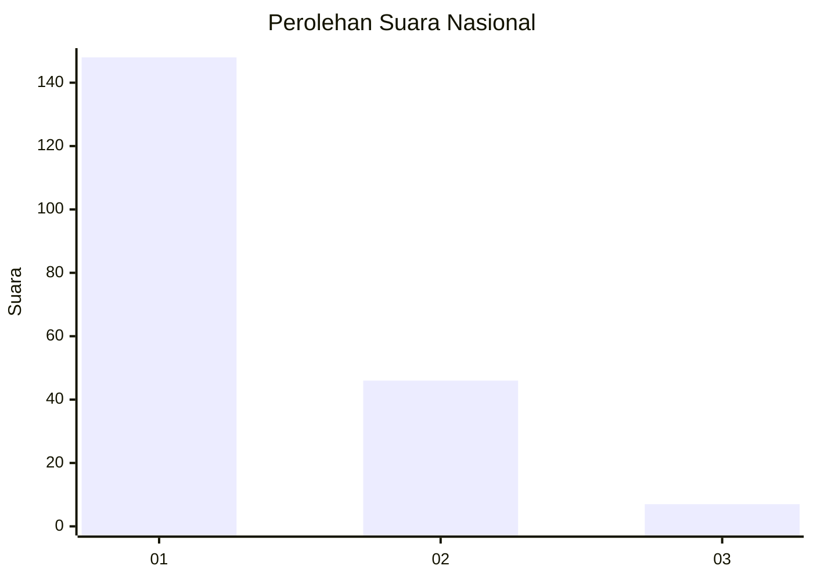
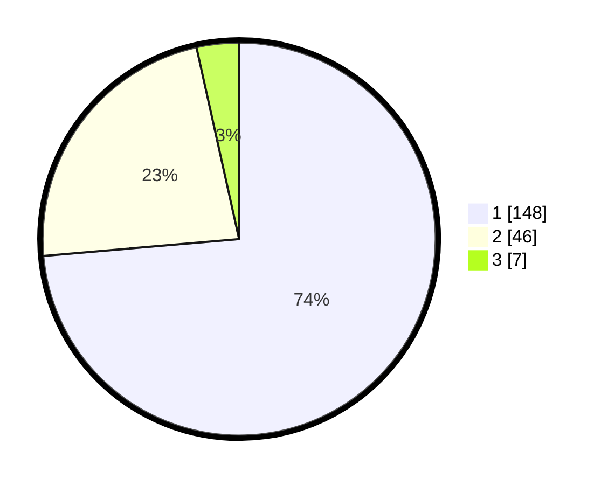

# Hasil

## Grafik

## Tabel

| No. | Nama Paslon    | Suara | Suara (raw) | Persentase |
|:--- |:-------------- | -----:| -----------:| ----------:|
| 1   | ANIES MUHAIMIN | 148   | [148][p-1]  | 73,63      |
| 2   | PRABOWO GIBRAN | 46    | [46][p-2]   | 22,89      |
| 3   | GANJAR MAHFUD  | 7     | [7][p-3]    | 3,48       |

[p-1]: https://github.com/gigit-pemilu/pemilu-2024/blob/main/pilpres/hitung-suara/sub/14-riau/sub/71-kota-pekanbaru/sub/07-bukit-raya/sub/1012-airdingin/sub/023-tps/sub/paslon-1.txt
[p-2]: https://github.com/gigit-pemilu/pemilu-2024/blob/main/pilpres/hitung-suara/sub/14-riau/sub/71-kota-pekanbaru/sub/07-bukit-raya/sub/1012-airdingin/sub/023-tps/sub/paslon-2.txt
[p-3]: https://github.com/gigit-pemilu/pemilu-2024/blob/main/pilpres/hitung-suara/sub/14-riau/sub/71-kota-pekanbaru/sub/07-bukit-raya/sub/1012-airdingin/sub/023-tps/sub/paslon-3.txt

## Foto C Plano

https://sirekap-obj-formc.kpu.go.id/aee6/pemilu/ppwp/14/71/07/10/12/1471071012023-20240215-055922--524c7395-aa75-413e-b8a0-5869428002b2.jpg

https://sirekap-obj-formc.kpu.go.id/aee6/pemilu/ppwp/14/71/07/10/12/1471071012023-20240216-135549--ed71875d-4831-4d51-ac0e-04dcafd9f95b.jpg

https://sirekap-obj-formc.kpu.go.id/aee6/pemilu/ppwp/14/71/07/10/12/1471071012023-20240215-060157--50379418-80d6-43c0-9b4d-acec4a82a059.jpg

## Metadata

| Key        | Value               |
| ---------- | ------------------- |
| Time Stamp | 2024-02-16 16:25:10 |

