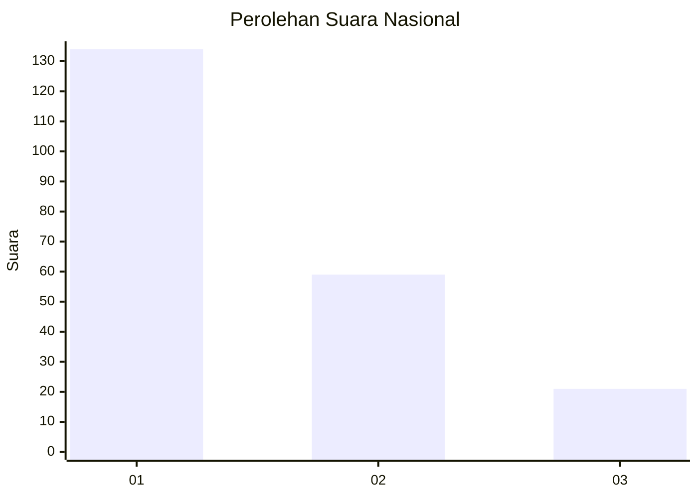
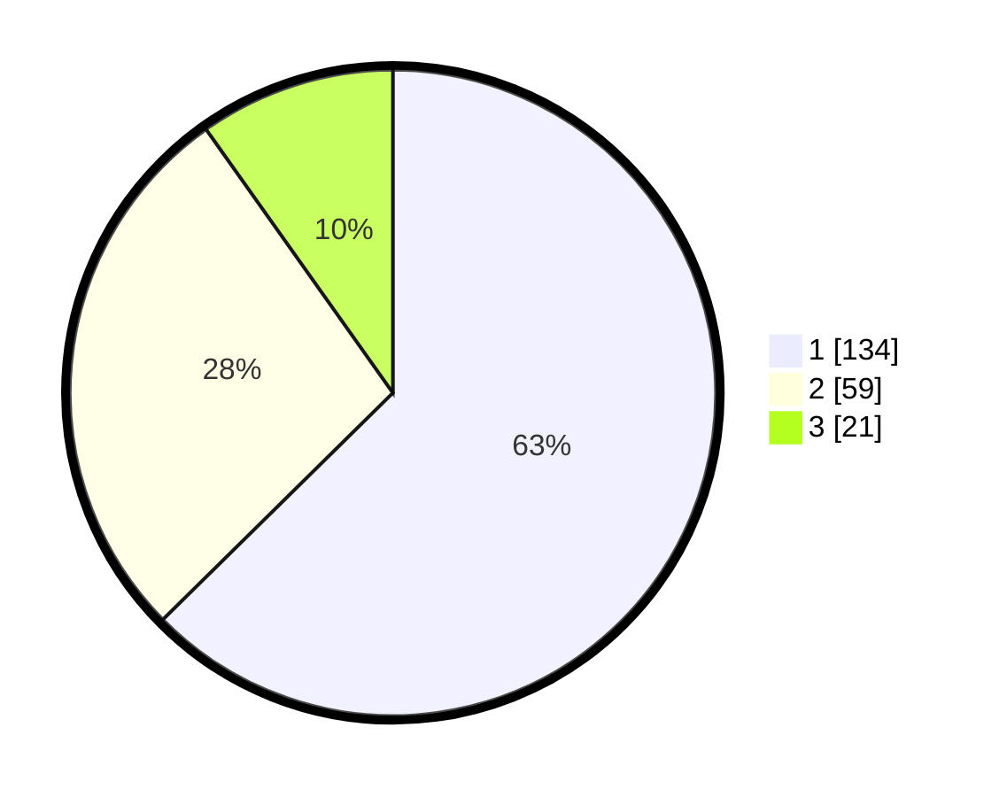

# Hasil

## Grafik

## Tabel

| No. | Nama Paslon    | Suara | Suara (raw) | Persentase |
|:--- |:-------------- | -----:| -----------:| ----------:|
| 1   | ANIES MUHAIMIN | 134   | [134][p-1]  | 62,62      |
| 2   | PRABOWO GIBRAN | 59    | [59][p-2]   | 27,57      |
| 3   | GANJAR MAHFUD  | 21    | [21][p-3]   | 9,81       |

[p-1]: https://github.com/gigit-pemilu/pemilu-2024/blob/main/pilpres/hitung-suara/sub/14-riau/sub/71-kota-pekanbaru/sub/07-bukit-raya/sub/1012-airdingin/sub/048-tps/sub/paslon-1.txt
[p-2]: https://github.com/gigit-pemilu/pemilu-2024/blob/main/pilpres/hitung-suara/sub/14-riau/sub/71-kota-pekanbaru/sub/07-bukit-raya/sub/1012-airdingin/sub/048-tps/sub/paslon-2.txt
[p-3]: https://github.com/gigit-pemilu/pemilu-2024/blob/main/pilpres/hitung-suara/sub/14-riau/sub/71-kota-pekanbaru/sub/07-bukit-raya/sub/1012-airdingin/sub/048-tps/sub/paslon-3.txt

## Foto C Plano

https://sirekap-obj-formc.kpu.go.id/9d2a/pemilu/ppwp/14/71/07/10/12/1471071012048-20240215-015025--29ed09bc-0db2-466d-91bc-9dcad873e4be.jpg

https://sirekap-obj-formc.kpu.go.id/9d2a/pemilu/ppwp/14/71/07/10/12/1471071012048-20240215-015127--f6a0d4e2-d0f2-40c1-9e3c-7630d07a7730.jpg

https://sirekap-obj-formc.kpu.go.id/9d2a/pemilu/ppwp/14/71/07/10/12/1471071012048-20240215-015209--6306625c-d1a8-4256-a279-ace862afd343.jpg

## Metadata

| Key        | Value               |
| ---------- | ------------------- |
| Time Stamp | 2024-02-17 11:30:03 |

