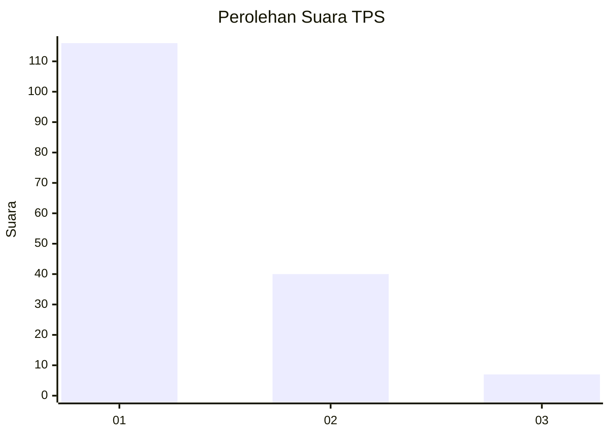
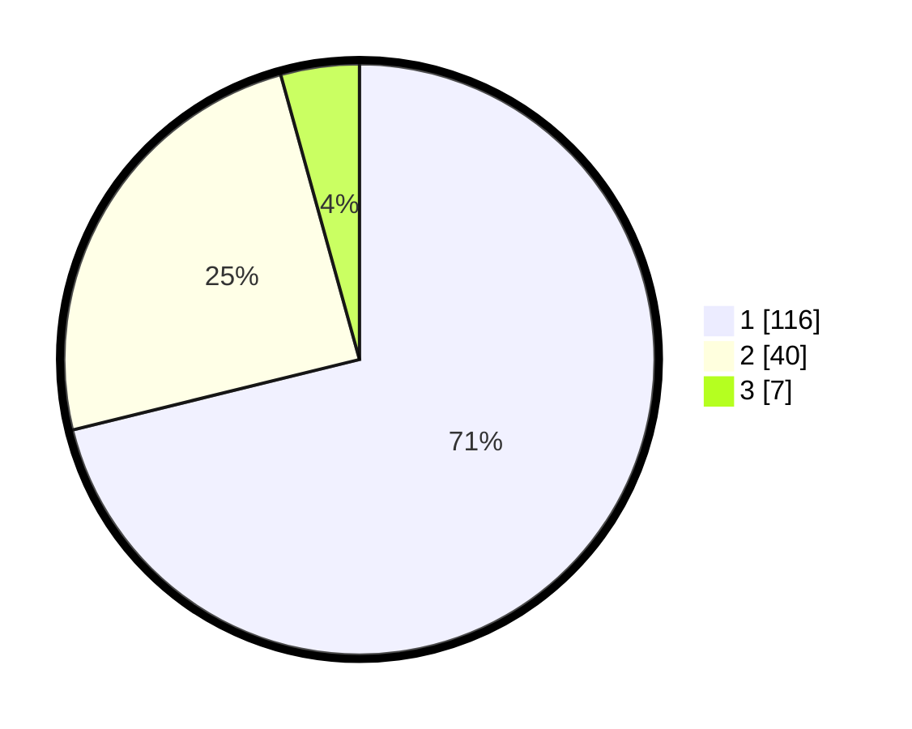

# Hasil

## Grafik

## Tabel

| No. | Nama Paslon    | Suara | Suara (raw) | Persentase |
|:--- |:-------------- | -----:| -----------:| ----------:|
| 1   | ANIES MUHAIMIN | 116   | [116][p-1]  | 71,17      |
| 2   | PRABOWO GIBRAN | 40    | [40][p-2]   | 24,54      |
| 3   | GANJAR MAHFUD  | 7     | [7][p-3]    | 4,29       |

[p-1]: https://github.com/gigit-pemilu/pemilu-2024-14-riau/blob/main/pilpres/hitung-suara/sub/14-riau/sub/71-kota-pekanbaru/sub/07-bukit-raya/sub/1012-airdingin/sub/060-tps/sub/paslon-1.txt
[p-2]: https://github.com/gigit-pemilu/pemilu-2024-14-riau/blob/main/pilpres/hitung-suara/sub/14-riau/sub/71-kota-pekanbaru/sub/07-bukit-raya/sub/1012-airdingin/sub/060-tps/sub/paslon-2.txt
[p-3]: https://github.com/gigit-pemilu/pemilu-2024-14-riau/blob/main/pilpres/hitung-suara/sub/14-riau/sub/71-kota-pekanbaru/sub/07-bukit-raya/sub/1012-airdingin/sub/060-tps/sub/paslon-3.txt

## Foto C Plano

https://sirekap-obj-formc.kpu.go.id/602f/pemilu/ppwp/14/71/07/10/12/1471071012060-20240215-040756--6c0a6687-45be-41cb-be42-4c432ade5068.jpg

https://sirekap-obj-formc.kpu.go.id/602f/pemilu/ppwp/14/71/07/10/12/1471071012060-20240215-040914--e033fe2a-a9a1-4eb4-ac3a-c56a3f18466a.jpg

https://sirekap-obj-formc.kpu.go.id/602f/pemilu/ppwp/14/71/07/10/12/1471071012060-20240215-041145--656feedf-2968-4ff2-891c-a74ef27e54f3.jpg

## Metadata

| Key        | Value               |
| ---------- | ------------------- |
| Time Stamp | 2024-02-17 11:00:02 |

