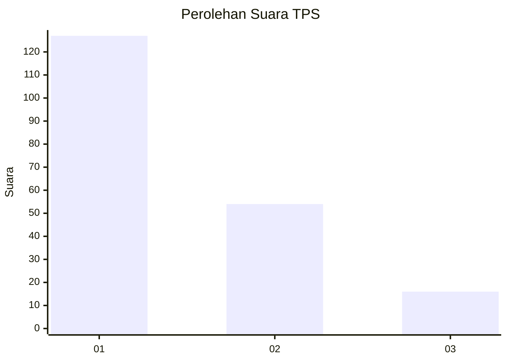
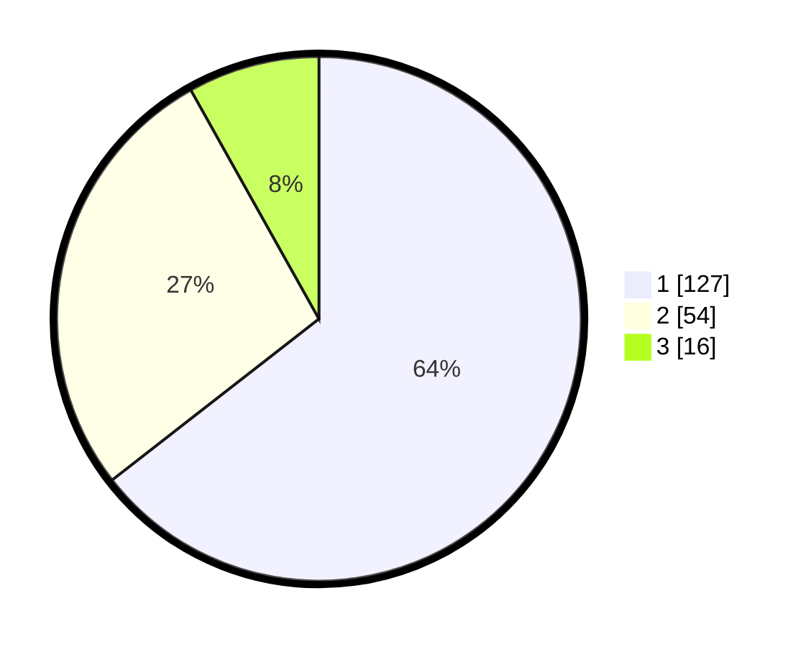

# Hasil

## Grafik

## Tabel

| No. | Nama Paslon    | Suara | Suara (raw) | Persentase |
|:--- |:-------------- | -----:| -----------:| ----------:|
| 1   | ANIES MUHAIMIN | 127   | [127][p-1]  | 64,47      |
| 2   | PRABOWO GIBRAN | 54    | [54][p-2]   | 27,41      |
| 3   | GANJAR MAHFUD  | 16    | [16][p-3]   | 8,12       |

[p-1]: https://github.com/gigit-pemilu/pemilu-2024-14-riau/blob/main/pilpres/hitung-suara/sub/14-riau/sub/71-kota-pekanbaru/sub/08-binawidya/sub/1008-delima/sub/045-tps/sub/paslon-1.txt
[p-2]: https://github.com/gigit-pemilu/pemilu-2024-14-riau/blob/main/pilpres/hitung-suara/sub/14-riau/sub/71-kota-pekanbaru/sub/08-binawidya/sub/1008-delima/sub/045-tps/sub/paslon-2.txt
[p-3]: https://github.com/gigit-pemilu/pemilu-2024-14-riau/blob/main/pilpres/hitung-suara/sub/14-riau/sub/71-kota-pekanbaru/sub/08-binawidya/sub/1008-delima/sub/045-tps/sub/paslon-3.txt

## Foto C Plano

https://sirekap-obj-formc.kpu.go.id/3630/pemilu/ppwp/14/71/08/10/08/1471081008045-20240217-085936--3332e28a-e461-4b15-b7cc-2e90dfff5c86.jpg

https://sirekap-obj-formc.kpu.go.id/3630/pemilu/ppwp/14/71/08/10/08/1471081008045-20240217-090053--4a685bef-daf8-4ea2-b01b-e7db4748c74f.jpg

https://sirekap-obj-formc.kpu.go.id/3630/pemilu/ppwp/14/71/08/10/08/1471081008045-20240215-051555--a7609ee2-93d9-4999-85c5-35a5ed2390d2.jpg

## Metadata

| Key        | Value               |
| ---------- | ------------------- |
| Time Stamp | 2024-02-17 18:30:00 |

