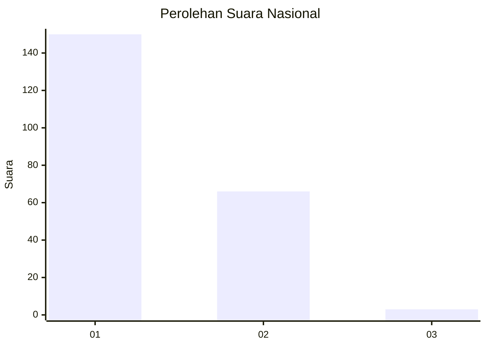
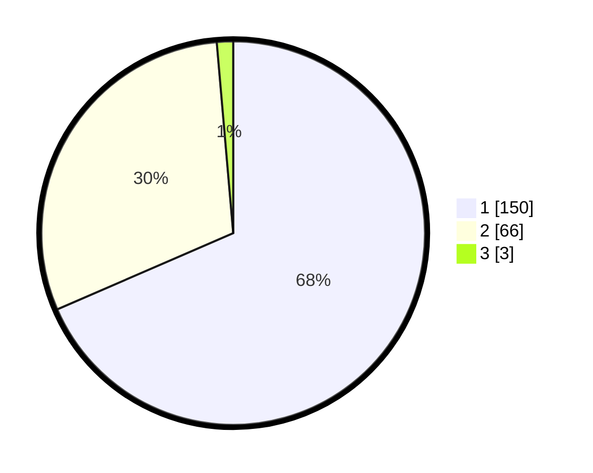

# Hasil

## Grafik

## Tabel

| No. | Nama Paslon    | Suara | Suara (raw) | Persentase |
|:--- |:-------------- | -----:| -----------:| ----------:|
| 1   | ANIES MUHAIMIN | 150   | [150][p-1]  | 68,49      |
| 2   | PRABOWO GIBRAN | 66    | [66][p-2]   | 30,14      |
| 3   | GANJAR MAHFUD  | 3     | [3][p-3]    | 1,37       |

[p-1]: https://github.com/gigit-pemilu/pemilu-2024/blob/main/pilpres/hitung-suara/sub/14-riau/sub/71-kota-pekanbaru/sub/09-marpoyan-damai/sub/1001-tangkerang-barat/sub/029-tps/sub/paslon-1.txt
[p-2]: https://github.com/gigit-pemilu/pemilu-2024/blob/main/pilpres/hitung-suara/sub/14-riau/sub/71-kota-pekanbaru/sub/09-marpoyan-damai/sub/1001-tangkerang-barat/sub/029-tps/sub/paslon-2.txt
[p-3]: https://github.com/gigit-pemilu/pemilu-2024/blob/main/pilpres/hitung-suara/sub/14-riau/sub/71-kota-pekanbaru/sub/09-marpoyan-damai/sub/1001-tangkerang-barat/sub/029-tps/sub/paslon-3.txt

## Foto C Plano

https://sirekap-obj-formc.kpu.go.id/c2f4/pemilu/ppwp/14/71/09/10/01/1471091001029-20240217-154301--2d8e3877-12d0-42ef-a795-88a18dbe7e9b.jpg

https://sirekap-obj-formc.kpu.go.id/c2f4/pemilu/ppwp/14/71/09/10/01/1471091001029-20240217-155106--8d3a3333-73cb-4c14-8001-f913c4480a03.jpg

https://sirekap-obj-formc.kpu.go.id/c2f4/pemilu/ppwp/14/71/09/10/01/1471091001029-20240217-155228--79bd7f6e-391a-4b91-9a4b-d93bed53c0b3.jpg

## Metadata

| Key        | Value               |
| ---------- | ------------------- |
| Time Stamp | 2024-02-17 17:30:00 |

