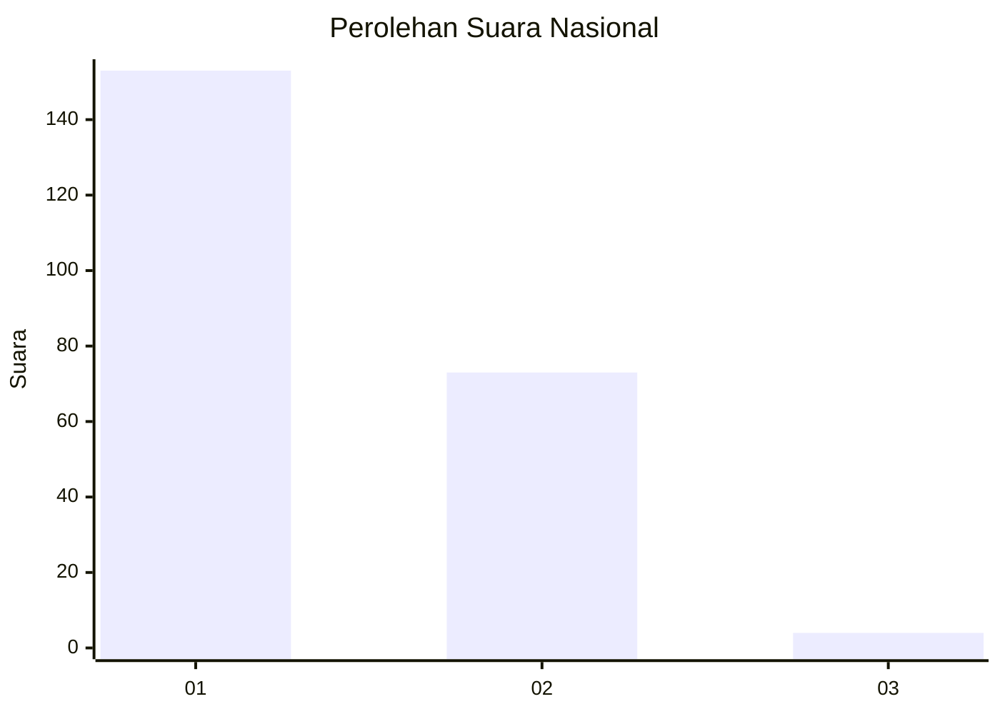
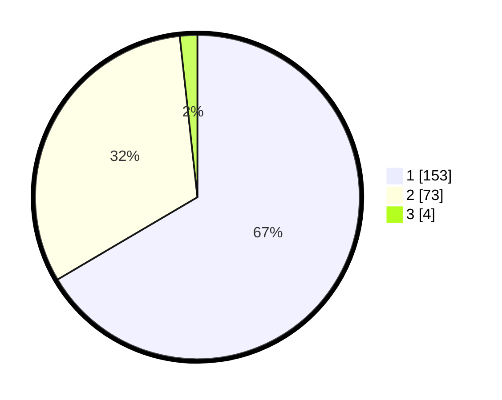

# Hasil

## Grafik

## Tabel

| No. | Nama Paslon    | Suara | Suara (raw) | Persentase |
|:--- |:-------------- | -----:| -----------:| ----------:|
| 1   | ANIES MUHAIMIN | 153   | [153][p-1]  | 66,52      |
| 2   | PRABOWO GIBRAN | 73    | [73][p-2]   | 31,74      |
| 3   | GANJAR MAHFUD  | 4     | [4][p-3]    | 1,74       |

[p-1]: https://github.com/gigit-pemilu/pemilu-2024/blob/main/pilpres/hitung-suara/sub/14-riau/sub/71-kota-pekanbaru/sub/09-marpoyan-damai/sub/1002-tangkerang-tengah/sub/044-tps/sub/paslon-1.txt
[p-2]: https://github.com/gigit-pemilu/pemilu-2024/blob/main/pilpres/hitung-suara/sub/14-riau/sub/71-kota-pekanbaru/sub/09-marpoyan-damai/sub/1002-tangkerang-tengah/sub/044-tps/sub/paslon-2.txt
[p-3]: https://github.com/gigit-pemilu/pemilu-2024/blob/main/pilpres/hitung-suara/sub/14-riau/sub/71-kota-pekanbaru/sub/09-marpoyan-damai/sub/1002-tangkerang-tengah/sub/044-tps/sub/paslon-3.txt

## Foto C Plano

https://sirekap-obj-formc.kpu.go.id/9e40/pemilu/ppwp/14/71/09/10/02/1471091002044-20240215-003316--f94ea5c4-a6e3-4ea5-bb2a-38d2f3609a88.jpg

https://sirekap-obj-formc.kpu.go.id/9e40/pemilu/ppwp/14/71/09/10/02/1471091002044-20240214-232723--0f0f3348-8c28-47c8-8627-3e688d1f8f95.jpg

https://sirekap-obj-formc.kpu.go.id/9e40/pemilu/ppwp/14/71/09/10/02/1471091002044-20240214-232935--ffa8884d-0ba1-4210-a54b-9df873f2f91a.jpg

## Metadata

| Key        | Value               |
| ---------- | ------------------- |
| Time Stamp | 2024-02-16 21:01:00 |

