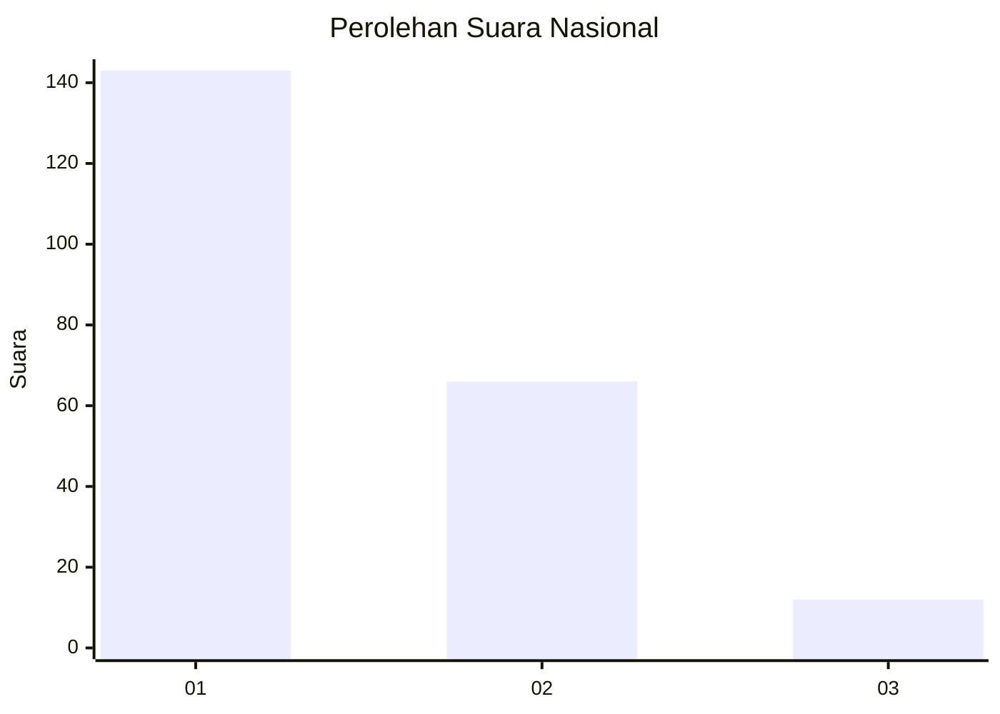
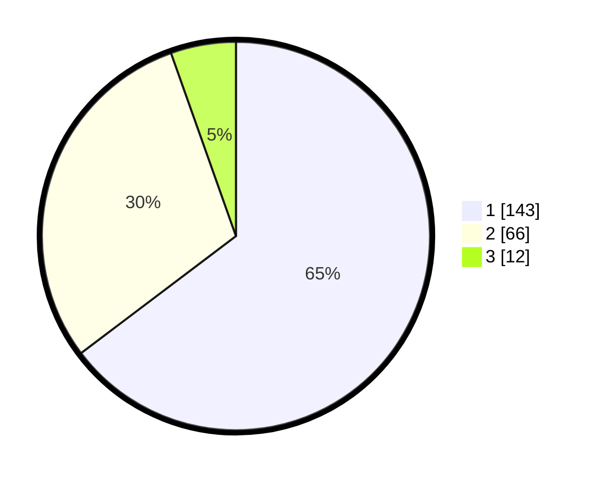

# Hasil

## Grafik

## Tabel

| No. | Nama Paslon    | Suara | Suara (raw) | Persentase |
|:--- |:-------------- | -----:| -----------:| ----------:|
| 1   | ANIES MUHAIMIN | 143   | [143][p-1]  | 64,71      |
| 2   | PRABOWO GIBRAN | 66    | [66][p-2]   | 29,86      |
| 3   | GANJAR MAHFUD  | 12    | [12][p-3]   | 5,43       |

[p-1]: https://github.com/gigit-pemilu/pemilu-2024/blob/main/pilpres/hitung-suara/sub/14-riau/sub/71-kota-pekanbaru/sub/09-marpoyan-damai/sub/1003-sidomulyo-timur/sub/064-tps/sub/paslon-1.txt
[p-2]: https://github.com/gigit-pemilu/pemilu-2024/blob/main/pilpres/hitung-suara/sub/14-riau/sub/71-kota-pekanbaru/sub/09-marpoyan-damai/sub/1003-sidomulyo-timur/sub/064-tps/sub/paslon-2.txt
[p-3]: https://github.com/gigit-pemilu/pemilu-2024/blob/main/pilpres/hitung-suara/sub/14-riau/sub/71-kota-pekanbaru/sub/09-marpoyan-damai/sub/1003-sidomulyo-timur/sub/064-tps/sub/paslon-3.txt

## Foto C Plano

https://sirekap-obj-formc.kpu.go.id/baa2/pemilu/ppwp/14/71/09/10/03/1471091003064-20240214-212823--b6aa6e43-807a-479e-8fc1-f4f74a6c7f0c.jpg

https://sirekap-obj-formc.kpu.go.id/baa2/pemilu/ppwp/14/71/09/10/03/1471091003064-20240214-213111--4af2edb6-1cd2-4cdc-8e9d-71bbece2f2a9.jpg

https://sirekap-obj-formc.kpu.go.id/baa2/pemilu/ppwp/14/71/09/10/03/1471091003064-20240214-213841--7df4a545-3918-472a-bce7-7b6469cd9a7d.jpg

## Metadata

| Key        | Value               |
| ---------- | ------------------- |
| Time Stamp | 2024-02-15 12:00:28 |

