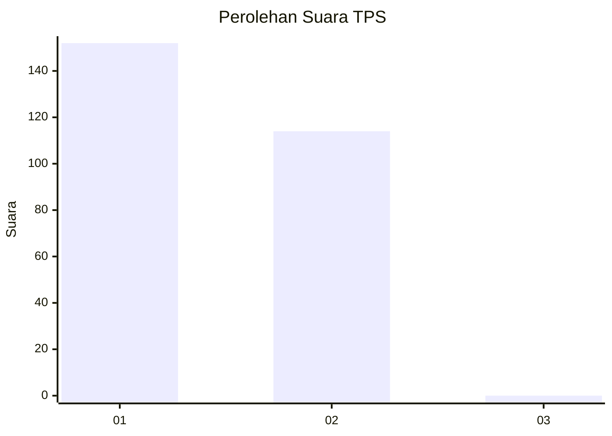
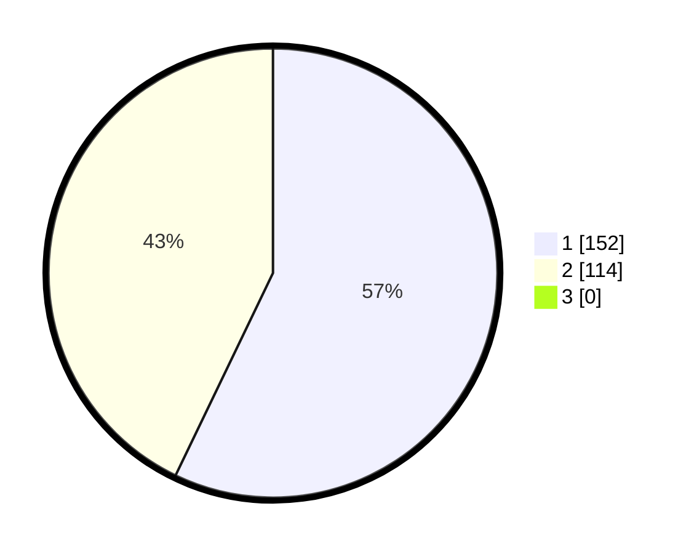

# Hasil

## Grafik

## Tabel

| No. | Nama Paslon    | Suara | Suara (raw) | Persentase |
|:--- |:-------------- | -----:| -----------:| ----------:|
| 1   | ANIES MUHAIMIN | 152   | [152][p-1]  | 57,14      |
| 2   | PRABOWO GIBRAN | 114   | [114][p-2]  | 42,86      |
| 3   | GANJAR MAHFUD  | 0     | [0][p-3]    | 0,00       |

[p-1]: https://github.com/gigit-pemilu/pemilu-2024-14-riau/blob/main/pilpres/hitung-suara/sub/14-riau/sub/71-kota-pekanbaru/sub/12-rumbai/sub/1004-lembah-damai/sub/015-tps/sub/paslon-1.txt
[p-2]: https://github.com/gigit-pemilu/pemilu-2024-14-riau/blob/main/pilpres/hitung-suara/sub/14-riau/sub/71-kota-pekanbaru/sub/12-rumbai/sub/1004-lembah-damai/sub/015-tps/sub/paslon-2.txt
[p-3]: https://github.com/gigit-pemilu/pemilu-2024-14-riau/blob/main/pilpres/hitung-suara/sub/14-riau/sub/71-kota-pekanbaru/sub/12-rumbai/sub/1004-lembah-damai/sub/015-tps/sub/paslon-3.txt

## Foto C Plano

https://sirekap-obj-formc.kpu.go.id/9b28/pemilu/ppwp/14/71/12/10/04/1471121004015-20240217-125236--6c1abed4-b90d-47b6-9b69-6c7037aabb3d.jpg

https://sirekap-obj-formc.kpu.go.id/9b28/pemilu/ppwp/14/71/12/10/04/1471121004015-20240217-125504--b38c1244-f42d-4a4c-90b7-bba362e33621.jpg

https://sirekap-obj-formc.kpu.go.id/9b28/pemilu/ppwp/14/71/12/10/04/1471121004015-20240217-125659--53ee595f-cc21-4219-91f9-24c27cdee29e.jpg

## Metadata

| Key        | Value               |
| ---------- | ------------------- |
| Time Stamp | 2024-02-17 13:37:34 |

