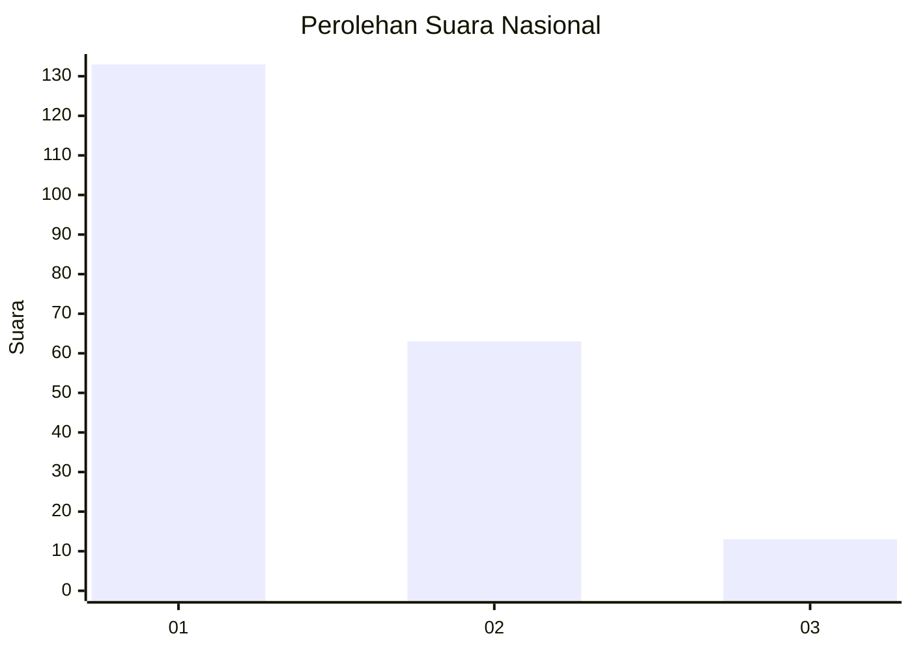
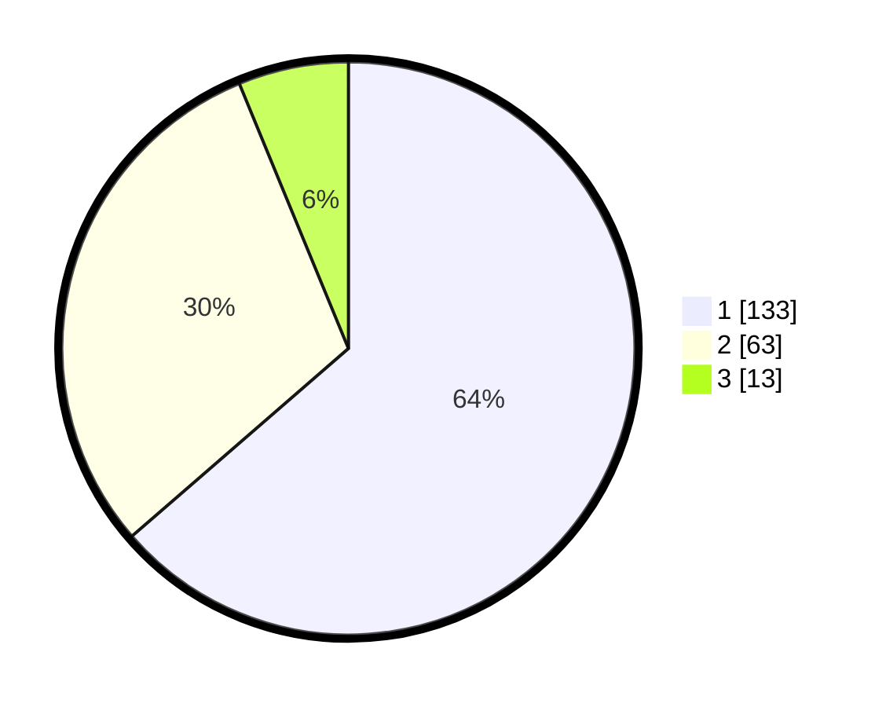

# Hasil

## Grafik

## Tabel

| No. | Nama Paslon    | Suara | Suara (raw) | Persentase |
|:--- |:-------------- | -----:| -----------:| ----------:|
| 1   | ANIES MUHAIMIN | 133   | [133][p-1]  | 63,64      |
| 2   | PRABOWO GIBRAN | 63    | [63][p-2]   | 30,14      |
| 3   | GANJAR MAHFUD  | 13    | [13][p-3]   | 6,22       |

[p-1]: https://github.com/gigit-pemilu/pemilu-2024/blob/main/pilpres/hitung-suara/sub/14-riau/sub/71-kota-pekanbaru/sub/13-tuahmadani/sub/1001-sidomulyo-barat/sub/001-tps/sub/paslon-1.txt
[p-2]: https://github.com/gigit-pemilu/pemilu-2024/blob/main/pilpres/hitung-suara/sub/14-riau/sub/71-kota-pekanbaru/sub/13-tuahmadani/sub/1001-sidomulyo-barat/sub/001-tps/sub/paslon-2.txt
[p-3]: https://github.com/gigit-pemilu/pemilu-2024/blob/main/pilpres/hitung-suara/sub/14-riau/sub/71-kota-pekanbaru/sub/13-tuahmadani/sub/1001-sidomulyo-barat/sub/001-tps/sub/paslon-3.txt

## Foto C Plano

https://sirekap-obj-formc.kpu.go.id/33f1/pemilu/ppwp/14/71/13/10/01/1471131001001-20240214-230439--9f69d531-b551-4005-95ae-04da6cfd5588.jpg

https://sirekap-obj-formc.kpu.go.id/33f1/pemilu/ppwp/14/71/13/10/01/1471131001001-20240214-230507--3d915108-f6d3-439e-9a62-51276f8f25c0.jpg

https://sirekap-obj-formc.kpu.go.id/33f1/pemilu/ppwp/14/71/13/10/01/1471131001001-20240214-230544--b1ef5cce-471b-4394-9083-df241a382921.jpg

## Metadata

| Key        | Value               |
| ---------- | ------------------- |
| Time Stamp | 2024-02-15 12:00:28 |

