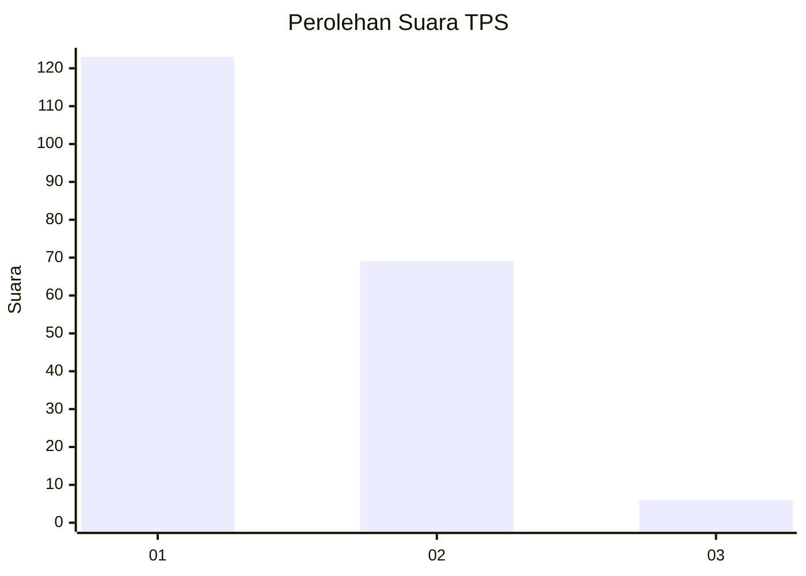
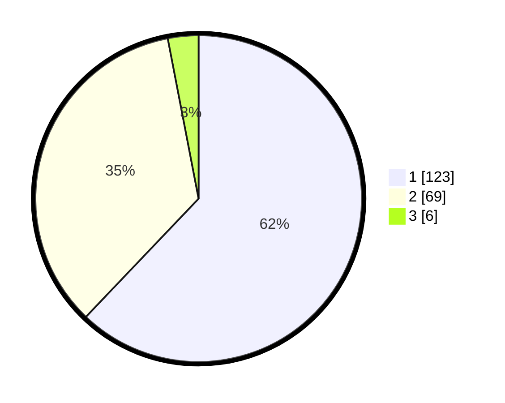

# Hasil

## Grafik

## Tabel

| No. | Nama Paslon    | Suara | Suara (raw) | Persentase |
|:--- |:-------------- | -----:| -----------:| ----------:|
| 1   | ANIES MUHAIMIN | 123   | [123][p-1]  | 62,12      |
| 2   | PRABOWO GIBRAN | 69    | [69][p-2]   | 34,85      |
| 3   | GANJAR MAHFUD  | 6     | [6][p-3]    | 3,03       |

[p-1]: https://github.com/gigit-pemilu/pemilu-2024-14-riau/blob/main/pilpres/hitung-suara/sub/14-riau/sub/71-kota-pekanbaru/sub/13-tuahmadani/sub/1001-sidomulyo-barat/sub/006-tps/sub/paslon-1.txt
[p-2]: https://github.com/gigit-pemilu/pemilu-2024-14-riau/blob/main/pilpres/hitung-suara/sub/14-riau/sub/71-kota-pekanbaru/sub/13-tuahmadani/sub/1001-sidomulyo-barat/sub/006-tps/sub/paslon-2.txt
[p-3]: https://github.com/gigit-pemilu/pemilu-2024-14-riau/blob/main/pilpres/hitung-suara/sub/14-riau/sub/71-kota-pekanbaru/sub/13-tuahmadani/sub/1001-sidomulyo-barat/sub/006-tps/sub/paslon-3.txt

## Foto C Plano

https://sirekap-obj-formc.kpu.go.id/a55f/pemilu/ppwp/14/71/13/10/01/1471131001006-20240214-224957--4e3bd679-61c1-4c35-8b02-3dd2de97c191.jpg

https://sirekap-obj-formc.kpu.go.id/a55f/pemilu/ppwp/14/71/13/10/01/1471131001006-20240214-224959--580be9de-f718-4958-bec4-9daf97db04ec.jpg

https://sirekap-obj-formc.kpu.go.id/a55f/pemilu/ppwp/14/71/13/10/01/1471131001006-20240214-225002--525bb1d8-6380-4da6-bdef-d87d1a189caf.jpg

## Metadata

| Key        | Value               |
| ---------- | ------------------- |
| Time Stamp | 2024-02-15 15:00:29 |

