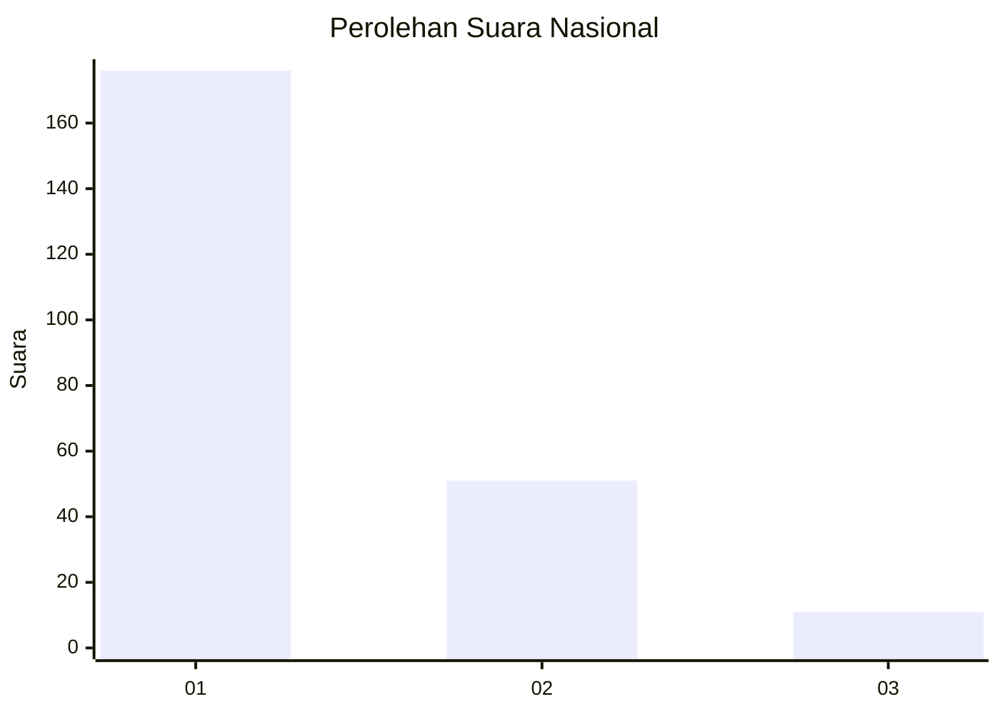
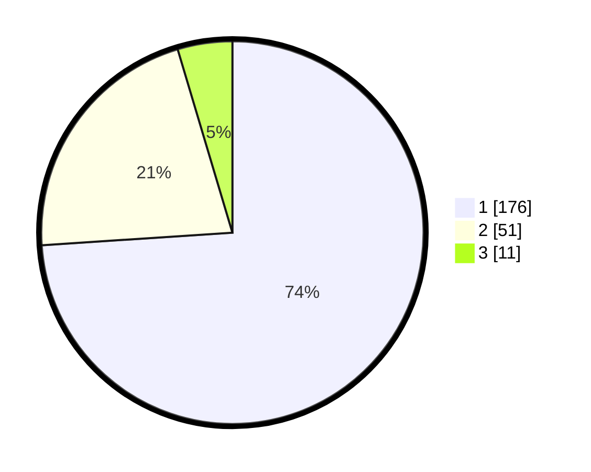

# Hasil

## Grafik

## Tabel

| No. | Nama Paslon    | Suara | Suara (raw) | Persentase |
|:--- |:-------------- | -----:| -----------:| ----------:|
| 1   | ANIES MUHAIMIN | 176   | [176][p-1]  | 73,95      |
| 2   | PRABOWO GIBRAN | 51    | [51][p-2]   | 21,43      |
| 3   | GANJAR MAHFUD  | 11    | [11][p-3]   | 4,62       |

[p-1]: https://github.com/gigit-pemilu/pemilu-2024/blob/main/pilpres/hitung-suara/sub/14-riau/sub/71-kota-pekanbaru/sub/13-tuahmadani/sub/1001-sidomulyo-barat/sub/025-tps/sub/paslon-1.txt
[p-2]: https://github.com/gigit-pemilu/pemilu-2024/blob/main/pilpres/hitung-suara/sub/14-riau/sub/71-kota-pekanbaru/sub/13-tuahmadani/sub/1001-sidomulyo-barat/sub/025-tps/sub/paslon-2.txt
[p-3]: https://github.com/gigit-pemilu/pemilu-2024/blob/main/pilpres/hitung-suara/sub/14-riau/sub/71-kota-pekanbaru/sub/13-tuahmadani/sub/1001-sidomulyo-barat/sub/025-tps/sub/paslon-3.txt

## Foto C Plano

https://sirekap-obj-formc.kpu.go.id/b8b6/pemilu/ppwp/14/71/13/10/01/1471131001025-20240214-213813--be319cdb-578e-48c0-abff-9bea4cb4e97a.jpg

https://sirekap-obj-formc.kpu.go.id/b8b6/pemilu/ppwp/14/71/13/10/01/1471131001025-20240214-214257--9a763255-a124-488f-9538-53415be7dee1.jpg

https://sirekap-obj-formc.kpu.go.id/b8b6/pemilu/ppwp/14/71/13/10/01/1471131001025-20240214-220740--8a5e5130-9cfc-4589-87b4-dacefff6ad68.jpg

## Metadata

| Key        | Value               |
| ---------- | ------------------- |
| Time Stamp | 2024-02-15 23:29:50 |

