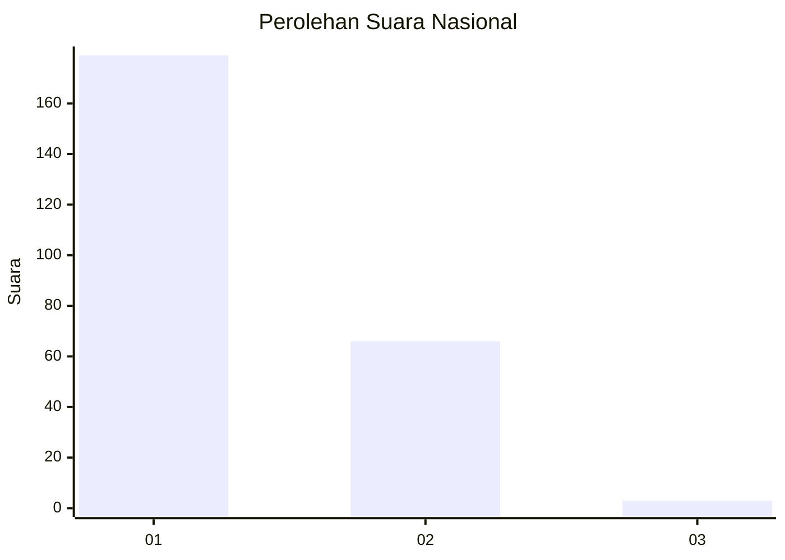
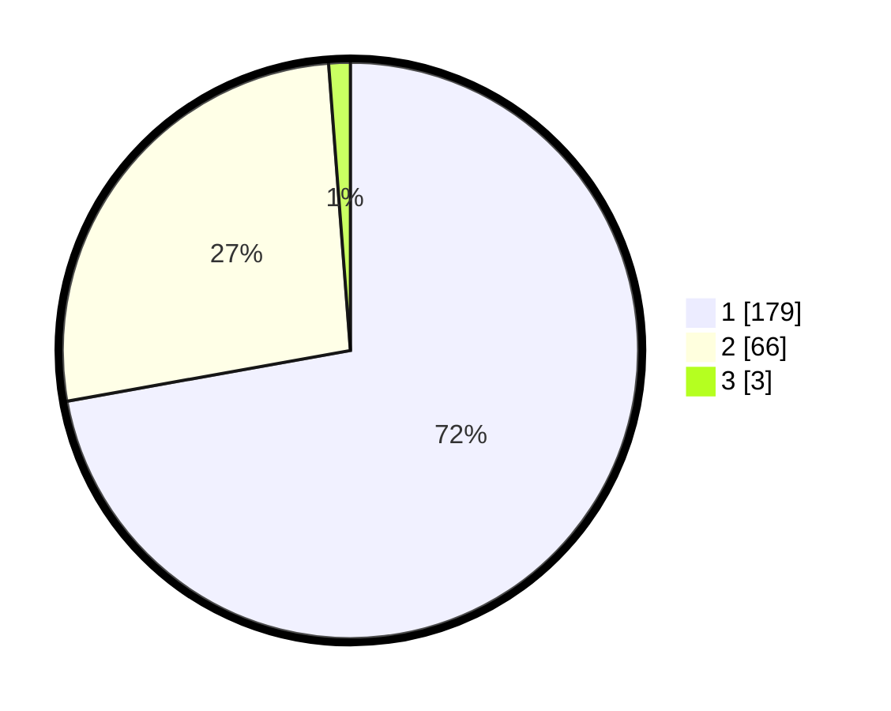

# Hasil

## Grafik

## Tabel

| No. | Nama Paslon    | Suara | Suara (raw) | Persentase |
|:--- |:-------------- | -----:| -----------:| ----------:|
| 1   | ANIES MUHAIMIN | 179   | [179][p-1]  | 72,18      |
| 2   | PRABOWO GIBRAN | 66    | [66][p-2]   | 26,61      |
| 3   | GANJAR MAHFUD  | 3     | [3][p-3]    | 1,21       |

[p-1]: https://github.com/gigit-pemilu/pemilu-2024/blob/main/pilpres/hitung-suara/sub/14-riau/sub/71-kota-pekanbaru/sub/13-tuahmadani/sub/1001-sidomulyo-barat/sub/026-tps/sub/paslon-1.txt
[p-2]: https://github.com/gigit-pemilu/pemilu-2024/blob/main/pilpres/hitung-suara/sub/14-riau/sub/71-kota-pekanbaru/sub/13-tuahmadani/sub/1001-sidomulyo-barat/sub/026-tps/sub/paslon-2.txt
[p-3]: https://github.com/gigit-pemilu/pemilu-2024/blob/main/pilpres/hitung-suara/sub/14-riau/sub/71-kota-pekanbaru/sub/13-tuahmadani/sub/1001-sidomulyo-barat/sub/026-tps/sub/paslon-3.txt

## Foto C Plano

https://sirekap-obj-formc.kpu.go.id/6eb4/pemilu/ppwp/14/71/13/10/01/1471131001026-20240214-224113--9f41cebb-a101-4773-8c1f-bc5fe2b5ee44.jpg

https://sirekap-obj-formc.kpu.go.id/6eb4/pemilu/ppwp/14/71/13/10/01/1471131001026-20240214-224259--a05c6627-f08a-434d-b99a-e8088502aab5.jpg

https://sirekap-obj-formc.kpu.go.id/6eb4/pemilu/ppwp/14/71/13/10/01/1471131001026-20240214-224511--8e7de732-059a-44ff-8a86-bac008cf2f86.jpg

## Metadata

| Key        | Value               |
| ---------- | ------------------- |
| Time Stamp | 2024-02-22 17:00:00 |

