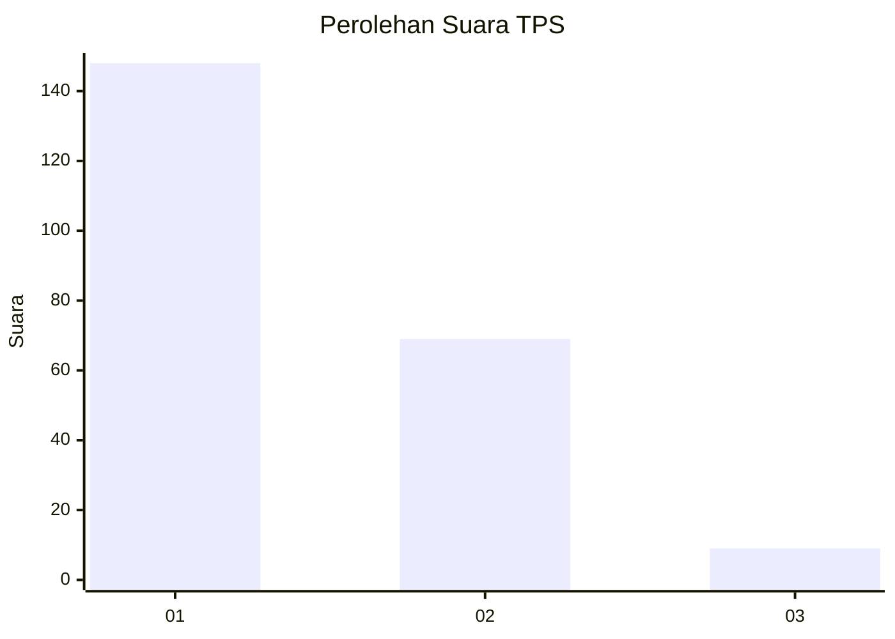
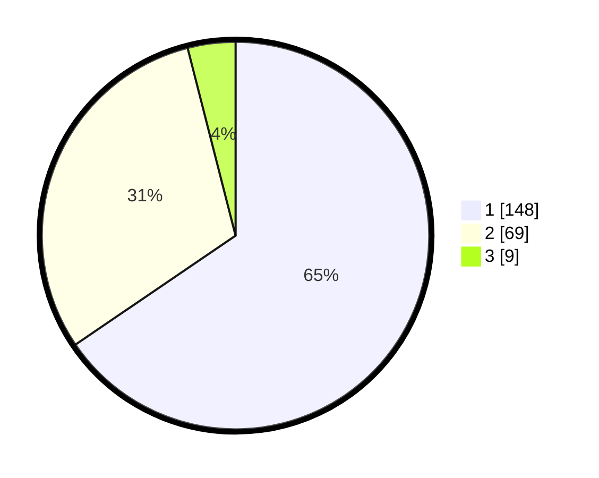

# Hasil

## Grafik

## Tabel

| No. | Nama Paslon    | Suara | Suara (raw) | Persentase |
|:--- |:-------------- | -----:| -----------:| ----------:|
| 1   | ANIES MUHAIMIN | 148   | [148][p-1]  | 65,49      |
| 2   | PRABOWO GIBRAN | 69    | [69][p-2]   | 30,53      |
| 3   | GANJAR MAHFUD  | 9     | [9][p-3]    | 3,98       |

[p-1]: https://github.com/gigit-pemilu/pemilu-2024-14-riau/blob/main/pilpres/hitung-suara/sub/14-riau/sub/71-kota-pekanbaru/sub/13-tuahmadani/sub/1001-sidomulyo-barat/sub/046-tps/sub/paslon-1.txt
[p-2]: https://github.com/gigit-pemilu/pemilu-2024-14-riau/blob/main/pilpres/hitung-suara/sub/14-riau/sub/71-kota-pekanbaru/sub/13-tuahmadani/sub/1001-sidomulyo-barat/sub/046-tps/sub/paslon-2.txt
[p-3]: https://github.com/gigit-pemilu/pemilu-2024-14-riau/blob/main/pilpres/hitung-suara/sub/14-riau/sub/71-kota-pekanbaru/sub/13-tuahmadani/sub/1001-sidomulyo-barat/sub/046-tps/sub/paslon-3.txt

## Foto C Plano

https://sirekap-obj-formc.kpu.go.id/43f9/pemilu/ppwp/14/71/13/10/01/1471131001046-20240215-000327--592b9dd5-e3f5-4892-8579-0783e9f53236.jpg

https://sirekap-obj-formc.kpu.go.id/43f9/pemilu/ppwp/14/71/13/10/01/1471131001046-20240215-000451--1b82554b-c2fe-4550-ae2f-6968a1d43445.jpg

https://sirekap-obj-formc.kpu.go.id/43f9/pemilu/ppwp/14/71/13/10/01/1471131001046-20240215-000841--d8790ca9-b0da-4cdb-801b-d107c4a5b55c.jpg

## Metadata

| Key        | Value               |
| ---------- | ------------------- |
| Time Stamp | 2024-02-15 12:00:28 |

