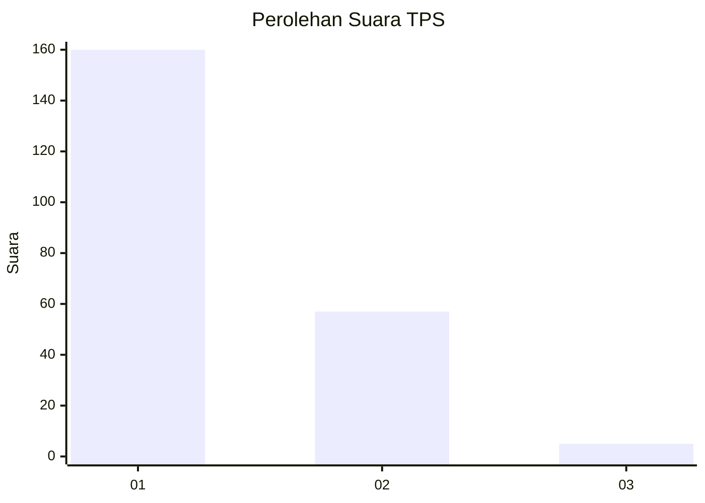
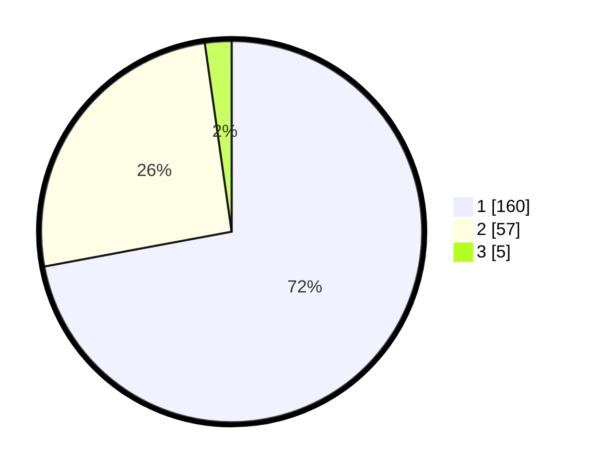

# Hasil

## Grafik

## Tabel

| No. | Nama Paslon    | Suara | Suara (raw) | Persentase |
|:--- |:-------------- | -----:| -----------:| ----------:|
| 1   | ANIES MUHAIMIN | 160   | [160][p-1]  | 72,07      |
| 2   | PRABOWO GIBRAN | 57    | [57][p-2]   | 25,68      |
| 3   | GANJAR MAHFUD  | 5     | [5][p-3]    | 2,25       |

[p-1]: https://github.com/gigit-pemilu/pemilu-2024-14-riau/blob/main/pilpres/hitung-suara/sub/14-riau/sub/71-kota-pekanbaru/sub/13-tuahmadani/sub/1002-sialangmunggu/sub/007-tps/sub/paslon-1.txt
[p-2]: https://github.com/gigit-pemilu/pemilu-2024-14-riau/blob/main/pilpres/hitung-suara/sub/14-riau/sub/71-kota-pekanbaru/sub/13-tuahmadani/sub/1002-sialangmunggu/sub/007-tps/sub/paslon-2.txt
[p-3]: https://github.com/gigit-pemilu/pemilu-2024-14-riau/blob/main/pilpres/hitung-suara/sub/14-riau/sub/71-kota-pekanbaru/sub/13-tuahmadani/sub/1002-sialangmunggu/sub/007-tps/sub/paslon-3.txt

## Foto C Plano

https://sirekap-obj-formc.kpu.go.id/5148/pemilu/ppwp/14/71/13/10/02/1471131002007-20240215-021605--6dda9a78-41b6-4922-8f1b-0aa47cdf4a72.jpg

https://sirekap-obj-formc.kpu.go.id/5148/pemilu/ppwp/14/71/13/10/02/1471131002007-20240215-021643--452f0250-7735-4fe0-a490-cd353017d5b9.jpg

https://sirekap-obj-formc.kpu.go.id/5148/pemilu/ppwp/14/71/13/10/02/1471131002007-20240215-021819--199b8d68-bf20-459e-9efc-07a1effc108b.jpg

## Metadata

| Key        | Value               |
| ---------- | ------------------- |
| Time Stamp | 2024-02-15 19:30:26 |

